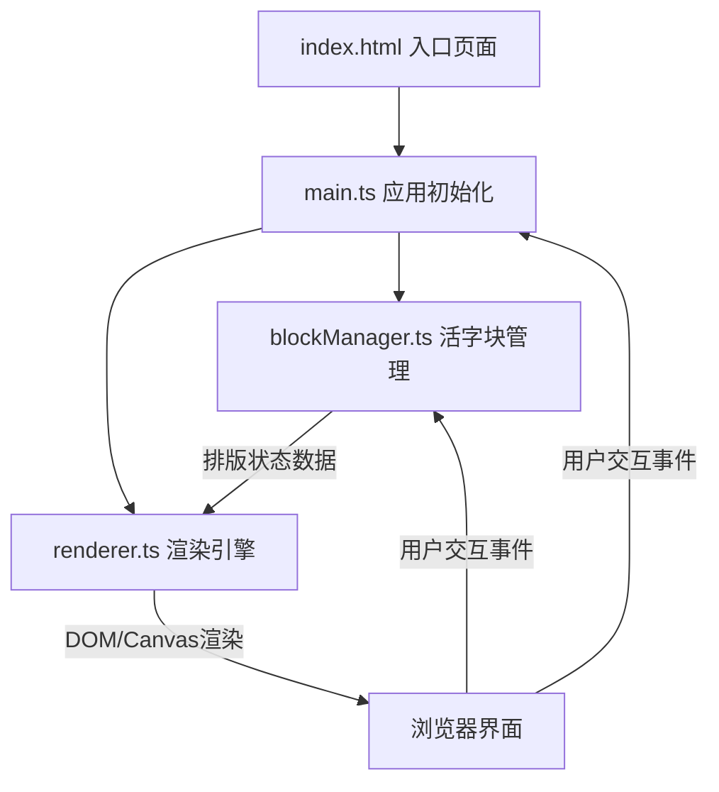
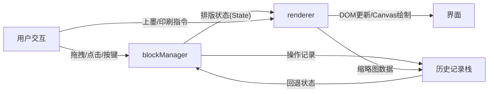

## 1. 架构设计



采用纯TypeScript + 原生JavaScript实现，不使用任何前端框架。使用Canvas和DOM混合渲染策略：活字库和排版盘使用DOM元素实现拖拽交互，印刷预览区使用Canvas实现镜像渲染和渗墨效果。

## 2. 技术说明

- **前端**：TypeScript + 原生DOM/Canvas，无框架
- **构建工具**：Vite
- **开发语言**：TypeScript (strict mode, target ES2020)
- **后端**：无
- **数据库**：无

## 3. 文件结构

| 文件路径 | 职责 |
|---------|------|
| package.json | 项目依赖(typescript, vite)，启动脚本(npm run dev) |
| vite.config.js | 构建配置，入口index.html，端口3000 |
| tsconfig.json | TypeScript严格模式，target ES2020 |
| index.html | 入口页面，包含所有静态组件占位 |
| src/main.ts | 应用初始化，挂载事件监听和主循环，设置画布尺寸、启动动画帧、协调各模块 |
| src/blockManager.ts | 活字块管理，维护活字库和排版盘数据结构，拖拽坐标映射、网格吸附、添加移除操作 |
| src/renderer.ts | 渲染引擎，渲染活字库列表、排版盘内容、上墨动画、印刷预览镜像文字和渗墨效果、历史缩略图生成 |

## 4. 模块间数据流



### 4.1 blockManager 核心数据结构

```typescript
interface TypeBlock {
  id: string;
  char: string;
  x: number;
  y: number;
  inTray: boolean;
  gridRow: number;
  gridCol: number;
  fontSize: number;
}

interface LayoutState {
  blocks: TypeBlock[];
  fontSize: number;
  lineSpacing: number;
  inked: boolean;
  printed: boolean;
}
```

### 4.2 renderer 渲染策略

- **活字库面板**：DOM元素，每个活字为绝对定位div，支持drag事件
- **排版盘区域**：DOM元素，凹槽引导线用CSS绘制，活字拖入后DOM定位
- **印刷预览区**：Canvas元素，实现镜像翻转文字绘制和渗墨噪点效果
- **上墨动画**：CSS transition + requestAnimationFrame逐行着色
- **缩略图生成**：离屏Canvas渲染，toDataURL导出

## 5. 关键动画实现

| 动画 | 实现方式 | 时长 | 缓动 |
|------|---------|------|------|
| 活字悬停上移 | CSS transform + box-shadow | 0.2s | ease |
| 网格吸附 | JS动画(requestAnimationFrame) | 0.15s | ease-out |
| 活字删除散开淡出 | CSS transform + opacity | 0.3s | ease |
| 上墨逐行显现 | CSS transition stagger | 每行0.2s | ease |
| 参数调整过渡 | CSS transition | 0.3s | ease |
| 按钮点击缩放 | CSS transform scale | 0.15s | ease |
| 历史回退 | JS动画序列 + 进度条 | 每活字0.2s | ease |
