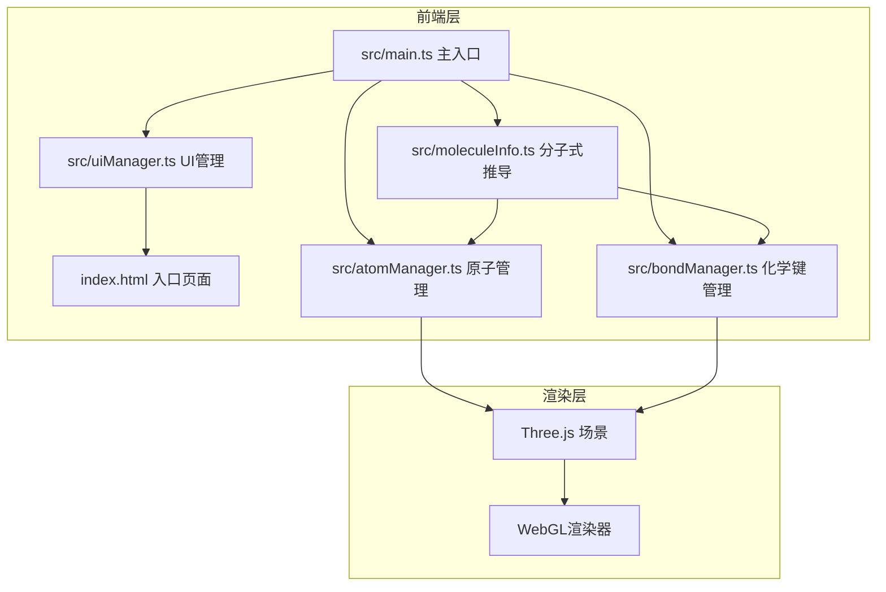

## 1. 架构设计



## 2. 技术说明
- **前端**：TypeScript + Three.js + Vite
- **初始化工具**：Vite
- **后端**：无
- **数据库**：无

## 3. 路由定义
无路由，单页应用。

## 4. 文件结构
| 文件 | 用途 |
|------|------|
| package.json | 依赖：three, typescript, vite, @types/three；脚本：npm run dev |
| index.html | 入口页面，背景色#1E2A38，全屏自适应 |
| vite.config.js | 构建配置，入口index.html，端口3000 |
| tsconfig.json | 严格模式，target ES2022，moduleResolution bundler |
| src/main.ts | 初始化场景、相机、渲染器、灯光，创建主循环，调用其他模块 |
| src/atomManager.ts | AtomManager类：addAtom, removeAtom, dragAtom，维护原子数组(带userData的Mesh) |
| src/bondManager.ts | BondManager类：addBond, removeBond, getBondCount，维护键数组(CylinderGeometry) |
| src/uiManager.ts | UIManager类：管理工具栏和面板DOM交互，绑定按钮事件和键盘快捷键，实时更新分子式 |
| src/moleculeInfo.ts | deriveFormula函数：根据原子和键数据推导分子式，返回分子式字符串和各原子计数 |

## 5. 核心数据结构

```typescript
interface AtomData {
  type: 'C' | 'O' | 'H' | 'N';
  position: THREE.Vector3;
  mesh: THREE.Mesh;
}

interface BondData {
  from: AtomData;
  to: AtomData;
  mesh: THREE.Mesh;
}

interface MoleculeFormula {
  formula: string;
  counts: Record<string, number>;
}
```

## 6. 关键交互逻辑

### 原子放置
- 鼠标点击 → Raycaster投射到y=0平面 → 交点处创建原子Mesh

### 原子拖拽
- mousedown在原子上 → 高亮黄色 → mousemove沿y=0平面移动 → mouseup释放

### 化学键创建
- mousedown在原子A上 → 拖拽到原子B上释放 → 创建圆柱体连接A和B球心 → 生长动画0.2秒

### 化学键删除
- 点击键的圆柱体 → 缩小融化消失动画0.15秒 → 移除

### 自动旋转
- 开关开启 → 分子组绕Y轴0.5rad/s旋转 → 蓝紫渐变光晕粒子环绕

### 重置
- 所有原子和键向外爆炸散开动画0.5秒 → 清空场景
