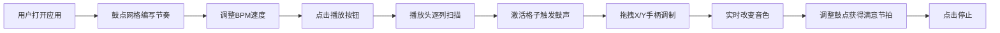

## 1. 产品概述
基于Canvas的交互式鼓机与X/Y调制器Web应用，为音乐制作爱好者和Beatmaker提供直观的节奏编排与实时音色调制体验。
- 解决在线鼓机界面简陋、缺乏硬件合成器式实时调制控制的痛点
- 让用户通过可视化网格编写鼓点，拖拽X/Y控制点实时塑造音色动态变化

## 2. 核心功能

### 2.1 功能模块
1. **主界面**：16x3鼓点网格、播放控制、BPM调节、X/Y调制控制区、参数显示

### 2.2 页面详情
| 页面名称 | 模块名称 | 功能描述 |
|-----------|-------------|---------------------|
| 主界面 | 鼓点网格 | 16列x3行（底鼓/军鼓/踩镲），点击切换激活状态，激活格子脉冲闪烁动画 |
| 主界面 | 播放控制 | 圆形播放/停止按钮，点击缩放动画，播放头逐列扫描触发鼓声 |
| 主界面 | BPM滑块 | 范围60-180，实时调整播放速度，轨道高4px，悬停高亮 |
| 主界面 | X/Y调制区 | 200x200px正方形区域，圆形拖拽手柄，十字辅助虚线，发光描边 |
| 主界面 | 参数显示 | 实时显示滤波器截止频率和包络衰减时间数值 |

## 3. 核心流程
用户打开应用 → 在鼓点网格上点击编写节奏 → 调整BPM → 点击播放按钮开始播放 → 拖拽X/Y手柄实时调制音色 → 调整鼓点获得满意节拍 → 点击停止结束播放

## 4. 用户界面设计

### 4.1 设计风格
- **主色调**：深灰黑背景 #1A1A1A，激活格子 #FF6B6B，播放头 #4FC3F7，调制手柄渐变 #FFB74D → #FF9800，按钮渐变 #FF5252 → #D32F2F
- **按钮风格**：圆形按钮50px直径，点击缩放0.9倍（0.1s动画），悬停亮度提升15%
- **字体**：等宽monospace，参数文字 #B0BEC5，字号14px
- **布局风格**：桌面端水平布局（网格+参数显示 | X/Y控制区），移动端垂直堆叠
- **交互特效**：格子点击缩放0.9+恢复（0.1s），激活格子脉冲闪烁（0.5s周期），手柄拖拽投影偏移10px，所有过渡0.2s ease-out

### 4.2 页面设计概述
| 页面名称 | 模块名称 | UI元素 |
|-----------|-------------|-------------|
| 主界面 | 鼓点网格 | 16x3格子40x40px，圆角4px，激活#FF6B6B/未激活#3A3A3A，背景#2D2D2D，圆角8px，边框1px #444 |
| 主界面 | 播放控制 | 圆形按钮，渐变#FF5252→#D32F2F，播放头横线#4FC3F7宽2px |
| 主界面 | BPM滑块 | 轨道4px #555，滑块圆形#888悬停#AAA |
| 主界面 | X/Y调制区 | 200x200px，渐变#2A2A2A→#1A1A1A，圆角8px，十字虚线#444间距50px，外发光#FF9800透明度0.3宽2px |
| 主界面 | 参数显示 | 截止频率xxxx Hz，衰减xxx ms，#B0BEC5，monospace 14px |

### 4.3 响应式设计
- 桌面优先（Desktop-first）
- 移动端（宽度>=375px）：竖屏单列布局，网格与X/Y控制区垂直堆叠
- 所有交互元素支持触控操作

## 5. 性能约束
- Canvas渲染帧率稳定60fps
- 音频延迟不超过50ms
- X/Y手柄拖拽调制无卡顿
