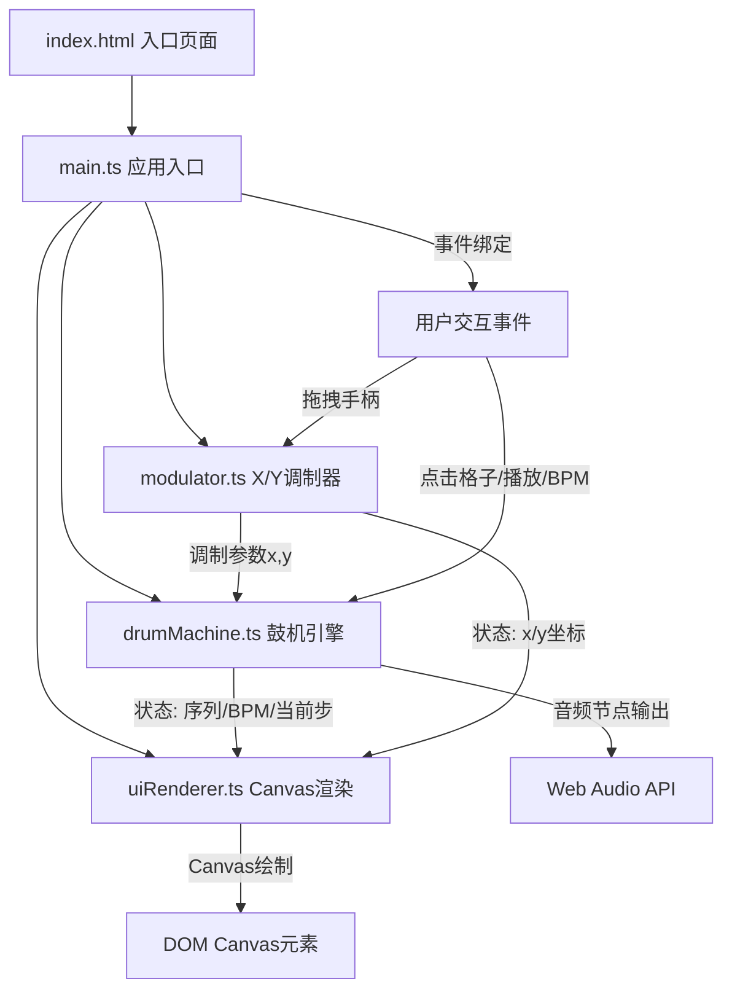

## 1. 架构设计



## 2. 技术描述
- **前端**：TypeScript + 原生JavaScript + Vite
- **初始化工具**：Vite 初始化项目
- **构建工具**：Vite（端口3000，入口index.html）
- **渲染**：HTML5 Canvas 2D API（60fps）
- **音频**：Web Audio API（OscillatorNode, BufferSource, BiquadFilter, GainNode）
- **无后端**，纯前端应用

## 3. 文件结构与职责

```
项目根目录/
├── package.json          # 依赖配置(typescript, vite)，启动脚本npm run dev
├── vite.config.js        # Vite构建配置，端口3000
├── tsconfig.json         # TypeScript严格模式，target ES2020
├── index.html            # 入口页面，全屏自适应
└── src/
    ├── main.ts           # 应用入口：初始化AudioContext、UI、事件、主循环
    ├── drumMachine.ts    # 鼓机引擎：16步序列、start/stop/toggle/setBPM、音频生成
    ├── modulator.ts      # X/Y调制器：x→滤波器截止(200-4000Hz)，y→衰减(0.05-0.3s)
    └── uiRenderer.ts     # Canvas渲染：网格、播放头、X/Y手柄、参数文本
```

### 文件调用关系与数据流向：

| 源文件 | 调用目标 | 数据内容 |
|--------|----------|----------|
| main.ts | drumMachine.ts | 初始化、start()/stop()/toggleStep(row,col)/setBPM(bpm) |
| main.ts | modulator.ts | 初始化、setPosition(x,y)、订阅onChange回调 |
| main.ts | uiRenderer.ts | 初始化、每帧传入state渲染、接收点击/拖拽坐标 |
| drumMachine.ts | modulator参数 | 通过main.ts传入cutoffFreq和decayTime到playDrum() |
| modulator.ts | main.ts | 通过onChange(x,y,cutoff,decay)回调输出 |
| uiRenderer.ts | main.ts | 通过onGridClick(row,col)、onPlayToggle()、onBpmChange(v)、onModulatorStart/Move/End(x,y)回调 |

## 4. 数据模型

### 4.1 鼓机状态 (DrumMachineState)
| 字段 | 类型 | 说明 |
|------|------|------|
| sequence | boolean[3][16] | 3行16列的鼓点序列（0=底鼓,1=军鼓,2=踩镲） |
| bpm | number | 每分钟节拍数，默认120，范围60-180 |
| currentStep | number | 当前播放步索引0-15，未播放时-1 |
| isPlaying | boolean | 是否正在播放 |

### 4.2 调制器状态 (ModulatorState)
| 字段 | 类型 | 说明 |
|------|------|------|
| x | number | 归一化x值0-1，默认0.5 |
| y | number | 归一化y值0-1，默认0.5 |
| cutoffFreq | number | 滤波器截止频率200-4000Hz |
| decayTime | number | 包络衰减时间0.05-0.3s |
| isDragging | boolean | 是否正在拖拽 |

### 4.3 音色定义
| 音色 | 波形/成分 | 时长 | 调制影响 |
|------|----------|------|----------|
| 底鼓Kick | 80Hz正弦波 | 衰减0.3s（可被y调制） | 低通滤波，截止由x控制 |
| 军鼓Snare | 混合噪声+200Hz正弦 | 衰减0.2s（可被y调制） | 带通滤波，截止由x控制 |
| 踩镲HiHat | 白噪声带通滤波 | 衰减0.1s（可被y调制） | 高通+带通，截止由x控制 |

## 5. 核心算法与常量

### 5.1 时间步进计算
```
每步持续时间(秒) = 60 / (BPM * 4)  （16分音符）
调度窗口 = 当前音频时间 + 前瞻时间(100ms)
使用setTimeout提前调度下一批音符
```

### 5.2 调制映射公式
```
截止频率 = 200 + x * 3800  (Hz)
衰减时间 = 0.05 + y * 0.25  (秒)
```

### 5.3 渲染帧率
- requestAnimationFrame驱动，每秒60帧
- 每帧传入最新state给uiRenderer.render(state)

## 6. 事件与回调接口
```typescript
// drumMachine回调
onStepChange: (step: number) => void
onPlayStateChange: (playing: boolean) => void

// modulator回调
onChange: (x: number, y: number, cutoff: number, decay: number) => void

// uiRenderer回调
onGridClick: (row: number, col: number) => void
onPlayToggle: () => void
onBpmChange: (bpm: number) => void
onModulatorStart: (x: number, y: number) => void
onModulatorMove: (x: number, y: number) => void
onModulatorEnd: () => void
```
