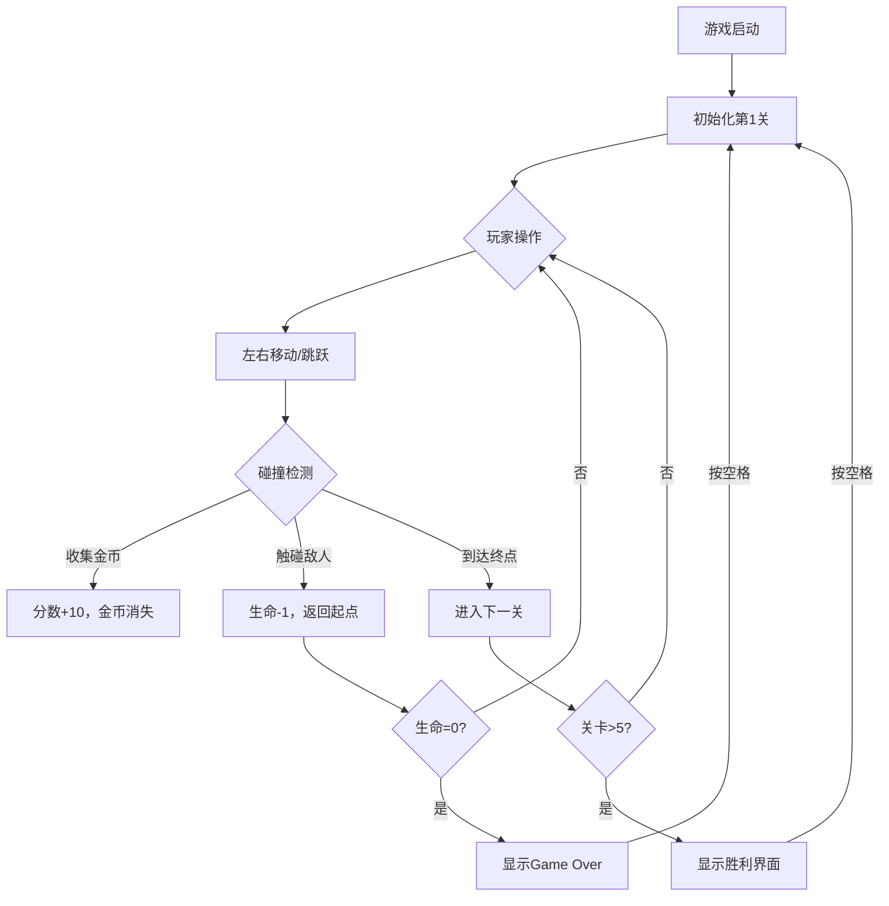

## 1. 产品概述

2D平台跳跃游戏，玩家控制像素风格角色在随机生成的关卡中收集金币、躲避敌人并到达终点。支持5个关卡递进，具备完整的生命值、分数系统和暂停/重开机制。

- 核心目标：通过5个关卡，收集金币获取高分，躲避敌人保持生命
- 目标用户：休闲游戏玩家、网页游戏爱好者
- 产品价值：提供轻量级、即开即玩的2D平台游戏体验，展示Canvas游戏开发能力

## 2. 核心功能

### 2.1 功能模块

1. **游戏主界面**：Canvas渲染区域、分数显示、生命显示、暂停覆盖层
2. **玩家控制系统**：方向键移动、空格跳跃、物理重力系统
3. **关卡生成系统**：种子随机数生成平台、金币、敌人位置
4. **碰撞检测系统**：AABB碰撞算法检测玩家与平台/金币/敌人交互
5. **游戏状态管理**：关卡进度、生命值、分数、暂停/游戏结束/胜利状态
6. **性能监控系统**：FPS监控与自动降级机制

### 2.2 页面详情

| 页面名称 | 模块名称 | 功能描述 |
|---------|---------|---------|
| 游戏主界面 | Canvas渲染区 | 动态渲染背景、平台、玩家、金币、敌人 |
| 游戏主界面 | UI信息栏 | 左上角显示分数（金色粗体30px Arial）和红色心形生命图标 |
| 游戏主界面 | 暂停覆盖层 | 半透明灰色遮罩+白色"Paused"文字，按P键切换 |
| 游戏主界面 | Game Over界面 | 显示"Game Over"和最终分数，空格重开 |
| 游戏主界面 | 胜利界面 | 显示"You Win!"和总分数 |

## 3. 核心流程

游戏主流程：启动游戏 → 加载第1关 → 玩家控制角色移动跳跃 → 收集金币增加分数 → 躲避敌人保持生命 → 到达右侧终点区域 → 进入下一关 → 通过第4关后显示胜利界面。若生命归零则显示Game Over，按空格重新开始。

## 4. 用户界面设计

### 4.1 设计风格
- **主色调**：天空蓝#87CEEB → 浅灰#D3D3D3（深度渐变背景）
- **平台色**：土黄色#8B4513填充，深棕色2px边框
- **金币色**：金色，带旋转动画
- **敌人色**：红色尖刺球，脉冲效果
- **UI色**：金色分数文字、红色心形图标
- **字体**：Arial（30px粗体用于分数）
- **布局**：Canvas居中显示，16:9宽高比自适应

### 4.2 页面设计概述

| 页面名称 | 模块名称 | UI元素 |
|---------|---------|---------|
| 游戏主界面 | 背景渲染 | 天空蓝→浅灰垂直渐变 |
| 游戏主界面 | 平台绘制 | 土黄色渐变矩形+深棕边框 |
| 游戏主界面 | 玩家角色 | 20×30px像素风（蓝上衣/棕裤子/红帽子），带动画 |
| 游戏主界面 | 金币元素 | 直径16px金色圆形，每帧旋转3° |
| 游戏主界面 | 敌人元素 | 直径20px红色尖刺球，水平移动，脉冲动画 |
| 游戏主界面 | 信息栏 | 左上角：金色分数 + 红色心形生命图标（间隔4px） |
| 游戏主界面 | 暂停遮罩 | 半透明灰色 + 居中白色"Paused"文字 |
| 游戏主界面 | 结束界面 | 居中显示"Game Over"/"You Win!"和最终分数 |

### 4.3 响应性

- **Desktop优先**：Canvas采用16:9固定宽高比
- **自适应居中**：窗口大小变化时Canvas自动居中，保持比例缩放
- **键盘操作**：方向键（←→）移动，空格跳跃，P键暂停
