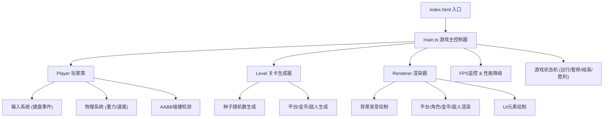

## 1. 架构设计



## 2. 技术描述

- **前端框架**：原生 TypeScript + HTML5 Canvas（无额外UI框架）
- **构建工具**：Vite 5.x
- **编译目标**：ES2020
- **TypeScript模式**：严格模式 (strict: true)
- **渲染方式**：2D Canvas Context，每帧清空重绘
- **游戏循环**：requestAnimationFrame + deltaTime 时间步进
- **物理系统**：自主实现（重力加速度、速度积分）
- **碰撞算法**：AABB (Axis-Aligned Bounding Box)

## 3. 文件结构

```
auto18/
├── package.json              # 依赖: typescript, vite; 脚本: npm run dev
├── index.html                # 入口页面 (Canvas容器)
├── vite.config.js            # Vite配置 (index.html为入口)
├── tsconfig.json             # TS配置 (严格模式, target ES2020)
└── src/
    ├── main.ts               # 游戏初始化, Canvas创建, 游戏循环
    ├── player.ts             # 玩家类 (位置/速度/跳跃/碰撞)
    ├── level.ts              # 关卡生成器 (种子随机数)
    └── renderer.ts           # 渲染器 (所有绘制逻辑)
```

## 4. 数据流向

### 4.1 输入→玩家状态
```
键盘事件(keydown/keyup)
  → inputState {left,right,jump}
    → Player.update(dt)
      → 速度积分 → 位置更新
        → 碰撞检测(平台/金币/敌人)
          → playerState {x,y,vy,onGround,alive}
```

### 4.2 关卡生成
```
关卡配置 {levelIndex, seed}
  → SeededRandom 生成随机序列
    → platforms[] / coins[] / enemies[]
      → 提供给 主循环 做碰撞 & 渲染
```

### 4.3 渲染流程
```
每帧: requestAnimationFrame
  → update(dt): 玩家 + 敌人 + 金币动画更新
  → render(): Renderer 按序绘制
    1. 清空画布 + 背景渐变
    2. 平台 (渐变矩形)
    3. 金币 (旋转圆)
    4. 敌人 (尖刺球+脉冲)
    5. 玩家 (像素精灵)
    6. UI层 (分数/生命/暂停遮罩/结束文字)
```

## 5. 核心类型定义

```typescript
// 平台
interface Platform {
  x: number; y: number; width: number; height: number;
}

// 金币
interface Coin {
  x: number; y: number; radius: number;
  collected: boolean; rotation: number;
}

// 敌人
interface Enemy {
  x: number; y: number; radius: number;
  startX: number; range: number; speed: number;
  direction: 1 | -1; pulsePhase: number;
}

// 玩家
interface PlayerState {
  x: number; y: number;
  vx: number; vy: number;
  width: number; height: number;
  onGround: boolean;
  facingRight: boolean;
}

// 游戏状态
type GamePhase = 'playing' | 'paused' | 'gameover' | 'win';

interface GameState {
  phase: GamePhase;
  score: number;
  lives: number;
  currentLevel: number;
  platforms: Platform[];
  coins: Coin[];
  enemies: Enemy[];
  player: Player;
}
```

## 6. 性能约束实现

- **目标FPS**：60FPS（每帧约16.67ms）
- **时间步进**：使用 deltaTime = frameTime / 1000，保证不同帧率下物理一致性
- **FPS监控**：记录最近10帧FPS，连续低于55触发降级
- **降级策略**：金币与敌人数量各减少20%（向下取整，最少保留1个）
- **碰撞优化**：仅检测玩家周围AABB范围内的对象

## 7. Canvas尺寸规则

- **逻辑尺寸**：1280 × 720（16:9基准）
- **实际渲染**：根据窗口大小等比缩放，保持16:9
- **居中策略**：CSS flex居中Canvas元素
- **坐标系统**：渲染时所有坐标基于逻辑尺寸1280×720，通过ctx.scale适配
