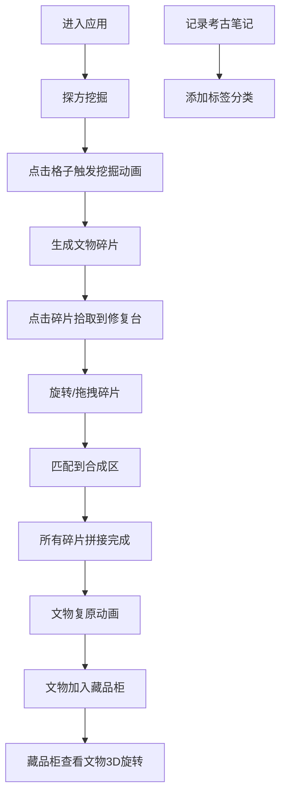

## 1. 产品概述
基于Web的交互式虚拟考古挖宝与文物修复应用，让用户模拟考古学家在探方中挖掘碎片、拼接修复古物并记录发掘笔记的完整过程。
- 主要目的：提供沉浸式考古体验，融合教育性与娱乐性，让用户了解文物发掘与修复的过程
- 目标用户：对考古、历史、文物感兴趣的普通用户，教育场景下的学生

## 2. 核心功能

### 2.1 用户角色
| 角色 | 注册方式 | 核心权限 |
|------|----------|----------|
| 普通用户 | 无需注册，直接使用 | 完整体验挖掘、修复、笔记功能 |

### 2.2 功能模块
1. **探方挖掘模块**：10x10网格探方，点击挖掘触发粒子动画，随机生成文物碎片
2. **文物修复模块**：碎片拾取、旋转、拖拽拼接，匹配吸附合并，文物复原动画
3. **考古笔记模块**：文字笔记记录、标签分类筛选、藏品柜展示已修复文物

### 2.3 页面详情
| 页面名称 | 模块名称 | 功能描述 |
|-----------|-------------|---------------------|
| 主应用页面 | 探方网格组件 | 10x10土色格子，悬停高亮，点击挖掘动画，随机生成1-3块碎片 |
| 主应用页面 | 修复台组件 | 碎片拖放区，旋转交互，合成区匹配吸附，文物复原动画特效 |
| 主应用页面 | 笔记面板组件 | 文字笔记记录，时间戳，标签筛选，藏品柜文物缩略图展示 |

## 3. 核心流程
用户进入页面后，首先在中间探方区点击格子进行挖掘，触发粒子动画并获得文物碎片。点击碎片将其拾取到右侧修复台，在修复台上旋转并拖拽碎片到合成区进行拼接。当所有碎片匹配完成后，触发文物复原动画。整个过程中用户可在左侧笔记面板记录发掘笔记，已修复的文物会自动加入藏品柜。

## 4. 用户界面设计

### 4.1 设计风格
- **主色调**：考古大地色系 - 沙土#C2B280, 陶土#A0845C, 深褐#3D2B1F, 青瓷#90A98E
- **辅助色**：白瓷#F5F0E1, 红陶#C46A4E, 黑陶#3A2A1A, 金色#FFD700
- **按钮风格**：圆角矩形，hover亮度提升15%，点击缩放0.95，动画0.15s
- **字体**：系统无衬线字体，文物名称使用手写风格
- **布局风格**：三栏布局 - 左笔记面板(220px) + 中探方区(最小600px) + 右修复台区
- **装饰元素**：不规则多边形碎片、粒子飞散特效、金色脉冲光效

### 4.2 页面设计概述
| 页面名称 | 模块名称 | UI元素 |
|-----------|-------------|-------------|
| 主应用页面 | 探方网格组件 | 10x10格子40x40px，1px深棕色分割线#8B7355，悬停浅土黄#D4C5A9，挖掘后深坑色#4A3728，土粒飞散粒子动画 |
| 主应用页面 | 修复台组件 | 深褐背景#3D2B1F，圆角12px，虚线圆合成区#A0845C，金色脉冲光效#FFD700，彩色粒子扩散特效 |
| 主应用页面 | 笔记面板组件 | 深褐背景#2C1810，圆角标签#8B7355，悬停#A0845C，藏品柜缩略图60x60px圆角6px |

### 4.3 响应式
- **桌面端**（>768px）：三栏并列布局，左笔记面板220px，中间探方区自适应，右修复台区占剩余空间
- **移动端**（≤768px）：上下布局，笔记面板折叠为可展开横条在上方，探方区居中，修复台在下方
- **触摸优化**：所有触摸操作保留，点击区域≥40x40px，滚动流畅

### 4.4 动画与交互
- **挖掘动画**：0.3秒土粒飞散（10个随机方向小方块，颜色#8B7355，透明度渐变）
- **拾取动画**：0.2秒缩放弹跳，从原位置飞行到修复台，ease-out缓动
- **旋转动画**：0.2秒旋转90度，ease-out缓动
- **吸附光效**：0.5秒金色脉冲发光#FFD700到#FFA500循环3次
- **复原动画**：0.5秒缩小到完整尺寸，100个彩色粒子扩散1.5秒
- **微交互**：按钮hover亮度+15%，点击缩放0.95，0.15s动画
