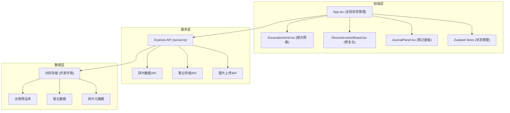
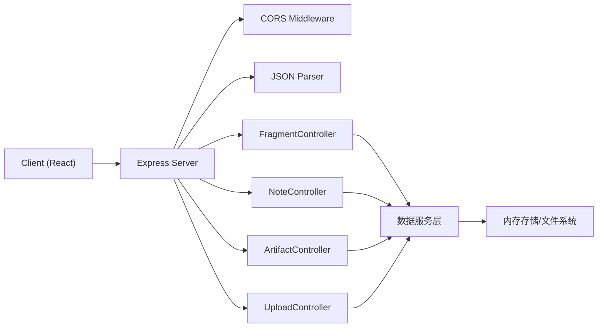
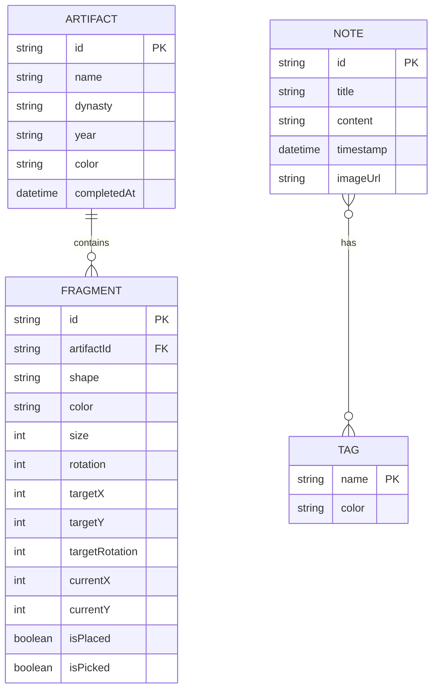

## 1. 架构设计



## 2. 技术描述
- **前端**：React@18 + TypeScript@5 + Vite@5 + @vitejs/plugin-react@4
- **状态管理**：Zustand@4
- **样式**：CSS Modules + 内联样式（动画特效）
- **后端**：Express@4 + TypeScript@5
- **中间件**：Cors@2 + uuid@9
- **图标**：lucide-react@latest
- **初始化工具**：vite-init react-express-ts模板

## 3. 路由定义
| 路由 | 用途 |
|-------|---------|
| / | 主应用页面 |
| /api/fragments | 获取/更新文物碎片数据 |
| /api/notes | 获取/创建/更新考古笔记 |
| /api/artifacts | 获取已修复文物列表 |
| /api/upload | 图片上传接口 |

## 4. API定义

```typescript
// 类型定义
interface Fragment {
  id: string;
  artifactId: string;
  shape: number[][]; // 多边形顶点坐标
  color: string;
  size: number;
  rotation: number;
  targetX: number;
  targetY: number;
  targetRotation: number;
  currentX: number;
  currentY: number;
  isPlaced: boolean;
  isPicked: boolean;
}

interface Artifact {
  id: string;
  name: string;
  dynasty: string;
  year: string;
  fragments: Fragment[];
  color: string;
  completedAt?: number;
}

interface Note {
  id: string;
  title: string;
  content: string;
  timestamp: number;
  tags: string[];
  imageUrl?: string;
}

// 请求响应定义
// GET /api/fragments
interface GetFragmentsResponse {
  fragments: Fragment[];
  artifacts: Artifact[];
}

// POST /api/notes
interface CreateNoteRequest {
  title: string;
  content: string;
  tags: string[];
  imageUrl?: string;
}
interface CreateNoteResponse {
  note: Note;
}

// GET /api/notes
interface GetNotesResponse {
  notes: Note[];
}

// GET /api/artifacts
interface GetArtifactsResponse {
  artifacts: Artifact[];
}
```

## 5. 服务器架构图



## 6. 数据模型

### 6.1 数据模型定义



### 6.2 预设数据
- **文物预设库**：内置10+件中国古代文物（陶罐、瓷器、青铜器等）
- **陶瓷色盘**：青瓷#90A98E, 白瓷#F5F0E1, 红陶#C46A4E, 黑陶#3A2A1A
- **标签预设**：重要发现、需要修复、已完成
- **粒子特效参数**：土粒10个/修复粒子100个，生命周期≤2秒

### 6.3 性能优化
- 探方网格使用CSS Grid渲染，点击响应≤50ms
- 碎片拖动使用transform + will-change优化，帧率≥45fps
- 粒子总数控制在150个以内，使用requestAnimationFrame统一更新
- 响应式断点768px，使用CSS Media Query实现布局切换
