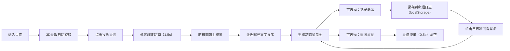

## 1. 产品概述

占星骰占卜应用 - 一个在浏览器中模拟古代占星术士通过抛掷星骰来占卜命运、生成星盘并解读吉凶的沉浸式Web应用。

- 主要用途：为传统桌游或角色扮演游戏提供自动化的星象占卜工具，替代裁判手动查表，提供沉浸式视觉反馈和即时解读
- 目标用户：桌游玩家、TRPG爱好者、神秘学爱好者

## 2. 核心特性

### 2.1 功能模块

1. **占星台主界面**：深邃夜空背景、3D悬浮旋转星骰、投掷/重置按钮组
2. **星骰投掷系统**：十二面体3D骰子、弹跳旋转投掷动画、随机面朝上结果生成
3. **动态星盘生成**：同心圆环、12宫位分区、占星符号放置、动态解读文本
4. **命运日志系统**：localStorage存储、日志列表渲染、点击回看历史星盘

### 2.3 页面详情

| 页面名称 | 模块名称 | 功能描述 |
|---------|---------|---------|
| 主页面 | 占星台 | 夜空背景渐变、中央3D骰子悬浮旋转、金色辉光结果显示 |
| 主页面 | 操作按钮区 | 投掷星骰按钮（紫蓝渐变）、记录命运按钮（书本图标）、重置占星按钮（弯月图标） |
| 主页面 | 星盘展示区 | 同心圆环（30px间距）、12宫位扇形分区（30度/区）、蓝色虚线放射、占星符号与解读文本 |
| 主页面 | 命运日志区 | 右侧280px滚动列表、时间戳+符号+关键词、下滑淡入动画、点击回看 |

## 3. 核心流程

用户进入页面 → 看到自动旋转的3D星骰 → 点击"投掷星骰" → 骰子弹跳旋转3圈（1.5s ease-out）→ 随机面朝上结果（金色辉光文字）→ 下方动态生成星盘图（同心圆环+12宫位+符号+解读）→ 可点击"记录命运"保存到日志 → 可点击"重置占星"清空星盘 → 可点击右侧日志项回看历史星盘

## 4. 用户界面设计

### 4.1 设计风格

- **主色调**：深邃夜空蓝 `#0B1021` 到暗紫 `#1A0A2E` 渐变背景
- **辅助色**：金色 `#C4A35A`（骰面）、高光金 `#E8D48B`（边缘/文字）、紫 `#7B2D8E`、蓝 `#4A6FA5`
- **按钮风格**：
  - 投掷按钮：放射渐变紫→蓝，圆角12px
  - 记录按钮：深蓝 `#2A3B5C`，悬停变 `#3A5A8C`，圆角6px，书本图标
  - 重置按钮：暗紫 `#3A2A5A`，弯月图标
- **字体**：衬线字体 Serif，解读文本16px，颜色 `#E8D48B`
- **布局风格**：左右结构（左侧占星区70%，右侧日志区固定280px），桌面端优先
- **视觉风格**：神秘、深邃、古典占星氛围

### 4.2 页面设计概览

| 页面名称 | 模块名称 | UI元素 |
|---------|---------|--------|
| 主页面 | 占星台 | 夜空渐变背景、居中3D十二面体骰子、自动缓慢旋转（0.01rad/frame）、金色骰面#C4A35A+高光边#E8D48B |
| 主页面 | 投掷结果 | 骰子上方金色辉光文字显示当前面符号 |
| 主页面 | 星盘 | 同心圆环（间距30px，色#2A3B5C，透明度0.3）、12宫位（30度扇形，蓝色虚线#4A6FA5放射）、符号+解读文本（Serif 16px #E8D48B） |
| 主页面 | 按钮区 | 下方居中排列：投掷按钮（紫蓝渐变12px圆角）、记录按钮（深蓝书本图标）、重置按钮（暗紫弯月图标） |
| 主页面 | 命运日志 | 右侧窄列280px，背景#151E30，滚动列表，每项含时间戳/符号/关键词，下滑淡入动画（20px+透明→不透明 0.3s） |

### 4.3 响应式设计

- **桌面端（≥768px）**：左右布局，占星区70%，日志区固定280px
- **移动端（<768px）**：日志区折叠至底部（高度180px可展开），占星区占满剩余高度
- 触控优化：增大按钮点击区域，支持触摸事件

### 4.4 动画与交互

- **骰子空闲动画**：3D悬浮，0.01rad/frame 自动缓慢旋转
- **投掷动画**：弹跳+旋转3圈，1.5s，ease-out缓动，弹性效果
- **星盘生成**：响应时间≤200ms
- **重置动画**：星盘透明度1→0，0.5s，ease-in-out缓动
- **日志项动画**：下滑淡入（上→下滑20px + 透明度0→1），0.3s
- **性能要求**：所有动画帧率≥50fps
