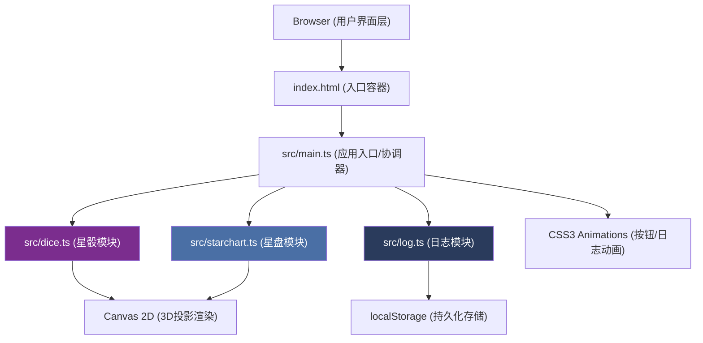

## 1. 架构设计



## 2. 技术说明

- **前端框架**：TypeScript + 原生JavaScript（无框架）
- **构建工具**：Vite 5.x
- **渲染技术**：Canvas 2D API（3D骰子用2D投影模拟）+ CSS3动画
- **数据存储**：浏览器 localStorage（命运日志持久化）
- **初始化方式**：Vite vanilla-ts 模板
- **数据库**：无后端，使用localStorage本地存储

## 3. 文件组织

```
项目根目录/
├── package.json          # 依赖与脚本配置
├── vite.config.js        # Vite构建配置（端口3000）
├── tsconfig.json         # TypeScript配置（严格模式，ES2020）
├── index.html            # 入口HTML（基础CSS+Canvas容器）
└── src/
    ├── main.ts           # 应用入口：初始化Canvas、绑定事件、协调流程
    ├── dice.ts           # 星骰模块：十二面体3D投影、投掷动画、随机面生成
    ├── starchart.ts      # 星盘模块：同心圆环、12宫位、符号放置、解读生成
    └── log.ts            # 日志模块：localStorage存储、列表渲染、回看功能
```

## 4. 模块接口定义

### 4.1 dice.ts 接口

```typescript
// 十二面体面定义（星座/行星符号）
export interface DiceFace {
  id: number;           // 面编号 0-11
  symbol: string;       // 星座符号：♈♉♊♋♌♍♎♏♐♑♒♓
  name: string;         // 名称：Aries/Taurus等
  planet: string;       // 关联行星：金星/火星等
  keywords: string[];   // 关键词数组
}

// 星骰类接口
export interface DiceEngine {
  // 初始化骰子渲染
  init(canvas: HTMLCanvasElement): void;
  // 启动空闲自动旋转动画
  startIdleAnimation(): void;
  // 执行投掷动画（弹跳+旋转3圈，1.5s），返回Promise
  roll(): Promise<DiceFace>;
  // 获取当前朝上的面
  getCurrentFace(): DiceFace | null;
  // 重置到空闲旋转状态
  reset(): void;
  // 渲染指定面（用于日志回看）
  renderFace(face: DiceFace): void;
}
```

### 4.2 starchart.ts 接口

```typescript
// 星盘数据
export interface ChartData {
  timestamp: number;
  diceFace: DiceFace;
  houses: HouseData[];       // 12宫位数据
  interpretation: string;    // 综合解读文本
}

// 单宫位数据
export interface HouseData {
  houseNumber: number;       // 1-12
  symbol: string;            // 占星符号
  text: string;              // 解读文本
  angle: number;             // 起始角度
}

// 星盘引擎接口
export interface StarchartEngine {
  init(canvas: HTMLCanvasElement): void;
  // 根据骰面生成星盘
  generate(face: DiceFace): ChartData;
  // 渲染星盘到Canvas
  render(data: ChartData): void;
  // 淡出清空（0.5s ease-in-out）
  fadeOut(): Promise<void>;
  // 清空立即
  clear(): void;
}
```

### 4.3 log.ts 接口

```typescript
// 日志条目
export interface LogEntry {
  id: string;               // UUID
  timestamp: number;        // 时间戳
  diceFace: DiceFace;       // 骰面快照
  chartData: ChartData;     // 星盘快照（完整数据用于回看）
  keywords: string[];       // 关键词（列表展示用）
}

// 日志引擎接口
export interface LogEngine {
  init(container: HTMLElement, onReplay: (entry: LogEntry) => void): void;
  // 保存一条记录
  save(entry: Omit<LogEntry, 'id' | 'timestamp'>): LogEntry;
  // 获取所有记录
  getAll(): LogEntry[];
  // 渲染列表
  renderList(): void;
  // 清空内存列表（不清空存储）
  clearDisplay(): void;
}
```

## 5. 数据流

### 5.1 投掷流程

```
用户点击"投掷星骰"
    ↓
main.ts → dice.roll() [Promise]
    ↓
dice.ts: 执行弹跳旋转动画（1.5s ease-out）→ 生成随机面 → resolve(DiceFace)
    ↓
main.ts 收到 DiceFace → 显示金色辉光结果文字
    ↓
main.ts → starchart.generate(face) → ChartData
    ↓
main.ts → starchart.render(chartData) 绘制星盘
```

### 5.2 记录与回看流程

```
用户点击"记录命运"
    ↓
main.ts 收集 DiceFace + ChartData → log.save(...)
    ↓
log.ts: 写入localStorage → 添加到列表（下滑淡入动画0.3s）
    
用户点击日志项
    ↓
log.ts 回调 onReplay(entry)
    ↓
main.ts → dice.renderFace(entry.diceFace) 恢复骰子状态
    ↓
main.ts → starchart.render(entry.chartData) 恢复星盘状态
```

## 6. 性能保障

- **帧率≥50fps**：使用 `requestAnimationFrame` 驱动骰子旋转动画
- **响应时间≤200ms**：星盘生成为纯CPU计算+Canvas绘制，避免重排
- **动画优化**：CSS动画用于UI元素，Canvas用于图形，分层渲染
- **内存管理**：Canvas尺寸随容器自适应，避免过大离屏缓冲

## 7. 构建与运行

- 安装依赖：`npm install`
- 开发模式：`npm run dev`（端口3000）
- 生产构建：`npm run build`
