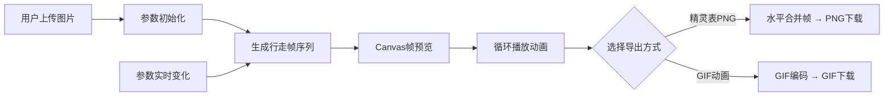

## 1. 产品概述

像素角色行走帧自动生成器 - 面向独立游戏开发者和像素艺术创作者的Web应用，将单张静态角色图片快速转换为循环行走精灵图表。

- **核心价值**：解决逐帧绘制重复性高、耗时的痛点，提供高效的像素角色行走动画生成工具
- **目标用户**：独立游戏工作室、像素艺术创作者、游戏爱好者
- **主要功能**：图片上传、参数调节、动画生成、帧预览、精灵表/GIF导出

## 2. 核心功能

### 2.1 用户角色
无需登录，面向所有访客开放全部功能

### 2.2 功能模块
1. **图片上传模块**：拖拽/点击上传像素角色图片（PNG/GIF），大小限制500KB，棋盘格背景预览
2. **参数调节面板**：步幅滑块（0-50px）、手臂摆动幅度滑块（0-30度）、帧速率滑块（4-12 FPS），实时数值显示
3. **动画生成引擎**：基于像素位移变形算法，自动生成4-8帧循环行走动画，包含四肢偏移、对称翻转、插值帧生成
4. **动画预览模块**：循环播放预览（250x250px纯黑背景），支持暂停/播放控制，帧率与设定值一致
5. **导出模块**：导出水平排列精灵表PNG（帧间距5px），导出封装好的GIF动画，自动下载

### 2.3 页面详情
| 页面名称 | 模块名称 | 功能描述 |
|-----------|-------------|---------------------|
| 主界面 | 左侧参数面板 | 300px宽灰色面板，包含上传区、参数滑块、导出按钮组 |
| 主界面 | 右侧画布区域 | 自适应宽度，居中显示原图Canvas、加载动画、预览区 |
| 主界面 | 响应式适配 | <768px时左侧面板折叠为顶部抽屉，汉堡菜单展开 |

## 3. 核心流程

用户上传图片 → 参数调节 → 实时生成帧 → 预览动画循环 → 选择导出格式（精灵表/GIF）→ 自动下载

## 4. 用户界面设计

### 4.1 设计风格
- **主色调**：深灰#2D2D2D（页面背景）、中灰#3A3A3A（面板）、浅灰#4A4A4A（分隔/次要）
- **高亮色**：#5B9BD5（按钮/滑块填充）、#7DBAE8（悬停态）、#4CAF50（加载/成功）
- **辅助色**：#1A1A1A（预览背景）、#E0E0E0/#FFFFFF（棋盘格）
- **按钮样式**：圆角6px，悬停变亮，点击缩放0.95倍，过渡0.15s ease
- **滑块样式**：轨道4px高#555，填充#5B9BD5，拇指16px圆形白色
- **字体**：全局等宽字体 monospace，保证像素风格
- **布局风格**：左右两列（左面板300px + 右自适应），工业像素风

### 4.2 页面设计概览
| 页面名称 | 模块名称 | UI元素 |
|-----------|-------------|-------------|
| 主界面 | 上传区 | 虚线边框拖放区，支持点击上传，文件大小提示 |
| 主界面 | 滑块组 | 每个滑块带标签、数值显示、统一视觉风格 |
| 主界面 | 加载动画 | 绿色圆点6px顺时针旋转，Canvas上方覆盖 |
| 主界面 | 预览区 | 250x250px纯黑背景，暂停/播放按钮 |
| 主界面 | 按钮组 | 导出精灵表、导出GIF，蓝色统一风格 |
| 主界面 | 响应式抽屉 | <768px汉堡菜单展开顶部面板 |

### 4.3 响应式
- 桌面端（≥768px）：左右两列布局，左侧300px固定宽度，右侧自适应
- 移动端（<768px）：左侧面板折叠为顶部抽屉，汉堡菜单触发展开，画布区域全屏
- 所有触摸元素增大点击区域，保证触屏友好

### 4.4 性能目标
- 上传→首帧生成 ≤ 500ms（200x200px图片）
- 动画帧率稳定性 ±1 FPS
- 8帧GIF编码 ≤ 2秒
