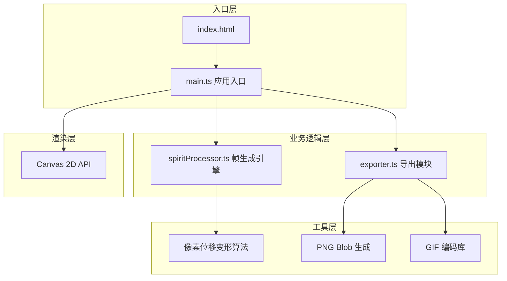

## 1. 架构设计

纯前端架构，无后端依赖，所有逻辑在浏览器端完成



**数据流向**：
1. 用户上传 → main.ts 读取 ImageData
2. ImageData + 参数 → spiritProcessor.generateFrames() → Frame[]
3. Frame[] → Canvas 预览循环播放
4. Frame[] → exporter.exportSpriteSheet() / exportGif() → 下载

**文件间调用关系**：
- main.ts → spiritProcessor.ts (调用 generateFrames)
- main.ts → exporter.ts (调用 exportSpriteSheet, exportGif)
- 各模块独立，无交叉依赖

## 2. 技术选型

- **前端框架**：原生 TypeScript + 原生 JavaScript（无框架），满足用户明确要求
- **构建工具**：Vite 5.x，配置端口3000，入口index.html
- **语言标准**：TypeScript 严格模式，target ES2020
- **第三方依赖**：gif.js（GIF编码），其他全部原生实现

## 3. 核心模块设计

### 3.1 类型定义（内联类型）
```typescript
interface WalkParams {
  stride: number;          // 步幅 0-50px，默认20
  armSwing: number;        // 手臂摆动幅度 0-30度，默认15
  frameRate: number;       // 帧率 4-12 FPS，默认8
}

interface FrameData {
  imageData: ImageData;    // 帧像素数据
  width: number;
  height: number;
}

type ExportFormat = 'spritesheet' | 'gif';
```

### 3.2 spiritProcessor.ts 核心算法
- **区域分割**：将角色图像分为头部、躯干、左臂、右臂、左腿、右腿六个逻辑区域
- **行走循环相位**：基于帧索引计算每个身体部位的位移相位（sin/cos函数）
- **像素级位移**：对每个区域的像素按相位偏移，使用最近邻采样保持像素感
- **对称翻转**：左右肢体使用反相相位实现交替动作
- **插值平滑**：根据帧数量自动计算相位步进，保证循环平滑

### 3.3 exporter.ts 导出模块
- **精灵表导出**：创建水平拼接Canvas，每帧间距5px，转PNG Blob触发下载
- **GIF导出**：使用gif.js库，设置帧延迟=1000/frameRate，循环播放，进度回调

### 3.4 main.ts 入口与UI管理
- 应用初始化：创建Canvas元素、注册事件、设置初始参数
- 上传处理：FileReader读取、尺寸校验、500KB限制、类型校验
- 参数面板：滑块事件绑定，防抖节流（16ms），实时重生成
- 预览循环：requestAnimationFrame 驱动，按 frameRate 切换帧
- 响应式：matchMedia监听，768px断点切换布局

## 4. 性能优化策略

| 优化点 | 策略 |
|--------|------|
| 帧生成速度 | 直接操作 Uint8ClampedArray，避免逐像素 getPixel/setPixel 调用 |
| 帧率稳定 | 使用累积时间戳而非 setInterval，校正帧切换时机 |
| GIF编码 | 仅提取调色板差异，启用 gif.js worker 线程 |
| 内存 | 及时 revokeObjectURL，复用 OffscreenCanvas（如可用） |
| UI响应 | 参数变化使用 rAF 节流，避免短时间多次重生成 |

## 5. 项目文件结构

```
├── index.html              # 入口页面，深灰背景#2D2D2D
├── package.json            # typescript + vite 依赖与脚本
├── vite.config.js          # vite 配置，端口3000
├── tsconfig.json           # TS严格模式，ES2020
└── src/
    ├── main.ts             # 入口：UI、事件、数据流向调度
    ├── spiritProcessor.ts  # 核心：像素位移变形、帧生成算法
    └── exporter.ts         # 导出：精灵表PNG合并、GIF编码下载
```
