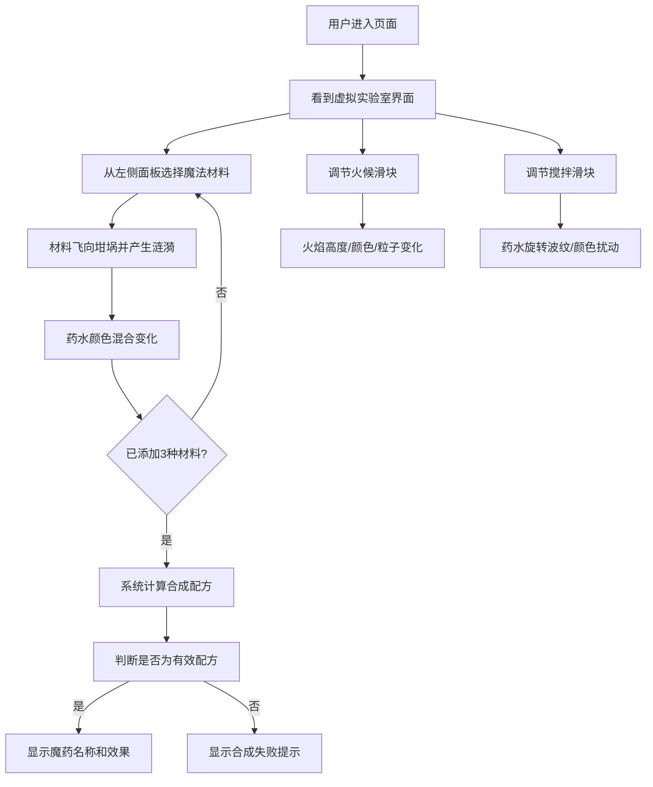

## 1. 产品概述

魔法学校药剂课交互式魔药配方合成模拟器，让学生在虚拟实验室中通过选择魔法材料、控制火候和搅拌速度，合成具有不同效果的魔药。

- **主要目的**：为魔法学校学生提供沉浸式的魔药合成实践体验，无需真实材料即可学习药剂配方
- **目标用户**：魔法学校药剂课学生、教师及魔法爱好者
- **产品价值**：降低教学成本，提高学习趣味性，实时可视化魔药合成过程

## 2. 核心功能

### 2.2 功能模块

1. **虚拟实验室主页**：中央坩埚模拟器、材料选择面板、火候与搅拌控制面板、配方提示与效果状态栏
2. **材料选择系统**：10种魔法材料库、材料悬停提示、材料添加动画
3. **坩埚模拟系统**：药水液体渲染、气泡动画、火焰效果、搅拌波纹效果
4. **火候控制系统**：火候滑块调节、火焰高度/颜色/粒子动态变化
5. **搅拌速度系统**：搅拌速度滑块、药水旋转波纹、颜色扰动效果
6. **配方合成系统**：材料组合识别、魔药效果计算、合成结果展示

### 2.3 页面详情

| 页面名称 | 模块名称 | 功能描述 |
|-----------|-------------|---------------------|
| 虚拟实验室主页 | 中央坩埚 | 直径320px铜质坩埚，金色镶嵌边框，实时渲染药水状态 |
| 虚拟实验室主页 | 三维火焰 | 三层渐变扇区火焰，高度/颜色/粒子随火候动态变化 |
| 虚拟实验室主页 | 材料选择面板 | 左侧200px宽度面板，10种40x40px圆形材料图标，金色边框 |
| 虚拟实验室主页 | 火候控制滑块 | 底部水平滑块，范围1-10，铜色滑块，渐变轨道 |
| 虚拟实验室主页 | 搅拌速度滑块 | 火候滑块右侧，范围1-10，木制纹理滑块 |
| 虚拟实验室主页 | 配方提示栏 | 底部显示当前配方进度、已选材料 |
| 虚拟实验室主页 | 效果状态栏 | 合成成功后显示魔药名称和效果描述 |
| 虚拟实验室主页 | 材料添加动画 | 点击材料后图标飞向坩埚，缩小消失，产生涟漪波纹 |

## 3. 核心流程

用户进入页面后，首先看到深邃紫色背景的魔法实验室界面，中央是铜质坩埚。用户从左侧材料面板选择材料（最多3种），每次添加材料后药水颜色发生混合变化。添加完第3种材料后，系统自动计算合成结果。用户可以调节火候滑块控制火焰大小和颜色，调节搅拌速度控制药水旋转波纹。合成成功后底部状态栏显示魔药名称和效果。

## 4. 用户界面设计

### 4.1 设计风格

- **主色调**：深邃魔法紫 `#1A0A2E` 到 `#2A1A3E` 渐变背景
- **强调色**：金色 `#DAA520`、铜色 `#CC8833`、魔法蓝 `#4488FF`
- **按钮风格**：圆形材料图标，金色边框，悬停放大1.05倍，点击缩小0.95倍，过渡0.2秒
- **字体**：魔法风格衬线字体用于标题，清晰无衬线字体用于正文
- **布局风格**：居中对称布局，中央坩埚为视觉焦点，左右两侧控制面板，底部状态提示
- **视觉风格**：中世纪羊皮卷与魔法阵结合，半透明渐变、微光描边、粒子效果

### 4.2 页面设计概述

| 页面名称 | 模块名称 | UI元素 |
|-----------|-------------|-------------|
| 虚拟实验室主页 | 中央坩埚 | 铜质纹理、金色边框、阴影、半透明药水液体、微光描边 |
| 虚拟实验室主页 | 三维火焰 | 三层渐变扇区（橙色#FF6600、红色#CC3300、黄色#FFCC00）、动态粒子 |
| 虚拟实验室主页 | 材料选择面板 | 200px宽度、背景#2A1A3E、圆形图标、金色边框、悬停发光 |
| 虚拟实验室主页 | 火候滑块 | 渐变轨道#331100到#CC5500、铜色滑块#CC8833、火焰颜色随火候变化 |
| 虚拟实验室主页 | 搅拌滑块 | 深褐轨道#4A2E1C、木制滑块#8B5E3C、波纹效果 |
| 虚拟实验室主页 | 气泡动画 | 半径3-8px、透明度0.6-0.9、上升速度1-2px/帧 |
| 虚拟实验室主页 | 火焰粒子 | 大小2-6px、透明度0.8→0、寿命30-60帧 |

### 4.3 响应性

- **桌面优先**：最小宽度800px，居中布局
- **自适应**：使用Canvas固定尺寸渲染，外层容器响应式居中
- **触控优化**：滑块支持触控拖动，材料图标支持点击

### 4.4 Canvas渲染优化

- **渲染帧率**：稳定30FPS以上，单帧绘制时间不超过30ms
- **粒子系统**：气泡上限50个，火焰粒子上限20个，对象池复用
- **状态管理**：增量更新，避免全量重绘
- **事件响应**：材料切换和滑块拖动延迟低于100ms
