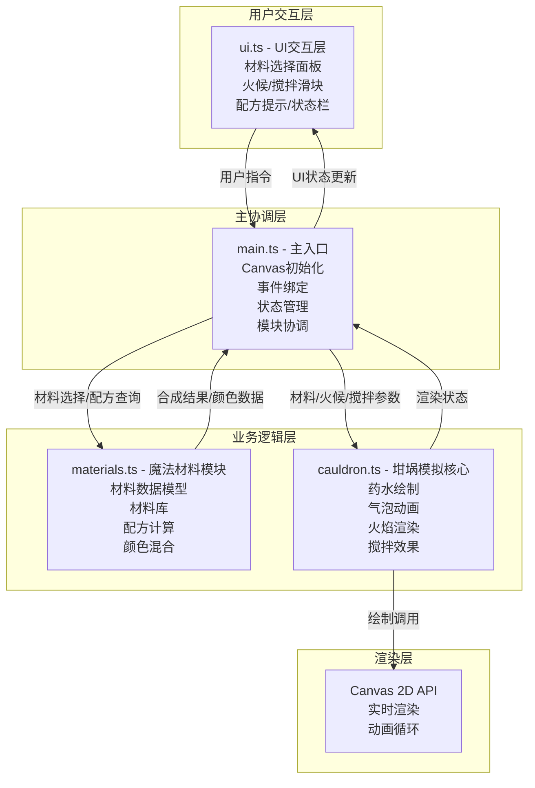

## 1. 架构设计

本项目为纯前端Canvas 2D魔药合成模拟器，采用模块化架构设计，各模块职责分离，通过主入口协调通信。



## 2. 技术描述

- **前端框架**：原生 TypeScript + Canvas 2D API（无UI框架）
- **构建工具**：Vite@5
- **开发语言**：TypeScript@5（严格模式，target ES2020）
- **项目初始化**：npm create vite@latest
- **后端**：无（纯前端应用）
- **数据库**：无（内存数据结构）

### 2.1 文件结构与职责

| 文件路径 | 职责描述 | 调用关系 |
|-----------|----------|----------|
| `package.json` | 项目依赖配置（typescript, vite），启动脚本 | 被 `npm run dev` 调用 |
| `vite.config.js` | Vite构建配置，端口3000，入口index.html | 被Vite调用 |
| `tsconfig.json` | TypeScript编译配置，严格模式，ES2020 | 被tsc调用 |
| `index.html` | 入口页面，深紫背景，favicon，Canvas容器 | 被浏览器加载 |
| `src/main.ts` | 主入口，初始化Canvas，绑定事件，状态管理，协调模块 | 调用 materials.ts, cauldron.ts, ui.ts |
| `src/materials.ts` | 材料数据模型，10种材料库，配方计算，颜色混合函数 | 被 main.ts 调用 |
| `src/cauldron.ts` | 坩埚模拟核心，绘制药水、气泡、火焰、搅拌动画 | 被 main.ts 调用，调用Canvas API |
| `src/ui.ts` | UI交互层，绘制面板、滑块、状态栏，处理用户事件 | 被 main.ts 调用，向 main.ts 传递用户指令 |

### 2.2 数据流向

```
用户操作 → ui.ts捕获事件 → main.ts更新状态 → materials.ts计算配方/颜色
                                         ↓
                                   cauldron.ts更新视觉参数 → Canvas渲染
                                         ↓
                                   main.ts → ui.ts更新UI状态显示
```

## 3. 数据模型定义

### 3.1 魔法材料数据模型

```typescript
interface MagicMaterial {
  id: string;
  name: string;
  color: string;
  rarity: 'common' | 'uncommon' | 'rare' | 'legendary';
  effectType: 'healing' | 'transformation' | 'protection' | 'illusion' | 'destruction' | 'enhancement';
  description: string;
  iconColor: string;
}
```

### 3.2 坩埚状态模型

```typescript
interface CauldronState {
  addedMaterials: MagicMaterial[];
  currentColor: string;
  heatLevel: number; // 1-10
  stirSpeed: number; // 1-10
  bubbles: Bubble[];
  flameParticles: FlameParticle[];
  ripples: Ripple[];
  stirAngle: number;
  colorPerturbation: number;
}
```

### 3.3 粒子系统模型

```typescript
interface Bubble {
  x: number;
  y: number;
  radius: number;
  speed: number;
  opacity: number;
  maxY: number;
}

interface FlameParticle {
  x: number;
  y: number;
  vx: number;
  vy: number;
  size: number;
  opacity: number;
  life: number;
  maxLife: number;
  color: string;
}

interface Ripple {
  x: number;
  y: number;
  radius: number;
  maxRadius: number;
  opacity: number;
}

interface MaterialFlyAnimation {
  material: MagicMaterial;
  startX: number;
  startY: number;
  currentX: number;
  currentY: number;
  targetX: number;
  targetY: number;
  scale: number;
  progress: number;
  duration: number;
}
```

### 3.4 配方模型

```typescript
interface PotionRecipe {
  materials: [string, string, string]; // 材料ID组合，顺序无关
  name: string;
  effect: string;
  resultColor: string;
  specialEffect: 'heart_bubbles' | 'sparkles' | 'smoke' | 'glow' | 'none';
}

interface SynthesisResult {
  success: boolean;
  potion?: PotionRecipe;
  message: string;
}
```

### 3.5 UI状态模型

```typescript
interface UIState {
  hoveredMaterialId: string | null;
  selectedMaterialId: string | null;
  clickAnimation: { materialId: string; startTime: number } | null;
  currentPotion: SynthesisResult | null;
}
```

## 4. 配方库（10种材料，预设配方）

### 4.1 10种魔法材料

| ID | 名称 | 颜色 | 稀有度 | 效果类型 | 图标颜色 |
|-----|------|------|--------|----------|----------|
| bat_wing | 蝙蝠翅膀 | #8B0000 | common | illusion | 暗红 |
| moonstone | 月光石 | #ADD8E6 | rare | enhancement | 淡蓝 |
| snake_fang | 毒蛇牙 | #32CD32 | uncommon | destruction | 亮绿 |
| dragon_scale | 龙鳞 | #FF4500 | legendary | destruction | 橙红 |
| unicorn_hair | 独角兽毛 | #FFFAF0 | legendary | healing | 米白 |
| nightshade | 颠茄 | #2F0040 | rare | illusion | 深紫 |
| phoenix_feather | 凤凰羽毛 | #FFD700 | legendary | enhancement | 金色 |
| mandrake_root | 曼德拉草根 | #8B4513 | common | healing | 棕褐 |
| fairy_dust | 仙尘 | #FFB6C1 | uncommon | transformation | 粉红 |
| shadow_essence | 暗影精华 | #1a1a2e | rare | protection | 深灰蓝 |

### 4.2 预设配方

| 材料组合 | 魔药名称 | 效果 | 结果颜色 | 特殊效果 |
|----------|----------|------|----------|----------|
| bat_wing + moonstone + snake_fang | 隐身药水 | 让你隐匿15秒 | #88FF88 | heart_bubbles |
| unicorn_hair + mandrake_root + fairy_dust | 治愈药水 | 恢复全部生命值 | #FFB6C1 | sparkles |
| dragon_scale + phoenix_feather + shadow_essence | 烈焰药水 | 释放火焰攻击 | #FF4500 | glow |
| nightshade + bat_wing + shadow_essence | 恐惧药水 | 使敌人恐慌逃跑 | #4B0082 | smoke |
| moonstone + fairy_dust + phoenix_feather | 智慧药水 | 提升智力50% | #E6E6FA | sparkles |

## 5. 核心算法

### 5.1 颜色混合算法

```typescript
function mixColors(colors: string[], weights?: number[]): string {
  // RGB加权平均混合，支持最多3种颜色
  // 将hex转换为RGB，按权重计算平均值，再转回hex
}
```

### 5.2 配方匹配算法

```typescript
function matchRecipe(materials: MagicMaterial[]): SynthesisResult {
  // 提取材料ID并排序，与配方库中的排序后ID组合比对
  // 返回匹配结果或失败提示
}
```

### 5.3 HSV颜色扰动

```typescript
function perturbColor(color: string, hueOffset: number): string {
  // RGB转HSV，H值±5度扰动，再转回RGB
}
```

## 6. 性能优化策略

1. **对象池模式**：气泡和火焰粒子使用对象池复用，避免频繁GC
2. **增量渲染**：只更新变化的粒子，不重绘静态元素
3. **离屏Canvas**：坩埚背景预渲染到离屏Canvas
4. **帧率控制**：requestAnimationFrame配合deltaTime控制
5. **事件节流**：滑块拖动事件使用节流，限制更新频率
6. **粒子上限**：气泡≤50个，火焰粒子≤20个，超出则移除最早的
