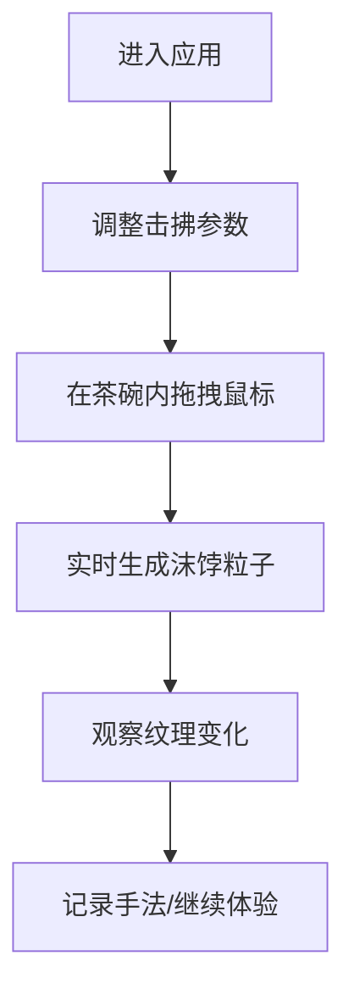
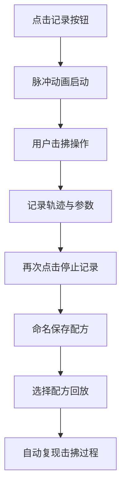
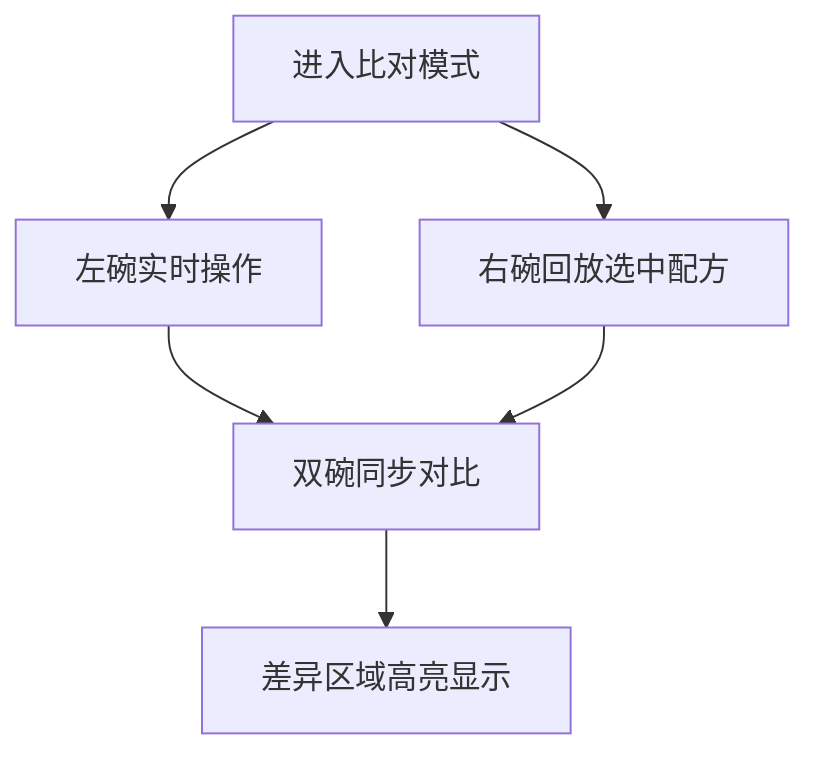

## 1. 产品概述

茶筅·击拂录是一款面向茶文化爱好者与教学场景的交互式茶道模拟应用。用户可通过鼠标拖拽在虚拟茶碗中模拟茶筅击拂动作，直观感受击拂力度、角度和频率对茶汤表面沫饽纹理的动态影响，并支持手法配方的记录、保存与复现对比。

- **目标用户**：茶文化爱好者、茶道教学者、茶艺学习者
- **核心价值**：将抽象的茶道手法转化为可视化的交互体验，降低学习门槛，提升茶文化传播效率

## 2. 核心功能

### 2.1 功能模块

1. **虚拟茶碗交互区**：Canvas 2D 渲染的茶碗，支持鼠标拖拽模拟茶筅击拂，实时生成沫饽粒子效果
2. **击拂参数调节面板**：力度、角度、速度三个滑块，实时影响沫饽生成与消散效果
3. **手法记录与回放**：记录击拂轨迹与参数组合，支持命名保存和多倍速回放
4. **纹理比对模式**：双茶碗并排显示，实时对比当前操作与选中配方的纹理差异

### 2.3 页面详情

| 页面名称 | 模块名称 | 功能描述 |
|---------|---------|---------|
| 主页面 | 顶部导航栏 | 应用名称、回放速度切换、保存按钮组 |
| 主页面 | 茶碗工作区 | 虚拟茶碗渲染、鼠标击拂交互、沫饽粒子动画 |
| 主页面 | 参数调节面板 | 力度/角度/速度滑块、角度刻度盘指示器 |
| 主页面 | 记录控制区 | 圆形记录按钮、脉冲动画、配方列表 |
| 主页面 | 纹理比对模式 | 双茶碗并排、差异区域高亮蒙版 |

## 3. 核心流程

### 3.1 击拂体验流程

### 3.2 记录与回放流程

### 3.3 纹理比对流程

## 4. 用户界面设计

### 4.1 设计风格

- **整体风格**：日式茶室和风设计，静谧雅致
- **主色调**：暗竹青 #2D3A2A、炭灰色 #1A1A1A、暗釉色 #4A3B32
- **点缀色**：茶金色 #C8A87C、沫饽白 #FFFFFF、记录红 #CC3333
- **字体**：Noto Serif SC（思源宋体），标题手写风格
- **交互反馈**：悬停色变 #D4B88C、按压缩放 0.95x、过渡 0.2s

### 4.2 页面布局

- **顶部导航栏**：高度 60px，半透明背景 #1A1A1A/0.9，底部 2px 实线 #4A5A3A
- **中央工作区**：宽 800px，高 600px，和纸纹理背景 #F5F0E1，居中显示
- **右侧参数面板**：宽 280px，半透磨砂玻璃效果 #2A2A2A/0.8，固定靠右
- **底部边距**：40px

### 4.3 关键视觉元素

| 元素 | 规格 |
|-----|-----|
| 茶碗 | 口径 12 单位，碗壁倾斜 15°，内壁 #4A3B32，碗底 #2D1F1A |
| 茶碗投影 | 模糊 12px，Y 偏移 +3px，颜色 #000/0.4 |
| 沫饽粒子 | 数量 100-500，大小 2-6px，透明度 0.6-0.9 |
| 记录按钮 | 直径 48px，红色 #CC3333，脉冲光圈动画 |
| 滑块 | 阻尼动画 0.3s，实时数值显示 |

### 4.4 响应式适配

- 适配 1920x1080 与 1440x900 分辨率
- 茶碗工作区居中，参数面板靠右固定
- 桌面端优先设计

### 4.5 性能要求

- 目标帧率：60FPS
- 500 粒子时最低帧率：≥ 50FPS
- Canvas 2D 渲染优化
