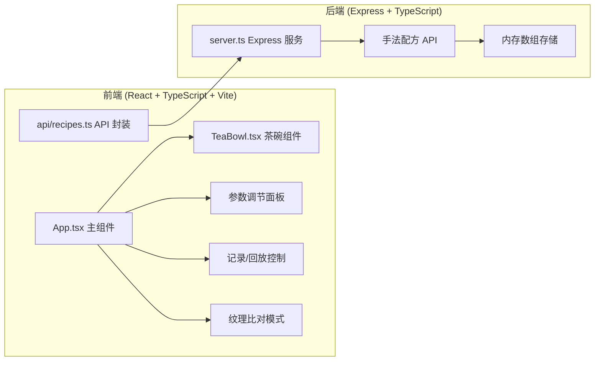

## 1. 架构设计



## 2. 技术描述

- **前端框架**：React 18 + TypeScript
- **构建工具**：Vite 5
- **后端框架**：Express 4
- **渲染技术**：Canvas 2D API
- **状态管理**：React useReducer
- **HTTP 通信**：fetch API + CORS
- **开发语言**：TypeScript 5（严格模式，target ES2020）

## 3. 文件结构

```
auto196/
├── package.json
├── index.html
├── vite.config.js
├── tsconfig.json
├── server.ts
├── src/
│   ├── App.tsx
│   └── TeaBowl.tsx
├── api/
│   └── recipes.ts
└── .trae/
    └── documents/
        ├── PRD.md
        └── tech-architecture.md
```

## 4. API 定义

### 4.1 获取配方列表

```typescript
// GET /api/recipes
interface Recipe {
  id: string;
  name: string;
  createdAt: number;
  params: {
    force: number;
    angle: number;
    speed: number;
  };
  trajectory: Array<{
    x: number;
    y: number;
    timestamp: number;
    force: number;
    speed: number;
  }>;
}

// Response: Recipe[]
```

### 4.2 保存配方

```typescript
// POST /api/recipes
// Request Body: Omit<Recipe, 'id' | 'createdAt'>
// Response: Recipe (with generated id)
```

## 5. 数据模型

### 5.1 手法配方 (Recipe)

| 字段 | 类型 | 说明 |
|-----|------|-----|
| id | string | 唯一标识（UUID） |
| name | string | 配方名称，如"春风拂面" |
| createdAt | number | 创建时间戳 |
| params | object | 击拂参数快照 |
| params.force | number | 力度 0-100 |
| params.angle | number | 角度 0-45 度 |
| params.speed | number | 速度 0-10 |
| trajectory | array | 击拂轨迹点数组 |
| trajectory[].x | number | 相对茶碗中心的 X 坐标 |
| trajectory[].y | number | 相对茶碗中心的 Y 坐标 |
| trajectory[].timestamp | number | 时间戳（ms） |
| trajectory[].force | number | 瞬时力度 |
| trajectory[].speed | number | 瞬时速度 |

### 5.2 沫饽粒子 (Particle)

| 字段 | 类型 | 说明 |
|-----|------|-----|
| x | number | X 坐标 |
| y | number | Y 坐标 |
| vx | number | X 方向速度 |
| vy | number | Y 方向速度 |
| size | number | 粒子大小 2-6px |
| opacity | number | 透明度 0.6-0.9 |
| life | number | 剩余生命周期 |
| maxLife | number | 最大生命周期 |

## 6. 核心算法

### 6.1 击拂轨迹记录

- 监听 mousedown/mousemove/mouseup 事件
- 根据移动距离和时间差计算瞬时速度
- 将屏幕坐标转换为茶碗相对坐标
- 限制轨迹点采样频率（约 60 点/秒）

### 6.2 沫饽粒子生成

- 根据力度参数决定生成数量
- 在击拂点周围随机分布粒子
- 粒子初始速度沿击拂方向散开
- 粒子大小随力度变化

### 6.3 粒子物理更新

- 每帧更新粒子位置（速度 × 时间步长）
- 速度衰减模拟液体阻力
- 透明度随生命周期线性衰减
- 超出茶碗边缘的粒子反弹或消除

### 6.4 纹理差异检测

- 双碗粒子位置网格化采样
- 对比相同网格单元内的粒子密度
- 密度差超过阈值的区域标记为差异
- 半透明红色蒙版叠加显示

## 7. 性能优化策略

1. **对象池**：粒子对象复用，避免频繁 GC
2. **requestAnimationFrame**：与显示器刷新率同步
3. **离屏 Canvas**：茶碗背景预渲染
4. **粒子数量限制**：动态调整，保证 50FPS 以上
5. **批量绘制**：使用 Path2D 批量绘制粒子
