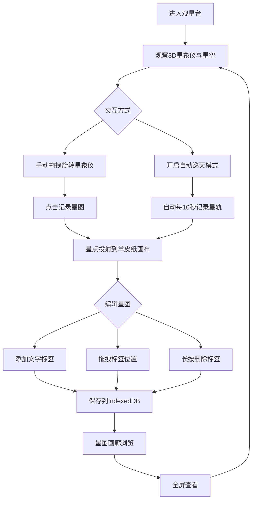

## 1. 产品概述

古代星象仪观测与星图绘制系统——让用户像古代天文学家一样，通过操作可旋转的3D星象仪观察不同经纬度下的星空，并在虚拟羊皮纸上绘制星图，体验古法天文观测与记录。
- 目标用户：天文爱好者、历史文化爱好者、教育场景
- 核心价值：沉浸式古代天文观测体验，结合科学数据与古典美学

## 2. 核心功能

### 2.1 功能模块

1. **观星台主页面**：3D星象仪交互、星空背景、坐标显示、记录按钮、星图画布、操作说明、星图画廊

### 2.2 页面详情

| 页面名称 | 模块名称 | 功能描述 |
|----------|----------|----------|
| 观星台主页面 | 3D星象仪 | 由三个青铜色金属环组成，最大环直径6单位，表面有刻度纹路和古篆文字(#C8A96E)，内环嵌套金色小球(#F5D742)代表太阳，外环可鼠标拖拽绕Y轴旋转，0.3秒惯性阻尼 |
| 观星台主页面 | 星空背景 | Canvas生成2000颗随机闪烁星点，亮度0.3-1.0，闪烁周期2-4秒随机 |
| 观星台主页面 | 坐标显示 | 左下角固定显示当前赤经赤纬坐标值，等宽字体#9CA3AF |
| 观星台主页面 | 记录星图按钮 | 铜绿渐变(#2D5016→#1A3A0A)，圆角8px，点击涟漪动画0.5秒，将亮度>0.6星点投射到羊皮纸画布 |
| 观星台主页面 | 羊皮纸星图画布 | 背景#E8D5A3，400x500px，纹理杂点透明度0.05，烧焦边缘#6B4226，星点2-6px(#1A2A0A)，星座连线 |
| 观星台主页面 | 文字标签 | 点击空白弹出输入框(圆角4px,边框#8B6914)，古风楷体#3A2A1A，14px，最长10字，可拖拽(0.2s缓动)，长按删除(气泡确认框圆角6px,红色按钮#DC2626) |
| 观星台主页面 | 自动巡天模式 | 滑块开关，0.003rad/frame匀速旋转，每10秒自动追加一帧星轨，最多50帧后清除最旧帧 |
| 观星台主页面 | 星图画廊 | 网格布局缩略图(200x150px,圆角4px)，悬停上浮2px阴影加深，点击全屏查看(蒙层#00000099)，ESC/点击蒙层关闭 |
| 观星台主页面 | 操作说明面板 | 左侧固定宽度220px，灰色背景#1E293B，半透明0.9 |
| 观星台主页面 | 状态栏 | 底部高度40px，显示当前时间、记录数量 |

## 3. 核心流程

用户进入观星台 → 观察星空和星象仪 → 拖拽旋转星象仪查看不同经纬度 → 点击"记录星图"将当前视角星点投射到羊皮纸 → 在星图上添加文字标签/拖拽/删除 → 可开启自动巡天模式持续记录星轨 → 在画廊中浏览历史星图记录

## 4. 界面设计

### 4.1 设计风格

- 主色调：深靛蓝(#0F172A) + 羊皮纸黄(#E8D5A3) + 古铜色(#8C6E2A)
- 按钮风格：圆润圆角，微妙渐变，铜绿色系
- 字体：思源宋体(Noto Serif SC)为主字体，等宽字体用于坐标显示
- 布局：左中右三栏(操作说明220px | 星象仪flex:1 | 星图画布450px)，底部状态栏40px
- 图标风格：古典天文学符号风格，简洁线条

### 4.2 页面设计概览

| 页面名称 | 模块名称 | UI元素 |
|----------|----------|--------|
| 观星台 | 星象仪区域 | 深靛蓝背景，青铜色3D环，金色太阳球，2000颗闪烁星点，等宽坐标文字 |
| 观星台 | 记录按钮 | 铜绿渐变，圆角8px，点击涟漪0.5s |
| 观星台 | 羊皮纸画布 | #E8D5A3底色，烧焦边缘，杂点纹理，古风星点与连线 |
| 观星台 | 标签输入框 | 圆角4px，#8B6914边框，古风楷体 |
| 观星台 | 操作说明面板 | #1E293B半透明，220px固定宽 |
| 观星台 | 状态栏 | 40px高度，当前时间和记录数量 |
| 观星台 | 画廊缩略图 | 200x150px，圆角4px，悬停上浮+阴影 |
| 观星台 | 全屏查看 | #00000099蒙层，星图居中，ESC关闭 |

### 4.3 响应式设计

- 桌面优先设计，三栏布局在大屏最佳
- 中等屏幕时左侧面板可收起
- 移动端暂不做适配，专注桌面体验

### 4.4 3D场景指导

- 环境：深靛蓝夜空氛围，模拟古代观星台
- 光照：微弱环境光+金色太阳球自发光，营造古典神秘感
- 相机：固定透视相机，中心对准星象仪
- 交互：外环Y轴拖拽旋转+惯性阻尼0.3秒
- 性能：2000星点60fps稳定，单帧渲染<16ms
