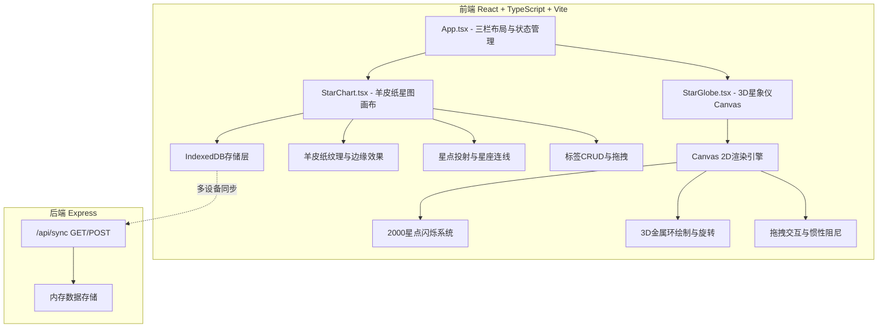
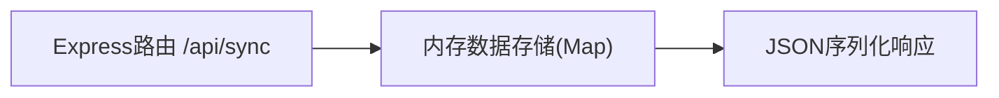
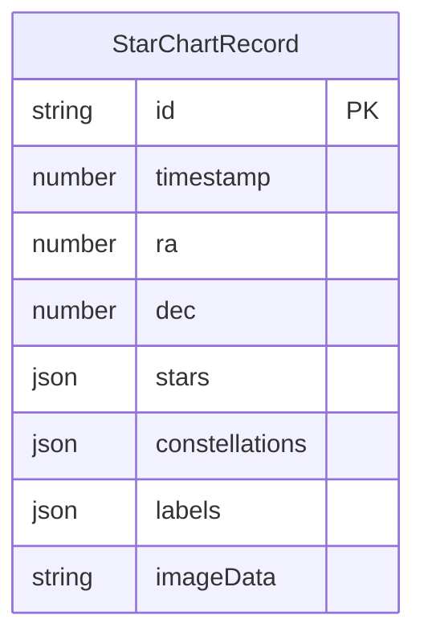

## 1. 架构设计



## 2. 技术说明

- 前端：React@18 + TypeScript + Vite + Tailwind CSS
- 初始化工具：vite-init (react-express-ts模板)
- 后端：Express@4，端口4000
- 数据库：IndexedDB(浏览器端主存储) + Express内存变量(同步辅助)
- 3D渲染：纯Canvas 2D API（性能可控，无WebGL依赖）

## 3. 路由定义

| 路由 | 用途 |
|------|------|
| / | 观星台主页面（唯一页面，所有功能集成） |

## 4. API定义

### 4.1 数据同步接口

```typescript
interface StarChartRecord {
  id: string;
  timestamp: number;
  ra: number;
  dec: number;
  stars: Array<{ x: number; y: number; brightness: number; size: number }>;
  constellations: Array<Array<[number, number]>>;
  labels: Array<{ id: string; text: string; x: number; y: number }>;
  imageData: string;
}

// GET /api/sync - 获取所有同步记录
// Response: { records: StarChartRecord[] }

// POST /api/sync - 上传星图记录用于同步
// Request: { record: StarChartRecord }
// Response: { success: boolean, id: string }
```

## 5. 服务端架构图



## 6. 数据模型

### 6.1 IndexedDB数据模型



### 6.2 文件结构

```
├── package.json
├── index.html
├── vite.config.js
├── tsconfig.json
├── server.js
└── src/
    ├── App.tsx
    ├── StarGlobe.tsx
    └── StarChart.tsx
```
