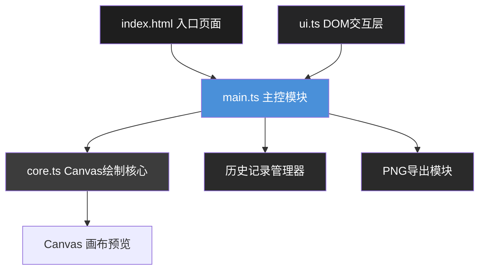

## 1. 架构设计



## 2. 技术描述

- **前端**：TypeScript + 原生JavaScript API（无UI框架）
- **构建工具**：Vite 5.x
- **语言**：TypeScript（严格模式，ES2020目标）
- **模块系统**：ESNext
- **渲染引擎**：HTML5 Canvas 2D API

## 3. 目录结构

```
project/
├── index.html              # 入口HTML
├── package.json            # 项目配置
├── vite.config.js          # Vite配置
├── tsconfig.json           # TypeScript配置
└── src/
    ├── core.ts             # Canvas绘制核心
    ├── ui.ts               # DOM交互与事件绑定
    └── main.ts             # 主控模块
```

## 4. 模块职责与调用关系

### 4.1 core.ts - Canvas绘制核心

**职责**：负责所有Canvas绘制操作，接收文本字符串和样式对象，逐字符绘制到画布。

**导出接口**：
```typescript
// 单个字符样式
interface CharStyle {
  fontSize: number;      // 字号 8-120px
  letterSpacing: number; // 字距 -10~20px
  baselineOffset: number;// 基线偏移 -20~20px
}

// 全局样式
interface GlobalStyle {
  gradientStart: string; // 渐变起始色
  gradientEnd: string;   // 渐变结束色
  gradientAngle: number; // 渐变角度 0-360°
  shadowOffsetX: number; // 投影X偏移 0-20px
  shadowOffsetY: number; // 投影Y偏移 0-20px
  shadowBlur: number;    // 投影模糊 0-15px
  shadowColor: string;   // 投影颜色
}

// 完整样式
interface TextStyle {
  text: string;
  charStyles: CharStyle[];
  global: GlobalStyle;
}

// 绘制函数
function drawText(
  ctx: CanvasRenderingContext2D,
  style: TextStyle,
  width: number,
  height: number
): ImageData;

// 获取字符位置信息
function getCharPositions(
  ctx: CanvasRenderingContext2D,
  style: TextStyle,
  width: number,
  height: number
): Array<{ x: number; y: number; width: number; height: number }>;
```

**被调用者**：main.ts

### 4.2 ui.ts - DOM交互层

**职责**：创建DOM交互面板，绑定事件监听，读取用户输入并生成样式对象。

**导出接口**：
```typescript
interface UIEvents {
  onStyleChange: (style: TextStyle) => void;
  onCharClick: (charIndex: number) => void;
  onUndo: () => void;
  onRedo: () => void;
  onExport: () => void;
}

function initUI(events: UIEvents): void;
function updateFloatingPanel(charIndex: number, style: CharStyle): void;
function showFloatingPanel(x: number, y: number): void;
function hideFloatingPanel(): void;
function highlightChar(index: number | null): void;
```

**数据流向**：DOM事件 → ui.ts事件处理 → 调用main.ts回调 → 传递样式对象

**调用者**：main.ts

### 4.3 main.ts - 主控模块

**职责**：初始化Canvas和UI，管理状态与历史记录，协调core.ts和ui.ts。

**核心功能**：
```typescript
// 状态管理
let currentStyle: TextStyle;
let history: TextStyle[] = [];
let historyIndex: number = -1;
const MAX_HISTORY = 10;

// 渲染节流
let renderPending: boolean = false;
function scheduleRender(): void;
function render(): void;

// 历史记录
function saveHistory(): void;
function undo(): void;
function redo(): void;

// 导出
function exportPNG(): void;
```

**调用关系**：
- main.ts → ui.ts.initUI() 初始化UI
- ui.ts → main.ts 回调传递样式变化
- main.ts → core.ts.drawText() 执行绘制
- main.ts → 调度requestAnimationFrame节流

## 5. 类型定义

```typescript
// 字符样式
interface CharStyle {
  fontSize: number;
  letterSpacing: number;
  baselineOffset: number;
}

// 全局样式
interface GlobalStyle {
  gradientStart: string;
  gradientEnd: string;
  gradientAngle: number;
  shadowOffsetX: number;
  shadowOffsetY: number;
  shadowBlur: number;
  shadowColor: string;
}

// 完整样式对象
interface TextStyle {
  text: string;
  charStyles: CharStyle[];
  global: GlobalStyle;
}

// 字符位置信息
interface CharPosition {
  index: number;
  char: string;
  x: number;
  y: number;
  width: number;
  height: number;
}
```

## 6. 性能优化策略

1. **requestAnimationFrame节流**：所有参数变化通过scheduleRender()调度，避免重复绘制
2. **字符位置缓存**：计算一次字符位置后缓存，减少重复measureText调用
3. **历史记录深拷贝**：使用结构化克隆保存样式快照，确保30ms内恢复
4. **离屏Canvas**：导出时使用离屏Canvas绘制1024x600px高清图
5. **事件委托**：字符点击/悬停使用Canvas坐标检测，避免DOM元素过多

## 7. 初始化数据

```typescript
// 默认样式
const defaultStyle: TextStyle = {
  text: "Hello, World!",
  charStyles: Array(13).fill(null).map(() => ({
    fontSize: 48,
    letterSpacing: 0,
    baselineOffset: 0
  })),
  global: {
    gradientStart: "#000000",
    gradientEnd: "#000000",
    gradientAngle: 0,
    shadowOffsetX: 0,
    shadowOffsetY: 0,
    shadowBlur: 0,
    shadowColor: "#000000"
  }
};
```
