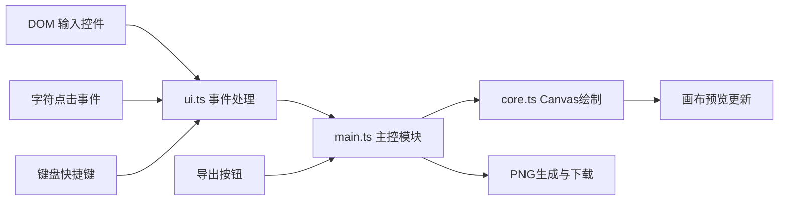

## 1. 产品概述

基于Canvas的交互式文本海报排版与特效生成Web应用，帮助设计师和前端开发者快速创建排版精美的文本海报。用户可在画布上输入文本、调整字符级属性并叠加渐变填充和投影效果，最终导出高清PNG海报。

- 目标用户：设计师、前端开发者、创意工作者
- 核心价值：简化字符级精细排版流程，提供直观的渐变与阴影效果预览，快速生成专业级海报

## 2. 核心特性

### 2.1 用户角色

| 角色 | 注册方式 | 核心权限 |
|------|----------|----------|
| 普通用户 | 无需注册，直接使用 | 完整的海报编辑、预览、导出功能 |

### 2.2 功能模块

1. **字符级精细排版**：点击字符弹出浮动面板，独立调整字号、字距、基线偏移
2. **渐变填充与阴影**：双色线性渐变、角度控制、投影偏移/模糊/颜色调整
3. **高清PNG导出**：1024x600px分辨率导出，自动命名下载
4. **撤销/重做**：10步历史记录，支持快捷键操作
5. **实时预览**：参数修改即时更新画布，字符悬停高亮提示

### 2.3 页面详情

| 页面名称 | 模块名称 | 功能描述 |
|---------|----------|----------|
| 主页面 | 左侧控制面板 | 文本输入、渐变设置、阴影设置、撤销重做按钮 |
| 主页面 | 右侧画布区域 | 800x400px白色画布，实时预览文本效果 |
| 主页面 | 浮动属性面板 | 字符级属性调整（字号、字距、基线偏移） |
| 主页面 | 导出按钮 | 圆形导出按钮，生成并下载PNG |

## 3. 核心流程

### 3.1 主要用户流程

用户进入应用 → 输入文本内容 → 点击字符调整属性 → 设置渐变和阴影效果 → 预览效果 → 导出PNG海报

### 3.2 数据流向

## 4. 用户界面设计

### 4.1 设计风格

- **主题**：暗色专业设计工具风格
- **主色调**：#1E1E1E（背景）、#252526（面板）、#4A90D9（强调色）
- **按钮样式**：导出按钮为圆形48px，悬停外发光，按下缩放0.95
- **字体**：等宽字体用于参数标签，系统无衬线字体用于正文
- **布局风格**：左右分栏布局，左侧控制面板，右侧画布区域
- **滑块样式**：4px高度轨道，12px直径滑块圆点，#4A90D9颜色

### 4.2 页面设计概述

| 页面名称 | 模块名称 | UI元素 |
|---------|----------|--------|
| 主页面 | 控制面板 | 文本输入框、渐变颜色拾取器、角度滑块、阴影参数组、撤销/重做按钮 |
| 主页面 | 画布区域 | 800x400px白色画布，圆角暗影，边框1px #E0E0E0 |
| 主页面 | 浮动面板 | 半透明#2A2A2A背景，圆角8px，backdrop-filter模糊，字号/字距/基线偏移滑块 |
| 主页面 | 导出按钮 | 圆形48px，#4A90D9背景，白色箭头图标，悬停外发光#6AB0FF |

### 4.3 响应式

桌面端优先设计，最小支持1280px宽度，画布居中显示。

### 4.4 交互细节

- 字符悬停显示淡蓝色矩形高亮框（#4A90D9，透明度0.3）
- 滑块使用requestAnimationFrame节流，确保50ms内响应
- 历史记录切换30ms内恢复
- 快捷键支持：Ctrl+Z撤销，Ctrl+Shift+Z重做

## 5. 性能约束

- 20个以上字符绘制，参数修改响应时间 ≤ 50ms
- 撤销/重做快照恢复时间 ≤ 30ms
- 使用requestAnimationFrame进行绘制节流
