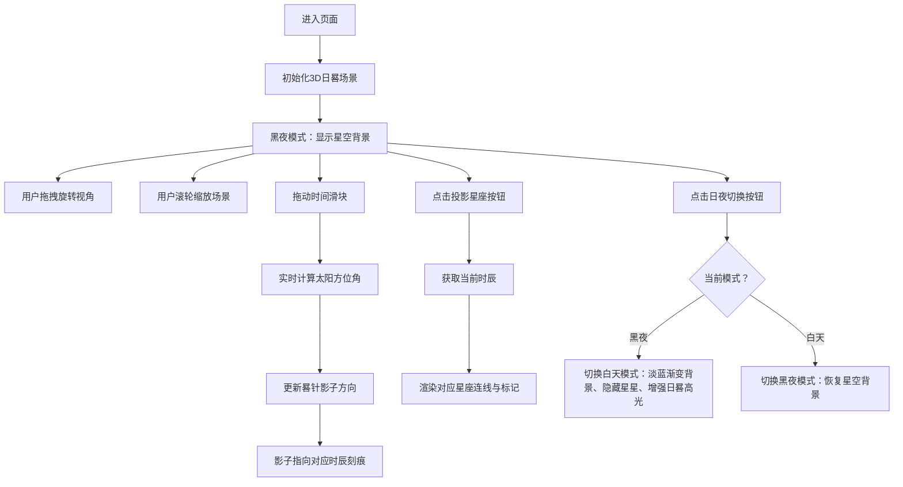

## 1. 产品概述
交互式3D日晷与星座投影天文演示应用，为天文爱好者和教育场景提供直观的太阳位置与星座关系可视化体验。
- 主要用途：模拟不同经纬度、时间下的日晷影子变化及对应时辰的星座投影，解决传统教学中难以直观展示天文现象的问题
- 目标用户：天文爱好者、学生、教育工作者
- 产品价值：将抽象的天文概念转化为可交互的3D视觉体验，提升学习和探索的趣味性

## 2. 核心特性

### 2.1 用户角色
| 角色 | 注册方式 | 核心权限 |
|------|---------|---------|
| 访客用户 | 无需注册 | 浏览3D场景、调节时间、切换日夜模式、查看星座投影 |

### 2.2 功能模块
1. **3D日晷模型**：全3D青铜晷面、哑光银晷针、可旋转缩放交互
2. **星空背景系统**：300颗随机闪烁星星、日夜模式渐变切换
3. **影子投影系统**：根据时间实时计算太阳方位角、驱动晷针影子旋转
4. **星座投影系统**：12时辰对应12星座连线投影、淡入动画效果
5. **信息面板系统**：实时显示模拟时间、季节、星座名称
6. **UI交互控制**：时间滑块、投影星座按钮、日夜切换按钮

### 2.3 页面详情
| 页面名称 | 模块名称 | 功能描述 |
|---------|---------|---------|
| 主页面 | 3D日晷场景 | 青铜晷面（直径6、厚0.3、刻12时辰）、晷针（高4、哑光银）、可拖拽旋转、滚轮缩放 |
| 主页面 | 星空背景 | 渐变星空（#0A0E27→#1F1344）、300颗闪烁星星、白天模式隐藏星星 |
| 主页面 | 影子系统 | 影子长度为晷针高度1.5倍、颜色深灰、随时间旋转、指向时辰刻痕 |
| 主页面 | 星座投影 | 点击按钮显示对应时辰星座、白色半透明连线、中心点标记文字 |
| 主页面 | 信息面板 | 右上角半透明卡片、显示时间/季节/星座名称 |
| 主页面 | 控制区 | 时间滑块（0-24小时）、投影星座按钮、日夜切换图标按钮 |

## 3. 核心流程
用户进入页面 → 查看默认3D日晷场景（黑夜模式）→ 拖拽旋转视角/滚轮缩放观察日晷 → 拖动时间滑块观察影子旋转 → 点击"投影星座"按钮查看当前时辰星座 → 切换日夜模式体验不同光照效果 → 阅读信息面板了解天文参数

## 4. 用户界面设计

### 4.1 设计风格
- **主色调**：古铜色（#B87333、#8B5E3C、#6B4226）与星空深蓝（#0A0E27、#1F1344）
- **强调色**：金色（#DAA520、#FFD700）、银色（#C0C0C0）
- **按钮风格**：青铜色渐变背景、圆角8px、悬停亮度提升20%、按下缩放0.95倍
- **字体**：等宽字体 'Courier New'，字号12px（星座标记）
- **布局风格**：卡片式信息面板、沉浸式3D场景、响应式横竖布局切换
- **视觉方向**：复古天文仪器金属质感 + 梦幻星空氛围，强调厚重历史感与宇宙神秘感的结合

### 4.2 页面设计概览
| 页面名称 | 模块名称 | UI元素 |
|---------|---------|-------|
| 主页面 | 3D日晷场景 | 晷面：青铜圆盘金色镶边、刻痕文字；晷针：哑光银立柱；光影：实时方向影子 |
| 主页面 | 星空背景 | 渐变背景、300颗随机星星（亮度0.2-1.0、周期2-4s闪烁） |
| 主页面 | 信息面板 | 右上角半透明黑卡片（#000000AA、圆角12px、宽220px、内边距16px） |
| 主页面 | 控制区域 | 底部时间滑块（宽200px、金色圆钮）、左侧青铜色按钮、右上角日夜圆形按钮 |
| 主页面 | 星座投影 | 白色半透明连线（#FFFFFF80、线宽1.5px、0.5s淡入）、白色标记文字 |

### 4.3 响应式设计
- **桌面端（>768px）**：横向布局，日晷场景居中，信息面板居右
- **移动端（≤768px）**：纵向堆叠，日晷场景占60%高度，信息面板占40%高度
- **触摸优化**：支持触摸拖拽旋转、双指缩放、滑块触摸响应

### 4.4 3D场景指引
- **环境氛围**：黑夜模式-深邃星空渐变、白天模式-柔和天空渐变
- **光照设置**：多光源组合，环境光+方向光模拟太阳光，白天模式提升材质光泽度40%
- **相机设置**：透视相机、初始距离适中、拖拽绕Y轴旋转（0-360°）、X轴俯仰（-90°~90°）、惯性阻尼0.85、滚轮缩放范围3-15单位、平滑过渡0.3s
- **构图焦点**：日晷居中为视觉主体，星空作为氛围背景，影子与星座投影为动态亮点
- **交互动画**：星座连线0.5s淡入、按钮过渡0.2-0.4s、滑块平滑响应、日夜切换渐变过渡
- **性能要求**：60FPS运行、拖拽旋转响应<50ms
