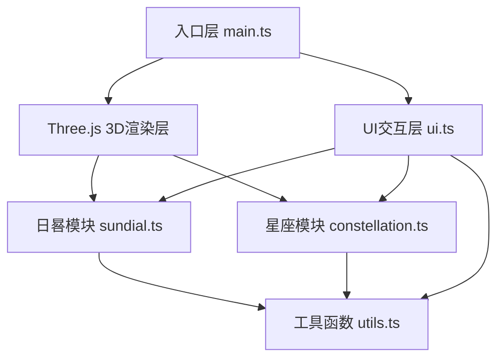

## 1. 架构设计
本项目为纯前端3D可视化应用，无后端服务。采用分层架构设计，将3D渲染、业务逻辑、UI交互清晰分离。



**架构说明：**
- **入口层 (main.ts)**：负责Three.js核心初始化（场景、相机、渲染器）、动画循环驱动、窗口事件绑定
- **日晷模块 (sundial.ts)**：构建晷面晷针网格、计算太阳方位角、管理影子投影
- **星座模块 (constellation.ts)**：12星座数据定义、根据时辰渲染连线投影
- **UI交互层 (ui.ts)**：DOM元素事件绑定、面板状态更新、动画过渡控制
- **工具函数层 (utils.ts)**：随机数、颜色插值、缓动函数、星座常量数据

## 2. 技术描述
- **前端框架**：无框架（原生TypeScript + DOM操作）
- **3D引擎**：Three.js r160+（原生Three.js，不使用React封装）
- **构建工具**：Vite 5.x（热更新、快速构建）
- **编程语言**：TypeScript 5.x（严格模式、ES2020目标）
- **类型定义**：@types/three
- **样式方案**：内联CSS + CSS变量（不使用Tailwind，保持原生轻量）
- **初始化方式**：手动创建项目文件结构（不使用脚手架）

## 3. 文件结构定义
| 文件路径 | 职责说明 |
|---------|---------|
| /package.json | 项目依赖与脚本配置 |
| /index.html | 入口页面、DOM容器、内联样式 |
| /vite.config.js | Vite构建配置、端口3000 |
| /tsconfig.json | TypeScript编译配置、严格模式 |
| /src/main.ts | 主入口：Three.js初始化、动画循环、resize处理 |
| /src/sundial.ts | 日晷核心：晷面晷针构建、太阳方位角计算、影子方向更新 |
| /src/constellation.ts | 星座投影：12星座点位连线数据、时辰映射、渲染逻辑 |
| /src/ui.ts | UI交互：按钮/滑块/切换按钮事件绑定、信息面板更新 |
| /src/utils.ts | 工具函数：随机数、星座常量、颜色插值、缓动函数 |

## 4. 核心数据结构定义

### 4.1 星座数据结构
```typescript
// 星座点位定义（归一化坐标，基于晷面平面）
interface ConstellationPoint {
  x: number;  // X坐标（相对晷面中心，单位与晷面对应）
  y: number;  // Y坐标（相对晷面中心）
  name?: string;  // 星点名称（可选）
}

// 星座连线定义
interface ConstellationLine {
  from: number;  // 起始点索引
  to: number;    // 终止点索引
}

// 完整星座数据
interface Constellation {
  name: string;  // 中文名称（如"水瓶座"）
  latinName: string;  // 拉丁名
  points: ConstellationPoint[];  // 星点集合
  lines: ConstellationLine[];  // 连线集合
  centerPoint: { x: number; y: number };  // 中心点（用于标记文字）
}

// 时辰-星座映射表
const SHICHEN_CONSTELLATION_MAP: Record<string, string> = {
  '子时': '水瓶座',
  '丑时': '双鱼座',
  '寅时': '白羊座',
  '卯时': '金牛座',
  '辰时': '双子座',
  '巳时': '巨蟹座',
  '午时': '狮子座',
  '未时': '处女座',
  '申时': '天秤座',
  '酉时': '天蝎座',
  '戌时': '射手座',
  '亥时': '摩羯座'
};
```

### 4.2 日晷状态结构
```typescript
interface SundialState {
  currentHour: number;  // 当前模拟小时 0-24
  currentMinute: number;  // 当前分钟 0-59
  season: '春' | '夏' | '秋' | '冬';  // 当前季节
  isDayMode: boolean;  // 是否白天模式
  showConstellation: boolean;  // 是否显示星座投影
  shadowAngle: number;  // 影子角度（弧度）
  currentShichen: string;  // 当前时辰（子丑寅卯...）
}
```

### 4.3 相机控制状态
```typescript
interface CameraControlState {
  theta: number;  // Y轴旋转角度 0-360°
  phi: number;    // X轴俯仰角度 -90°~90°
  radius: number; // 相机距离 3-15单位
  targetTheta: number;  // 目标theta（惯性过渡）
  targetPhi: number;    // 目标phi
  targetRadius: number; // 目标radius
  isDragging: boolean;  // 是否拖拽中
  lastX: number;  // 上一次鼠标X
  lastY: number;  // 上一次鼠标Y
  dampingFactor: number;  // 惯性阻尼系数 0.85
}
```

## 5. 核心算法说明

### 5.1 太阳方位角计算
```
输入：小时H (0-24), 分钟M (0-59)
将时间转换为一天中的进度：t = (H * 60 + M) / 1440
太阳角度（弧度）：solarAngle = t * 2π - π/2  （从12点方向逆时针计算）
影子角度 = 太阳角度 + π  （影子方向与太阳相反）
输出：影子角度（用于旋转影子几何体）
```

### 5.2 时辰判定
```
时辰范围定义：
子时: 23:00-01:00, 丑时: 01:00-03:00, 寅时: 03:00-05:00
卯时: 05:00-07:00, 辰时: 07:00-09:00, 巳时: 09:00-11:00
午时: 11:00-13:00, 未时: 13:00-15:00, 申时: 15:00-17:00
酉时: 17:00-19:00, 戌时: 19:00-21:00, 亥时: 21:00-23:00
```

### 5.3 缓动函数 (easeInOutQuad)
```
easeInOutQuad(t) = t < 0.5 ? 2*t*t : 1 - Math.pow(-2*t + 2, 2) / 2
用于所有平滑过渡动画（缩放、淡入淡出、相机移动）
```

### 5.4 相机惯性更新
```
每帧更新：
theta += (targetTheta - theta) * (1 - dampingFactor)
phi += (targetPhi - phi) * (1 - dampingFactor)
radius += (targetRadius - radius) * (1 - dampingFactor)
相机位置球面坐标转直角坐标：
x = radius * sin(phi) * cos(theta)
y = radius * cos(phi)
z = radius * sin(phi) * sin(theta)
```

## 6. 性能优化策略
1. **几何复用**：星星使用PointsGeometry合并渲染，避免300个独立Mesh
2. **材质共享**：相同属性的几何体共享Material实例
3. **帧率控制**：使用requestAnimationFrame，避免不必要的重绘
4. **CSS优化**：动画使用transform和opacity，避免触发layout
5. **事件节流**：拖拽事件使用requestAnimationFrame节流
