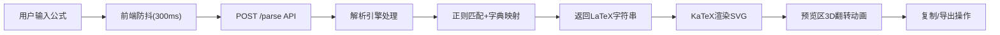

## 1. 产品概述

数学公式实时转LaTeX Web应用，旨在解决学术写作中手动编辑LaTeX繁琐且容易出错的痛点。用户通过自然语言或简写符号输入数学公式，系统实时转换为标准LaTeX代码并提供矢量排版预览。

- **目标用户**：学术研究人员、学生、科技写作者
- **核心价值**：大幅提升LaTeX公式编写效率，降低语法错误率

## 2. 核心功能

### 2.1 功能模块

1. **公式输入模块**：语法高亮输入框、预设示例按钮、实时校验
2. **公式解析模块**：自定义解析引擎、正则匹配、字典映射
3. **LaTeX渲染预览模块**：KaTeX渲染、SVG输出、缩放控制
4. **导出功能模块**：一键复制LaTeX源码、导出PNG图片（300dpi）

### 2.2 页面详情

| 页面名称 | 模块名称 | 功能描述 |
|-----------|-------------|---------------------|
| 主应用页 | 公式输入区 | 文本输入框支持语法高亮（运算符、变量、函数名分色）、5个预设示例一键填充 |
| 主应用页 | 公式预览区 | 右侧50%宽度显示KaTeX渲染结果，支持鼠标滚轮缩放（0.5x-3x） |
| 主应用页 | 操作工具栏 | 复制LaTeX按钮、导出PNG按钮、缩放控制 |

## 3. 核心流程

用户在输入框键入公式 → 前端防抖发送至后端API → 解析引擎通过正则+字典转换为LaTeX → 返回LaTeX字符串 → 前端KaTeX渲染SVG预览 → 用户可复制源码或导出PNG

## 4. 用户界面设计

### 4.1 设计风格

- **主色调**：#2c3e50（深蓝灰）
- **辅助色**：#3498db（亮蓝）
- **背景色**：#f5f7fa（浅灰蓝）
- **字体**：标题使用 'Playfair Display'，正文使用 'Source Sans Pro'，代码使用 'JetBrains Mono'
- **布局风格**：双栏并排卡片式布局，柔和阴影

### 4.2 页面设计概览

| 页面名称 | 模块名称 | UI元素 |
|-----------|-------------|-------------|
| 主应用页 | 顶部标题栏 | 渐变背景标题、副标题说明、图标装饰 |
| 主应用页 | 输入区卡片 | 发光脉冲边框输入框、预设按钮组（圆角矩形）、语法高亮着色 |
| 主应用页 | 预览区卡片 | 3D翻转容器、SVG渲染画布、缩放控制滑块 |
| 主应用页 | 底部操作栏 | 复制按钮、导出按钮，悬停缩放动效 |

### 4.3 响应式设计

- **桌面端（≥768px）**：左右双栏布局，各占约50%宽度，边缘20px安全间距
- **移动端（<768px）**：上下堆叠布局，输入区在上，预览区在下
- **触摸优化**：按钮最小尺寸48px，输入框支持软键盘

### 4.4 动画效果

- **输入框脉冲**：box-shadow 2s循环发光动画
- **预览翻转**：新LaTeX到达时沿Y轴旋转180度进场（0.6s，ease-in-out）
- **按钮悬停**：transform: scale(1.05)，0.3s过渡
- **页面加载**：内容渐入+轻微上移动画
