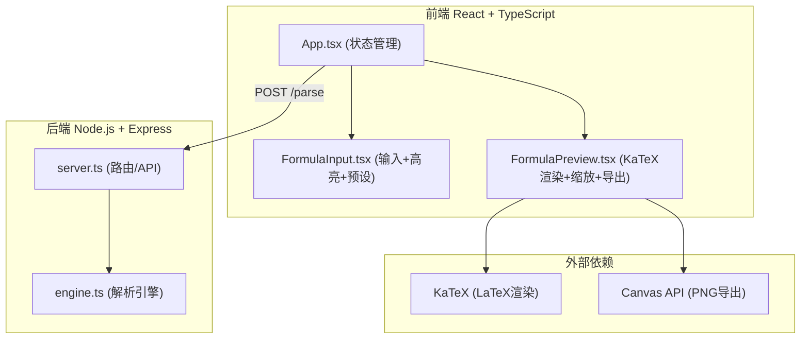

## 1. 架构设计



## 2. 技术选型

- **前端**：React@18 + TypeScript@5 + Vite@5
- **样式方案**：原生CSS（CSS Modules风格内联），不使用Tailwind（用户指定具体配色）
- **后端**：Express@4 + TypeScript
- **LaTeX渲染**：KaTeX（通过CDN + npm双重引入，保证渲染性能）
- **PNG导出**：Canvas 2D API（svg2canvas方案）

## 3. 项目文件结构

```
auto20/
├── package.json              # 前端依赖
├── index.html                # 入口HTML，含挂载点+KaTeX CDN
├── vite.config.js            # Vite配置
├── tsconfig.json             # TS配置（严格模式、ES2020）
├── src/
│   ├── App.tsx               # 主组件（状态管理、API调用）
│   ├── FormulaInput.tsx      # 输入组件（高亮、预设、校验）
│   └── FormulaPreview.tsx    # 预览组件（渲染、缩放、导出）
└── server/
    ├── package.json          # 后端依赖
    ├── server.ts             # Express服务端
    └── engine.ts             # 解析引擎（核心转换逻辑）
```

## 4. API 定义

### POST /parse

接收公式文本，返回LaTeX字符串。

**请求体：**
```typescript
interface ParseRequest {
  formula: string;
}
```

**响应体：**
```typescript
interface ParseResponse {
  latex: string;
  success: boolean;
  error?: string;
  parseTimeMs: number;
}
```

**示例：**
- 输入：`{ formula: "积分 sin(x) dx 从 0 到 pi" }`
- 输出：`{ latex: "\\int_{0}^{\\pi} \\sin(x) \\, dx", success: true, parseTimeMs: 12 }`

## 5. 解析引擎设计（engine.ts）

### 支持的10+种数学结构：

| 类别 | 输入示例 | LaTeX输出 |
|------|---------|-----------|
| 上下标 | `a^2 + b_0` | `a^{2} + b_{0}` |
| 分数 | `分数 1 2` 或 `1/2` | `\frac{1}{2}` |
| 根号 | `根号 x` 或 `sqrt(x)` | `\sqrt{x}` |
| n次根 | `n次根 3 x` | `\sqrt[3]{x}` |
| 积分 | `积分 sin(x) dx 从 a 到 b` | `\int_{a}^{b} \sin(x) \, dx` |
| 累加 | `累加 k 从 1 到 n k^2` | `\sum_{k=1}^{n} k^{2}` |
| 极限 | `极限 f(x) x 到 无穷` | `\lim_{x \to \infty} f(x)` |
| 矩阵 | `矩阵 [[1,2],[3,4]]` | `\begin{pmatrix} 1 & 2 \\ 3 & 4 \end{pmatrix}` |
| 三角函数 | `sin(x) + cos(theta)` | `\sin(x) + \cos(\theta)` |
| 括号 | `(a+b)*(c+d)` | `\left( a+b \right) \cdot \left( c+d \right)` |
| 分式/导数 | `d/dx f(x)` | `\frac{d}{dx} f(x)` |

### 处理顺序管道：
1. **中文关键字替换**（积分→\int，累加→\sum，无穷→\infty 等）
2. **函数名标准化**（sin→\sin，cos→\cos，log→\log 等）
3. **上下标处理**（正则匹配 ^ 和 _ 并包裹 {}）
4. **结构匹配**（分数、根号、积分、累加、极限、矩阵等模式）
5. **括号配对**（自动调整大小 \left...\right）
6. **运算符替换**（*→\cdot，>=→\geq，!=→\neq 等）

## 6. 性能指标

| 指标 | 目标值 |
|------|-------|
| 输入→预览总耗时 | ≤ 500ms（首次加载除外） |
| 后端解析延迟 | ≤ 50ms |
| 渲染精度 | SVG矢量，导出PNG ≥300dpi |
| 缩放范围 | 0.5x - 3x（鼠标滚轮） |
