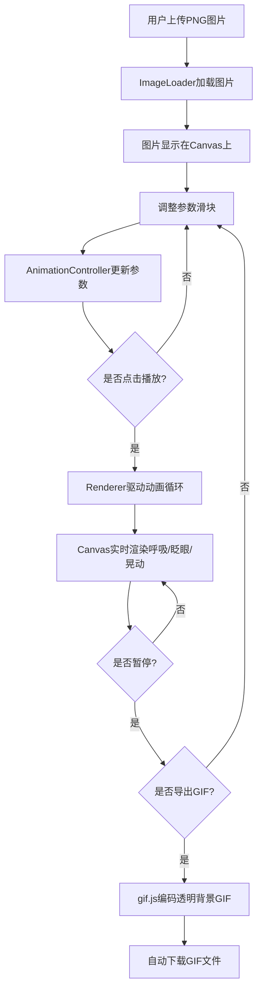

## 1. 产品概述

基于Canvas的交互式手绘角色呼吸动画生成Web应用，让插画师和设计团队将静态手绘风格角色PNG图片快速转换为带有呼吸、眨眼、头部微晃等细微动态的循环动画，支持实时参数调节和透明背景GIF导出。

- 解决逐帧绘制耗时且缺乏所见即所得参数调节能力的痛点
- 面向独立插画师和设计团队，提升角色动画制作效率

## 2. 核心功能

### 2.1 功能模块

1. **主工作区页面**：图片上传、画布预览、参数调节面板、动画控制、GIF导出

### 2.2 页面详情

| 页面名称 | 模块名称 | 功能描述 |
|---------|---------|---------|
| 主工作区 | 图片上传区 | 支持按钮点击或文件拖拽上传PNG角色图片（建议200x200到800x800），上传后图片立即显示在中央画布 |
| 主工作区 | 画布预览区 | 600x600画布，浅米色渐变背景，白色内阴影，动画播放时边缘有脉冲发光线 |
| 主工作区 | 参数调节面板 | 呼吸速率（0.25x-2x）、头部微晃幅度（0-15px）、眨眼间隔（1-8秒）滑块，实时数值显示 |
| 主工作区 | 动画控制 | 播放/暂停按钮，驱动呼吸动画循环播放 |
| 主工作区 | GIF导出 | 导出当前参数下1次完整呼吸周期（含2次眨眼）的透明背景GIF并自动下载 |

## 3. 核心流程

用户上传PNG图片 → 图片加载到Canvas → 调整动画参数（呼吸速率/头部晃动/眨眼间隔）→ 点击播放预览动画 → 满意后点击导出GIF → 自动下载透明背景GIF

## 4. 用户界面设计

### 4.1 设计风格

- 主色：泥土色系（#5C4A3E、#8B7D6B、#6B5B4D）
- 辅助色：深褐#3D2D1F（闭眼填充）、深灰#3A3026（文字）
- 背景色：暖灰#F0EDE8，画布渐变#F5F0E6到#E8E0D0
- 面板：半透明白色#FFFFFFD0，毛玻璃效果blur(8px)，圆角12px
- 按钮：圆角8px，低饱和度泥土色系，悬停变亮，过渡0.25s
- 滑块：定制圆钮直径16px，主色#8B7D6B
- 字体：温暖手写风格或衬线体
- 布局：居中画布+右侧面板，移动端面板移至底部

### 4.2 页面设计概览

| 页面名称 | 模块名称 | UI元素 |
|---------|---------|--------|
| 主工作区 | 图片上传区 | 虚线边框2px #A09387，圆角16px，内部提示文字，拖拽时实线边框#6B5B4D+淡黄光晕#E8D5A360 |
| 主工作区 | 画布预览区 | 600x600 Canvas，浅米色渐变背景，白色内阴影#D0C8B8，播放时边缘脉冲发光线#A09387 |
| 主工作区 | 参数面板 | 宽260px，毛玻璃背景，3个定制滑块，数值实时显示 |
| 主工作区 | 播放按钮 | 深褐#5C4A3E，圆角8px，悬停#7A6652，文字切换播放/暂停 |
| 主工作区 | 导出按钮 | 颜色#6B5B4D，悬停#8A7868，位于播放按钮下方 |

### 4.3 响应式设计

- 桌面端优先：画布居中，参数面板在右侧260px
- 移动端（768px以下）：参数面板移至底部，宽度100%
- 所有交互元素过渡动画0.25s ease
