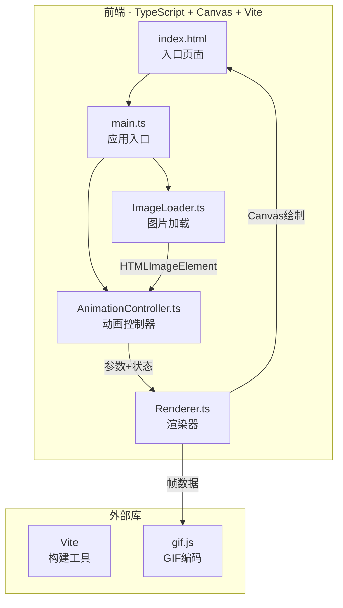

## 1. 架构设计



### 数据流向

1. **用户操作** → `index.html`（UI事件）
2. **图片上传** → `ImageLoader.ts`（加载PNG）→ `HTMLImageElement`
3. **图片传递** → `AnimationController.ts`（接收图片+参数）
4. **参数变化** → `AnimationController.ts`（更新参数）→ `Renderer.ts`
5. **动画循环** → `AnimationController.ts`（requestAnimationFrame驱动）→ `Renderer.ts`（每帧绘制）
6. **GIF导出** → `Renderer.ts`（逐帧编码）→ `gif.js`（生成GIF）→ 自动下载

## 2. 技术说明

- **前端**：TypeScript + 原生Canvas API（无React/Vue框架）
- **构建工具**：Vite（开发服务器端口3000）
- **GIF编码**：gif.js（Web Worker加速编码）
- **语言**：TypeScript（严格模式，target ES2020，moduleResolution bundler）
- **无后端**：纯前端应用，所有计算在浏览器端完成

## 3. 文件结构与职责

```
project/
├── package.json              # 依赖：typescript, vite, gif.js；脚本：npm run dev
├── vite.config.js            # 构建配置，入口index.html，端口3000
├── tsconfig.json             # 严格模式，target ES2020，moduleResolution bundler
├── index.html                # 入口页面，浅灰背景#F0EDE8，全屏居中
└── src/
    ├── main.ts               # 应用入口：初始化Canvas、注册事件监听
    ├── ImageLoader.ts        # 从input或拖拽加载PNG，返回HTMLImageElement
    ├── AnimationController.ts # 核心控制器：接收图片和参数，驱动动画循环
    └── Renderer.ts           # Canvas绘制逻辑：呼吸变形、眨眼裁剪、晃动、导出
```

### 模块间调用关系

| 调用方 | 被调用方 | 交互方式 |
|-------|---------|---------|
| main.ts | ImageLoader | 初始化图片加载器，注册回调 |
| main.ts | AnimationController | 创建控制器，传入图片和参数 |
| ImageLoader | AnimationController | 加载完成后传递HTMLImageElement |
| AnimationController | Renderer | 每帧调用Renderer.draw() |
| Renderer | gif.js | 导出时逐帧编码 |

## 4. 核心算法设计

### 4.1 呼吸动画

- 使用正弦函数 `Math.sin(time * breathRate * Math.PI * 2)` 驱动周期性变化
- 呼吸效果：整体头像上下微动（Y轴位移），幅度由参数控制
- 头部微晃：X轴小幅正弦偏移，相位偏移90度与呼吸错开
- 眨眼：定时触发，持续0.1秒，通过裁剪眼睛区域并填充深褐色#3D2D1F实现

### 4.2 Canvas绘制流程

1. 清空画布，绘制渐变背景
2. 计算当前帧的偏移量和变形参数
3. 使用Canvas 2D变换（translate + scale）绘制角色图片
4. 如果处于眨眼帧，裁剪眼睛区域并填充闭眼色
5. 绘制脉冲发光边框（动画播放时）

### 4.3 GIF导出

1. 计算一个完整呼吸周期的帧数
2. 禁用实时播放，逐帧计算参数并绘制到离屏Canvas
3. 将每帧像素数据传给gif.js编码
4. 编码完成后触发自动下载

## 5. 性能目标

- 动画循环维持30FPS以上（800x800图片，呼吸2x，晃动15px，眨眼1s）
- GIF导出耗时不超过5秒
- 参数调整后重新渲染延迟低于100ms
