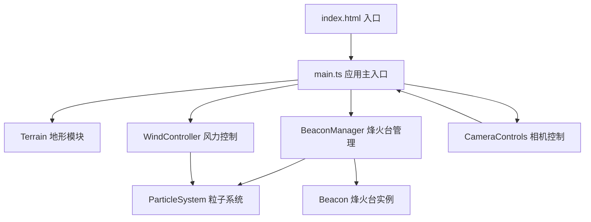

## 1. 架构设计



## 2. 技术说明

- 前端：Three.js r160 + TypeScript 5.4 + Vite 5.2
- 初始化工具：Vite vanilla-ts 模板
- 后端：无（纯前端应用）
- 数据库：无
- 关键依赖：three、@types/three

## 3. 目录结构

```
auto202/
├── index.html              # 入口页面
├── package.json            # 项目依赖
├── vite.config.js          # Vite构建配置
├── tsconfig.json           # TypeScript配置
└── src/
    ├── main.ts             # 应用主入口
    ├── utils/
    │   └── perlin.ts       # Perlin噪声实现
    └── modules/
        ├── terrain.ts      # 地形生成模块
        ├── beaconManager.ts# 烽火台管理模块
        ├── beacon.ts       # 单烽火台类
        ├── particleSystem.ts # 粒子系统
        ├── windController.ts # 风力控制模块
        └── cameraControls.ts # 相机控制模块
```

## 4. 模块职责

### 4.1 terrain.ts - 地形模块
- 使用Perlin噪声生成256x256高度图
- 创建PlaneGeometry + BufferGeometry，顶点Y值映射高度-1到2
- 顶点颜色从#4A7C59到#6B8E23渐变（根据高度）
- 随机生成50棵不重叠树木（CylinderGeometry树干 + SphereGeometry树冠）
- 暴露getTerrainHeight(x, z)方法用于烽火台贴地

### 4.2 beaconManager.ts - 烽火台管理
- 维护Beacon实例数组
- Raycaster检测地形点击，放置Beacon
- 提供放置预览（半透明金色圆环）
- 重置/清空所有烽火台接口
- 统计点燃烽火总数

### 4.3 beacon.ts - 烽火台类
- 构建十字形木架结构（CylinderGeometry组合）
- 三个火焰插槽（SphereGeometry，可点击）
- 点燃动画：火焰ConeGeometry从scale 0→1（0.5秒easeOut）
- 火焰粒子系统：每秒30个，颜色#FF4500→#FFD700，寿命0.5-1.5s
- 烟雾粒子系统：颜色#CCCCCC，透明度0.3-0.6，受风力偏移

### 4.4 particleSystem.ts - 粒子系统
- 通用粒子池（上限500个）
- 支持位置、速度、颜色、大小、寿命参数
- update(dt)方法更新粒子状态，回收过期粒子
- Points材质 + BufferGeometry实现高效渲染

### 4.5 windController.ts - 风力控制
- 风向箭头可视化（红色ArrowHelper，长度1单位）
- 风速范围：-2 ~ 2
- 风向角度：0° ~ 360°
- 计算风向量：windX = speed * cos(angle), windZ = speed * sin(angle)
- 生成原生HTML控制面板UI

### 4.6 cameraControls.ts - 相机控制
- 鼠标拖拽旋转（灵敏度0.003）
- 滚轮缩放（范围5-30单位）
- 自动环绕模式（默认关闭，0.2rad/s绕Y轴旋转）
- 球坐标系统管理相机位置

## 5. 核心数据模型

### 5.1 类型定义

```typescript
interface WindParams {
  speed: number;      // -2 ~ 2
  angle: number;      // 0 ~ 360 (degrees)
  vector: THREE.Vector3;
}

interface BeaconSlot {
  index: number;      // 0, 1, 2
  lit: boolean;
  mesh: THREE.Mesh;
  flameMesh: THREE.Mesh;
}

interface Particle {
  position: THREE.Vector3;
  velocity: THREE.Vector3;
  color: THREE.Color;
  size: number;
  life: number;       // remaining seconds
  maxLife: number;
}
```

## 6. 性能优化策略

1. **地形优化**：256x256网格使用单个BufferGeometry，顶点颜色渐变，单次draw call
2. **树木优化**：使用InstancedMesh渲染50棵树，合并draw call
3. **粒子限制**：全局粒子池上限500个，超出时回收最老粒子
4. **火焰优化**：未点燃的插槽不发射粒子，按需激活
5. **渲染循环**：requestAnimationFrame驱动，dt时间步进，避免固定帧率抖动
6. **材质复用**：相同材质的Mesh共享Material实例
