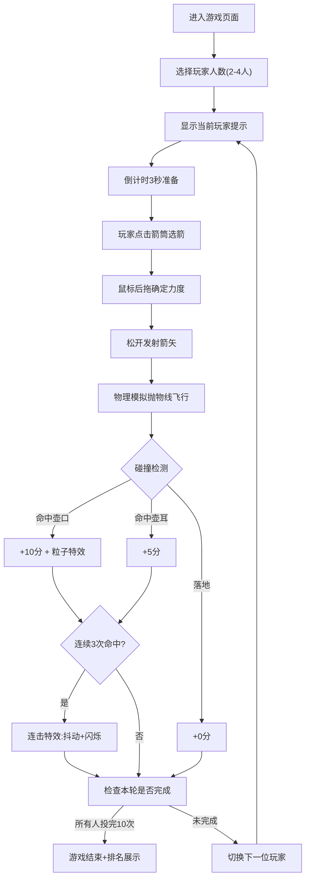

## 1. 产品概述

本产品是一款基于浏览器的古代投壶游戏交互式模拟器，旨在为传统文化教学、团建活动提供沉浸式的投壶规则体验、物理轨迹模拟和计分反馈系统。解决了现实活动中场地受限、道具缺失、规则不熟悉等问题。

- 核心价值：通过数字化方式还原传统礼仪投掷游戏，寓教于乐
- 目标用户：文化教育机构、企业团建组织者、传统文化爱好者

## 2. 核心功能

### 2.1 用户角色
不区分角色，所有用户均为游戏参与者

### 2.2 功能模块
1. **游戏主界面**：室内场景渲染、铜壶模型、箭筒展示、倒计时圆环
2. **投掷系统**：鼠标拖拽力度控制、抛物线物理计算、箭矢飞行尾迹
3. **计分系统**：命中判定（壶口10分/壶耳5分/落地0分）、连击特效、得分动画
4. **多人轮流模式**：2-4名玩家轮换投掷、当前玩家提示、10轮/人
5. **计分面板**：实时分数显示、玩家颜色标识、剩余投掷次数
6. **历史统计**：近5局得分柱状图、排名变化展示
7. **碰撞特效**：命中粒子爆发、壶身抖动、屏幕闪烁

### 2.3 页面详情
| 页面名称 | 模块名称 | 功能描述 |
|---------|---------|----------|
| 游戏主界面 | 场景渲染 | Canvas绘制仿红木+古铜色室内场景、铜壶兽纹浮雕、箭筒模型 |
| 游戏主界面 | 倒计时系统 | 壶口上方3秒弧形进度条，金色顺时针填充 |
| 游戏主界面 | 力度控制 | 鼠标后拖控制力度，绿到红渐变力度条 |
| 游戏主界面 | 物理模拟 | 抛物线轨迹、箭矢摇摆、尾迹效果 |
| 游戏主界面 | 碰撞判定 | 壶口命中、壶耳命中、落地判定 |
| 游戏主界面 | 特效系统 | 金色粒子爆发、屏幕抖动、全屏闪烁 |
| 计分面板 | 实时计分 | 多玩家分色显示、当前轮次提示 |
| 计分面板 | 玩家轮换 | 投掷完毕自动切换下一位玩家 |
| 历史统计 | 数据可视化 | 柱状图展示近5局得分与排名 |

## 3. 核心流程
进入游戏 → 选择玩家人数 → 玩家1开始投掷（点击箭筒→拖拽力度→松开发射） → 命中判定与计分 → 自动切换下一玩家 → 全部玩家10轮投掷完毕 → 显示最终排名 → 查看历史统计

## 4. 用户界面设计

### 4.1 设计风格
- **主色调**：仿红木色 #8B3A3A、古铜色 #CD853F
- **背景色**：纵向渐变 #1A0A2E（顶部）→ #2D1B0E（底部）
- **点缀色**：金色 #FFD700、青铜色 #B87333
- **玩家标识色**：玩家1红 #FF4444、玩家2蓝 #4488FF、玩家3绿 #44CC44、玩家4橙 #FF8844
- **按钮样式**：圆角8px，悬停放大1.05倍（0.2秒），点击缩小至0.95倍+按压阴影
- **字体**：楷体，标题字号24px，柱顶分数14px白色
- **布局风格**：垂直居中，宽高比16:9，最小宽度1024px，壶在黄金分割位置

### 4.2 页面设计概述
| 页面名称 | 模块名称 | UI元素 |
|---------|---------|--------|
| 主界面 | 场景容器 | 纵向渐变背景、16:9比例、垂直居中 |
| 主界面 | 铜壶 | 渐变上色+兽纹、命中抖动0.5度/0.15秒 |
| 主界面 | 箭筒 | 左右对称各10支箭、青铜箭头、竹节纹理 |
| 主界面 | 倒计时 | 壶口上方弧形圆环、金色#FFD700、4px宽、3秒顺时针 |
| 主界面 | 力度条 | 200x20px、圆角6px、绿#00FF7F→红#FF4500渐变 |
| 主界面 | 箭矢 | 8单位长、飞行时0.1秒摇摆2度、0.5秒金色尾迹 |
| 主界面 | 粒子系统 | 命中时30个金色粒子、半径3-6px、0.8秒消亡 |
| 计分面板 | 侧边面板 | 宽220px、半透明深褐#1A0F08、圆角12px |
| 计分面板 | 玩家标识 | 不同颜色小圆点+玩家名+分数 |
| 计分面板 | 当前玩家 | 楷体24px、居中显示在壶上方、0.5秒淡入淡出 |
| 历史面板 | 弹窗 | 400x300px、背景#2D1B0E、圆角12px、10px内边距 |
| 历史面板 | 柱状图 | 均匀分布柱、玩家色填充、柱顶14px白色分数 |

### 4.3 响应式设计
- **桌面端（>768px）**：标准16:9布局，壶和箭筒按原始尺寸
- **移动端/小屏（<768px）**：壶模型缩小至80%，箭筒移至壶两侧下方
- **触控支持**：支持触控拖拽操作

### 4.4 性能要求
- 连续投掷10次后帧率 ≥ 55fps
- 抛物线单次计算耗时 ≤ 0.05ms
- 30粒子并发性能消耗 ≤ 2ms
