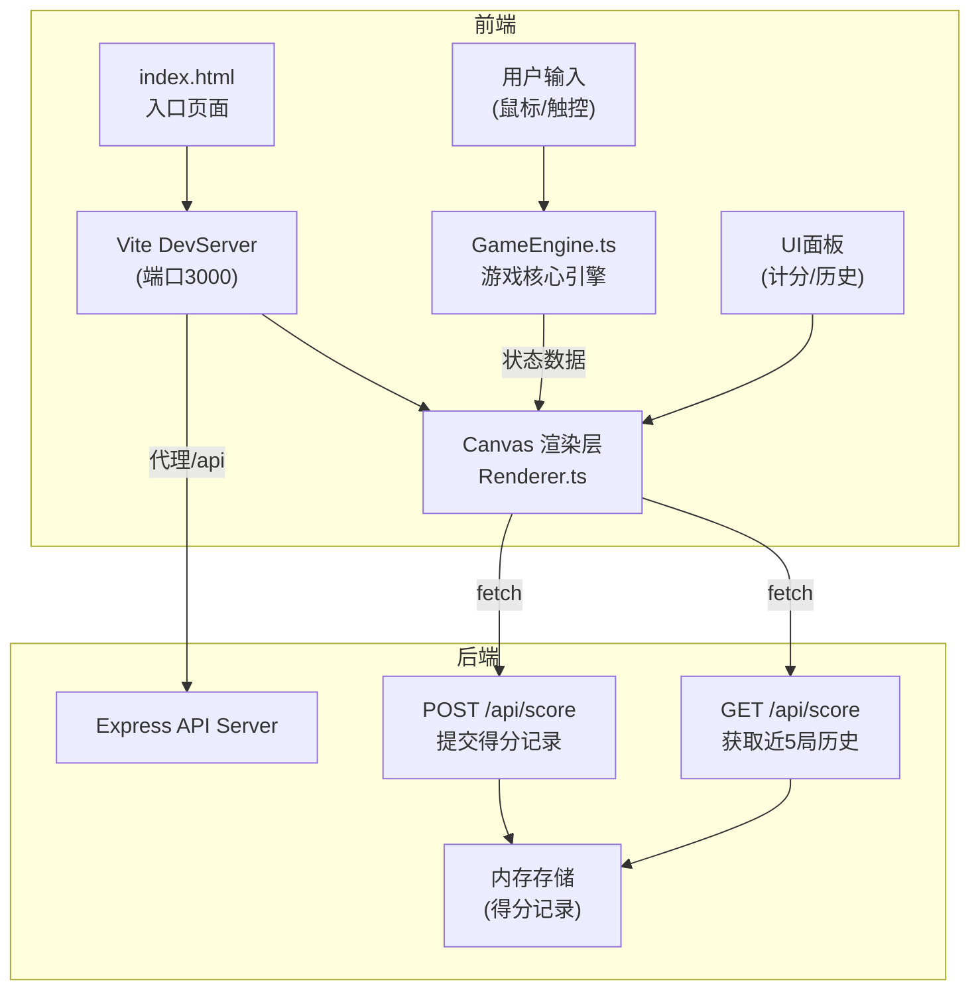

## 1. 架构设计



## 2. 技术描述
- **前端**：原生 TypeScript + Canvas 2D API + Vite
- **后端**：Express 4.x + CORS + UUID
- **构建工具**：Vite（入口index.html，端口3000，/api代理转发）
- **类型系统**：TypeScript（严格模式，target ES2020，module ESNext）
- **数据存储**：后端内存存储（运行时数据）

## 3. 项目文件结构
```
.
├── package.json
├── index.html
├── vite.config.js
├── tsconfig.json
├── server.js
└── src/
    ├── GameEngine.ts
    └── Renderer.ts
```

## 4. API 定义

### 4.1 类型定义
```typescript
interface PlayerScore {
  playerId: number;
  playerName: string;
  score: number;
  rank: number;
}

interface GameRecord {
  id: string;
  timestamp: number;
  playerCount: number;
  scores: PlayerScore[];
}

interface ScoreRequest {
  playerCount: number;
  scores: PlayerScore[];
}

interface ScoreResponse {
  success: boolean;
  data?: GameRecord[];
  message?: string;
}
```

### 4.2 POST /api/score
- **用途**：提交一局游戏的得分记录
- **请求体**：
```json
{
  "playerCount": 2,
  "scores": [
    { "playerId": 1, "playerName": "玩家1", "score": 85, "rank": 1 },
    { "playerId": 2, "playerName": "玩家2", "score": 60, "rank": 2 }
  ]
}
```
- **响应**：
```json
{ "success": true, "message": "得分已保存" }
```

### 4.3 GET /api/score
- **用途**：获取近5局历史得分数据
- **响应**：
```json
{
  "success": true,
  "data": [
    {
      "id": "uuid-xxx",
      "timestamp": 1234567890,
      "playerCount": 2,
      "scores": [...]
    },
    ...最多5条
  ]
}
```

## 5. 核心模块设计

### 5.1 GameEngine.ts 模块结构
```
GameEngine
├── 状态管理
│   ├── GameState (idle/aiming/flying/result)
│   ├── 玩家列表/当前玩家索引
│   ├── 每人剩余投掷次数
│   ├── 连中计数
│   └── 游戏结束标志
├── 输入处理
│   ├── 箭矢点击选择
│   ├── 鼠标/触控拖拽距离
│   └── 释放触发发射
├── 物理计算
│   ├── 抛物线轨迹函数
│   ├── 力度→初速度映射
│   ├── 重力加速度
│   └── 每帧位置更新
├── 碰撞检测
│   ├── 箭矢-壶口矩形碰撞
│   ├── 箭矢-壶耳圆形碰撞
│   └── 箭矢-地面边界
└── 计分逻辑
    ├── 命中类型判定
    ├── 分数累加
    ├── 连击检测
    └── 玩家轮换
```

### 5.2 Renderer.ts 模块结构
```
Renderer
├── Canvas 初始化
│   ├── 尺寸适配 (16:9, min 1024px)
│   ├── 响应式缩放
│   └── DPR 高清处理
├── 基础场景
│   ├── 背景渐变
│   ├── 铜壶绘制 (兽纹浮雕)
│   ├── 箭筒与箭矢
│   └── UI面板容器
├── 动态元素
│   ├── 倒计时圆环 (弧形进度条)
│   ├── 力度条
│   ├── 飞行箭矢 (摇摆+尾迹)
│   └── 粒子系统 (爆发+消亡)
├── 特效渲染
│   ├── 屏幕抖动 (translate)
│   ├── 全屏闪烁 (rgba遮罩)
│   └── 壶身抖动 (rotate)
├── UI 层
│   ├── 计分面板
│   ├── 当前玩家提示
│   ├── 历史统计柱状图
│   └── 操作按钮
└── 渲染循环
    ├── requestAnimationFrame
    ├── 插值平滑
    └── FPS 监控
```

## 6. 性能优化要点

### 6.1 物理计算优化
- 抛物线使用纯数学公式：`y = h0 + vy*t - 0.5*g*t²`
- 预计算系数，避免每帧重复运算
- 碰撞检测采用AABB优先，精确碰撞次之

### 6.2 Canvas 渲染优化
- 静态场景（壶、箭筒、背景）离屏缓存（offscreen canvas）
- 粒子使用路径批量绘制，减少 state 切换
- DPR 缩放仅在 resize 时计算一次

### 6.3 内存管理
- 粒子对象池复用，避免频繁 GC
- 尾迹点使用环形缓冲，固定最大长度
- 游戏结束时清理所有定时器与事件监听
