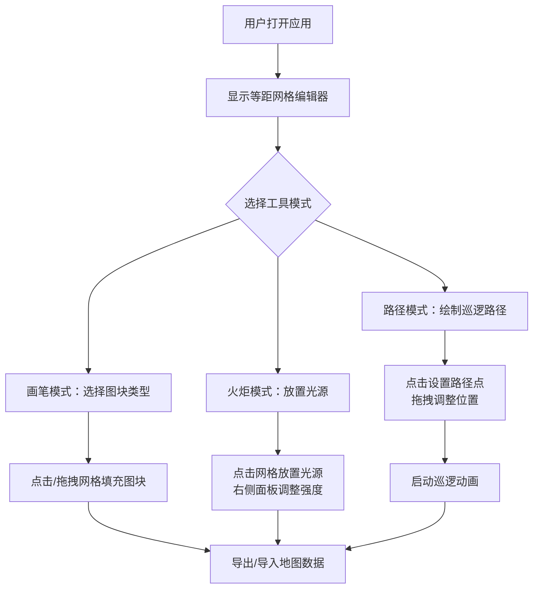

## 1. 产品概述

基于Canvas的交互式等距地牢编辑器与预览Web应用，让独立游戏关卡设计师在2D等距网格上快速绘制墙壁、地板和门，放置火炬光源，设定怪物巡逻路径，并实时预览光照阴影投射与怪物巡逻动画效果。

- 目标用户：独立游戏开发者、关卡设计师
- 核心价值：将繁琐的手动铺设地形、定义光照参数和AI路线的工作流程可视化、交互化，所见即所得

## 2. 核心功能

### 2.1 功能模块

1. **编辑器主界面**：等距网格画布、左侧工具栏、右侧光源面板、底部日志面板
2. **图块绘制系统**：墙壁、地板、门三种图块的放置与编辑
3. **光照系统**：火炬光源放置、强度调整、实时阴影投射
4. **巡逻路径系统**：路径点绘制、拖拽调整、怪物巡逻动画
5. **数据导入导出**：地图数据JSON序列化与反序列化

### 2.2 页面详情

| 页面名称 | 模块名称 | 功能描述 |
|----------|----------|----------|
| 编辑器主界面 | 等距网格画布 | 10x10菱形网格绘制，支持图块填充与缩放动画 |
| 编辑器主界面 | 左侧工具栏 | 画笔(墙壁/地板/门)、火炬、路径模式切换 |
| 编辑器主界面 | 右侧光源面板 | 光源列表、坐标显示、强度滑块调整 |
| 编辑器主界面 | 底部日志面板 | 时间戳日志、路径重叠警告 |
| 编辑器主界面 | 巡逻控制 | 路径模式绘制、启动巡逻、怪物移动动画 |
| 编辑器主界面 | 导入导出 | 导出地图JSON、导入地图JSON |

## 3. 核心流程

1. 用户打开页面，看到10x10等距网格和左侧工具栏
2. 选择图块类型（墙壁/地板/门），点击或拖拽网格填充图块
3. 切换到火炬模式，点击网格放置光源，在右侧面板调整强度
4. 切换到路径模式，点击网格设置路径点，拖拽调整位置
5. 点击"启动巡逻"按钮，怪物沿路径匀速移动
6. 点击"导出地图"生成JSON数据，可复制保存
7. 点击"导入地图"粘贴JSON数据恢复地图状态

## 4. 用户界面设计

### 4.1 设计风格

- **主色调**：暗灰岩(#2A2A2E)为基底，石灰色(#5A5A5E)辅助，琥珀色(#FFBF00)点缀
- **按钮样式**：36x36px方形，圆角4px，选中时背景#3A3A3E，悬停亮度提升20%，点击0.1秒缩小回弹
- **字体**：等宽字体(Monospace)
- **布局风格**：左侧固定工具栏(200px) + 居中画布 + 右侧光源面板 + 底部日志面板
- **图块样式**：墙壁石砖纹理#6B5B4E，地板灰色石板#5A5A5E，门深橡木#4A3728，选中高亮边框2px #FFD700

### 4.2 页面设计概览

| 页面名称 | 模块名称 | UI元素 |
|----------|----------|--------|
| 编辑器主界面 | 等距网格画布 | 菱形块80x40px，背景#3D3D42，四周留边20px，右下角坐标显示 |
| 编辑器主界面 | 左侧工具栏 | 固定宽度200px，背景#1E1E22，工具按钮36x36px圆角4px |
| 编辑器主界面 | 右侧光源面板 | 光源列表(坐标+强度滑块)，支持拖拽光源位置 |
| 编辑器主界面 | 底部日志面板 | 高120px，滚动更新，灰色时间戳#888888 |
| 编辑器主界面 | 巡逻路径 | 红色虚线#FF4444线宽2px，方向箭头，已走过变实线#FF6666 |
| 编辑器主界面 | 路径重叠警告 | 黄色⚠️图标20px，闪烁周期1秒 |

### 4.3 响应式设计

- 桌面优先设计
- 窗口缩放至800px宽时，左侧工具栏折叠为顶部图标条
- 画布全屏自适应，保持等距比例

### 4.4 动画效果

- 图块填充：0.1秒缩放动画(0.9→1.0)
- 光照更新：实时重绘，响应时间<100ms
- 巡逻动画：60FPS，速度2格/秒
- 按钮交互：悬停亮度+20%，点击0.1秒缩小回弹
- 路径重叠警告：⚠️图标1秒闪烁周期
