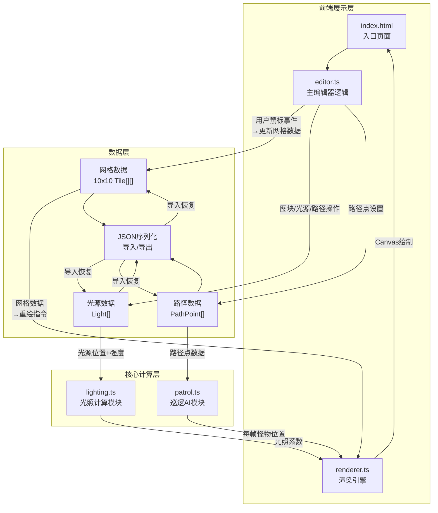

## 1. 架构设计



## 2. 技术说明

- **前端**：TypeScript + 原生Canvas API + Vite构建
- **构建工具**：Vite (开发服务器端口3000)
- **语言**：TypeScript (严格模式, target ES2020, moduleResolution bundler)
- **后端**：无
- **数据库**：无（客户端JSON导入导出）

## 3. 文件结构与调用关系

```
project/
├── package.json              # 依赖：typescript, vite；脚本：npm run dev
├── index.html                # 入口页面，深灰岩背景#2A2A2E
├── vite.config.js            # 构建配置，入口index.html，端口3000
├── tsconfig.json             # 严格模式，target ES2020
└── src/
    ├── editor.ts             # 主编辑器：鼠标事件→网格数据→重绘指令→renderer
    ├── renderer.ts           # 渲染引擎：网格数据+光照系数→等距投影Canvas绘制
    ├── lighting.ts           # 光照计算：光源+地图数据→每个图块光照系数
    └── patrol.ts             # 巡逻AI：路径点→每帧怪物位置→renderer
```

**数据流向**：
1. `editor.ts` 接收鼠标事件 → 更新 `GridData` / `LightData` / `PathData`
2. `editor.ts` 通知 `renderer.ts` 重绘
3. `lighting.ts` 读取 `LightData` + `GridData` → 计算光照系数 → 传给 `renderer.ts`
4. `patrol.ts` 读取 `PathData` → 每帧计算怪物位置 → 传给 `renderer.ts`
5. `renderer.ts` 综合网格、光照、怪物位置 → Canvas绘制

## 4. 核心数据模型

```typescript
type TileType = 'empty' | 'wall' | 'floor' | 'door';

interface Tile {
    type: TileType;
    x: number;
    y: number;
    scale: number;
}

interface Light {
    id: string;
    x: number;
    y: number;
    intensity: number;
    radius: number;
}

interface PathPoint {
    x: number;
    y: number;
    order: number;
}

interface MapData {
    grid: TileType[][];
    lights: Light[];
    paths: PathPoint[];
}
```

## 5. 性能要求

- 巡逻动画和光照更新保持60 FPS
- 光照重新计算响应时间 < 100ms
- Canvas重绘使用requestAnimationFrame
- 光照计算采用增量更新策略（仅光源变化时重算）

## 6. 关键实现策略

### 6.1 等距投影
- 菱形块宽80px、高40px
- 网格坐标→屏幕坐标转换：`screenX = (gridX - gridY) * 40`, `screenY = (gridX + gridY) * 20`
- 屏幕坐标→网格坐标反向转换用于鼠标拾取

### 6.2 光照系统
- 每个火炬光源：橙色圆形光晕，半径40-80px渐变
- 中心亮度0.9，边缘0.1
- 阴影投射：基于墙壁位置计算遮挡
- 光照系数叠加：多个光源贡献累加后clamp到[0,1]

### 6.3 巡逻系统
- 路径点间匀速移动：2格/秒
- 红色虚线#FF4444连接路径点，带方向箭头
- 已走过路径变为实线#FF6666
- 路径交叉检测：线段相交算法，重叠点显示⚠️警告

### 6.4 动画系统
- 图块填充：0.1秒CSS-like缩放动画(0.9→1.0)
- 按钮点击：0.1秒缩小回弹
- 路径警告闪烁：1秒周期
- 所有动画基于requestAnimationFrame + deltaTime
