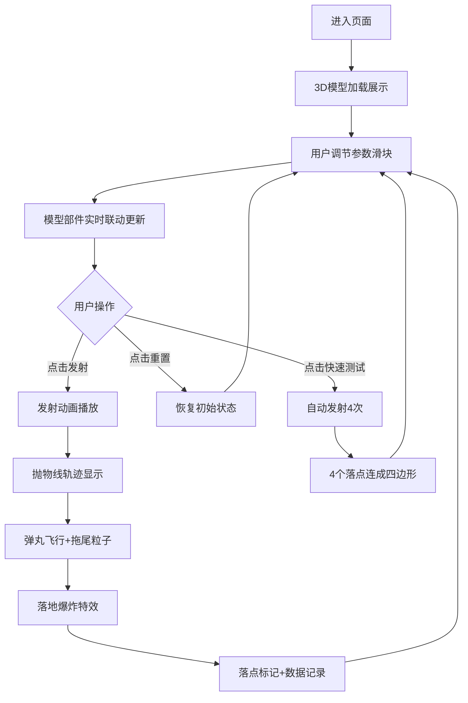

## 1. 产品概述

古代杠杆式抛石机3D交互可视化教学应用，用于历史军事教学场景，让用户直观体验配重块重量、力臂长度和发射角度对弹丸飞行距离与落点的影响。

- 主要目的：解决历史军事教学中无法直观看到抛石机工作原理的问题，通过3D交互模拟和即时反馈提升教学效果
- 目标用户：历史教师、军事爱好者、学生群体
- 产品价值：将抽象的物理原理和古代军事工程技术转化为可交互、可视化的沉浸式体验

## 2. 核心功能

### 2.1 功能模块

1. **3D抛石机模型展示**：全3D抛石机模型，包含木质底座、滑轨、力臂、配重块、兜袋和弹丸
2. **参数调节控制**：三个滑块分别控制配重重量（100-500kg）、力臂支点位置（0.4-0.7比例）、发射角度（30-75度）
3. **发射动画与弹道模拟**：弹丸发射动画、抛物线轨迹显示、拖尾粒子效果、落地爆炸特效
4. **落点标记与数据记录**：红色十字落点标记、飞行距离和坐标显示、历史发射记录
5. **快速测试对比**：自动生成4组随机参数依次发射，形成四边形落点散布区域

### 2.2 页面详情

| 页面名称 | 模块名称 | 功能描述 |
|-----------|-------------|---------------------|
| 主页面 | 3D场景区域 | 展示全3D抛石机模型、地面、发射动画和特效 |
| 主页面 | 控制面板 | 三个参数滑块、发射按钮、重置按钮、快速测试按钮 |
| 主页面 | 信息面板 | 显示当前发射参数、飞行距离、落点坐标、历史记录列表 |

## 3. 核心流程

用户进入页面 → 查看3D抛石机模型 → 通过滑块调节参数（模型实时联动）→ 点击发射按钮 → 观看弹丸发射动画和抛物线轨迹 → 观察落地爆炸特效 → 查看落点标记和发射数据 → 可选择重置或快速测试对比

## 4. 用户界面设计

### 4.1 设计风格
- **主色调**：羊皮纸米色 #F5E6CA（主背景），深褐色 #2D1B0E（副背景），金色 #D4A843（标题/数值）
- **按钮样式**：发射按钮红木色 #8B3A3A，圆角6px；重置按钮暗银灰 #606060，圆角6px
- **字体**：Georgia衬线字体，标题带0.5px黑色文字阴影
- **整体风格**：古军事手稿羊皮纸复古风格，木质/金属质感控件

### 4.2 页面设计概述

| 页面名称 | 模块名称 | UI元素 |
|-----------|-------------|-------------|
| 主页面 | 3D场景区域 | Three.js渲染，70%高度，含光照和阴影 |
| 主页面 | 控制面板 | 水平排列，滑块宽度200px，间距12px，数值标签金色 |
| 主页面 | 信息面板 | 半透明深褐背景 #1A0F08，宽200px，圆角8px，白色文字 |

### 4.3 响应式设计
- **桌面端（≥768px）**：3D场景占70%高度，控制面板水平居中排列，信息面板在右侧
- **移动端（<768px）**：3D场景占60%高度，控制面板垂直堆叠，滑块100%宽度，信息面板浮动在右上角

### 4.4 3D场景指引
- **环境**：羊皮纸色调地面，简洁环境突出抛石机主体
- **光照**：两束方向光（左上角45度，亮度1.0；环境光亮度0.3）+ 一束聚光（上方照射，亮度0.5，角度15度）
- **相机**：PerspectiveCamera，FOV 45，OrbitControls允许自由视角
- **材质**：木质部件带木纹浮雕纹理，金属轴哑光铁色 #4A4A4A，石质配重块 #808080
- **特效**：抛物线黄色虚线轨迹，飞行拖尾粒子（橙→灰渐变），落地爆炸扩散环+尘雾粒子
- **性能**：帧率稳定30FPS+，粒子总数≤200，单帧渲染<20ms
