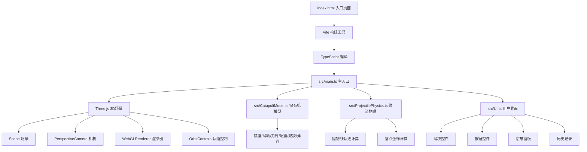

## 1. 架构设计



## 2. 技术描述

- **前端框架**：无额外UI框架，原生JavaScript DOM操作
- **3D引擎**：Three.js（r160+）
- **开发语言**：TypeScript（严格模式，target ES2020）
- **构建工具**：Vite 5.x，端口3000
- **类型定义**：@types/three

## 3. 文件结构

| 文件路径 | 用途 |
|-------|---------|
| /package.json | 项目依赖配置：three, typescript, vite, @types/three |
| /index.html | 入口页面，背景#F5E6CA，Georgia字体，全屏布局 |
| /vite.config.js | Vite构建配置，端口3000，src别名配置 |
| /tsconfig.json | TypeScript配置，严格模式，target ES2020 |
| /src/main.ts | 场景初始化，相机/渲染器/OrbitControls，主循环，ResizeHandler |
| /src/CatapultModel.ts | 抛石机3D模型构建，提供setWeight/setLeverPosition/setAngle/reset方法 |
| /src/ProjectilePhysics.ts | 弹道物理计算，提供getTrajectoryPoints/getImpactPoint/getImpactDistance |
| /src/UI.ts | DOM控件构建，滑块/按钮/面板/记录列表，事件监听与回调 |

## 4. 核心模块设计

### 4.1 CatapultModel.ts

```typescript
class CatapultModel {
  catapultGroup: THREE.Group;
  base: THREE.Mesh;           // 木质方形底座 #6B4226
  rails: THREE.Group;          // 两条平行滑轨 #8B5A2B
  lever: THREE.Mesh;           // 力臂木杆，长8单位
  counterweight: THREE.Mesh;   // 石质配重块 #808080
  pouch: THREE.Mesh;           // 兜袋
  projectile: THREE.Mesh;      // 弹丸，半径0.5 #707070
  slider: THREE.Mesh;          // 支点滑块
  pivotPoint: THREE.Vector3;   // 支点位置
  
  setWeight(kg: number): void;      // 调整配重块大小缩放
  setLeverPosition(ratio: number): void;  // 滑块在滑轨上移动
  setAngle(deg: number): void;      // 力臂绕支点旋转
  reset(): void;                    // 恢复初始状态
  getProjectileStartPosition(): THREE.Vector3;
}
```

### 4.2 ProjectilePhysics.ts

```typescript
class ProjectilePhysics {
  weight: number;        // 配重 kg (100-500)
  leverRatio: number;    // 力臂位置 (0.4-0.7)
  angle: number;         // 角度 度 (30-75)
  gravity: number;       // 重力加速度 9.8
  
  calculateInitialVelocity(): THREE.Vector3;
  getTrajectoryPoints(startPos: THREE.Vector3, timeStep: number = 0.02): THREE.Vector3[];
  getImpactPoint(startPos: THREE.Vector3): THREE.Vector3;
  getImpactDistance(startPos: THREE.Vector3): number;
}
```

### 4.3 UI.ts

```typescript
class UI {
  weightSlider: HTMLInputElement;
  leverSlider: HTMLInputElement;
  angleSlider: HTMLInputElement;
  fireBtn: HTMLButtonElement;
  resetBtn: HTMLButtonElement;
  quickTestBtn: HTMLButtonElement;
  infoPanel: HTMLDivElement;
  historyList: HTMLDivElement;
  
  onWeightChange(callback: (kg: number) => void): void;
  onLeverChange(callback: (ratio: number) => void): void;
  onAngleChange(callback: (deg: number) => void): void;
  onFire(callback: () => void): void;
  onReset(callback: () => void): void;
  onQuickTest(callback: () => void): void;
  updateDisplay(params: FireParams, distance: number, point: Vector3): void;
  addHistoryRecord(record: HistoryRecord): void;
  setFireButtonDisabled(disabled: boolean): void;
}
```

## 5. 性能优化策略

- **粒子池管理**：预分配最大200个粒子，复用而非创建销毁
- **轨迹线优化**：使用BufferGeometry存储轨迹点，避免每帧重建
- **帧率控制**：使用requestAnimationFrame + deltaTime确保动画平滑
- **阴影优化**：仅关键物体（抛石机、弹丸）投射阴影，地面接收阴影
- **响应式适配**：使用CSS媒体查询切换布局，避免JS计算布局

## 6. 光照配置

| 光源类型 | 位置/方向 | 亮度 | 其他参数 |
|---------|---------|------|---------|
| DirectionalLight (主光) | 左上角45度 (-5, 10, -5) | 1.0 | castShadow=true, shadow.mapSize=2048 |
| AmbientLight (环境光) | 全局 | 0.3 | - |
| SpotLight (聚光) | 抛石机正上方 (0, 15, 0) | 0.5 | angle=15°, penumbra=0.5, castShadow=true |
