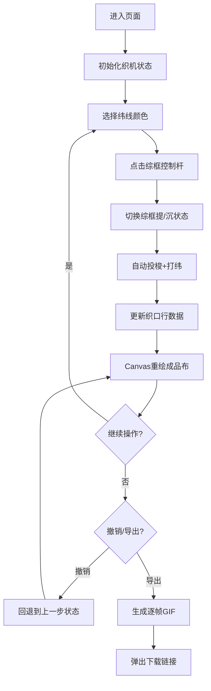

## 1. 产品概述
本产品是一款基于Canvas的交互式古代提花织机织造模拟Web应用，为博物馆和教育机构提供直观的织锦工艺展示工具。用户可亲手模拟提花织机的序贯穿综与显花操作，体验不同色线排列对最终花纹的动态影响。

- 核心价值：将抽象的古代织锦工艺转化为可交互的数字体验，降低学习门槛，提升参观者参与感
- 目标用户：博物馆参观者、学生、纺织工艺爱好者

## 2. 核心功能

### 2.1 Feature Module
1. **织机操作区**：48根经线示意图、8根综框控制杆、纬线颜色选择板
2. **成品布展示区**：Canvas实时渲染经纬交织图案，支持缩放和平移
3. **操作控制区**：撤销按钮、导出回放按钮
4. **动画导出系统**：记录织造过程，生成GIF动画文件

### 2.3 Page Details
| 页面名称 | 模块名称 | 功能描述 |
|-----------|-------------|---------------------|
| 主页面 | 织机示意图 | 展示48根垂直经线和综框连接示意 |
| 主页面 | 综框控制杆 | 8根水平控制杆，点击切换提/沉状态，带弹性动画 |
| 主页面 | 纬线颜色板 | 8种预设色，选中时外发光效果 |
| 主页面 | 成品布画布 | 480x640px Canvas，从底部向上逐行累积编织成果 |
| 主页面 | 撤销按钮 | 圆形按钮，撤销最近30步操作 |
| 主页面 | 导出回放按钮 | 导出织造过程为GIF动画 |

## 3. 核心流程
用户进入页面后，首先看到提花织机示意图和空白的成品布区域。用户选择纬线颜色，点击综框控制杆切换经线分组升降，系统自动完成投梭和打纬，成品布区域实时更新交织图案。用户可随时撤销操作或导出动画。

## 4. 用户界面设计

### 4.1 Design Style
- **主色调**：暖黄亚麻色 #D4C3A3，木色装饰 #8B4513
- **辅助色**：金色 #DAA520（分隔线），深褐色 #6B4226（控制面板）
- **按钮样式**：圆形按钮，圆角设计，悬停变色，点击缩放1.05倍
- **字体**：衬线字体，体现古典质感
- **布局风格**：桌面端左右并排（4:6比例），移动端上下排列
- **动效**：控制杆弹性动画0.2秒，缩放过渡0.3秒，按钮反馈0.1-0.2秒

### 4.2 Page Design Overview
| 页面名称 | 模块名称 | UI Elements |
|-----------|-------------|-------------|
| 主页面 | 织机示意图 | 48根经线（2px宽，#8B4513，间距3px），综框连接示意 |
| 主页面 | 综框控制杆 | 8根40px长控制杆，提#A0522D，沉#D2691E，弹性动画 |
| 主页面 | 纬线颜色板 | 8个25x25px色块，1px边框#8B7355，选中外发光#FFD700 |
| 主页面 | 成品布画布 | 480x640px，底色#F5E6CA，交织点经浮点2x8px，纬浮点8x2px |
| 主页面 | 撤销按钮 | 圆形40px，#8B4513，悬停#A0522D |
| 主页面 | 导出按钮 | 控制面板内，符合整体风格 |

### 4.3 Responsiveness
- 桌面端（≥768px）：织机区域40%，成品布区域60%，左右并排，金色竖线分隔
- 移动端（<768px）：织机在上，成品布在下，控件尺寸放大1.2倍，优化触控体验
- 所有交互元素支持鼠标和触摸操作

### 4.4 视觉细节
- 亚麻布纹理背景 #D4C3A3
- 仿绢面纹理背景 #E8D5A3
- 已完成部分半透明阴影 #00000015
- 无数据时淡灰色网格 #C0B090 和斜体提示文字
- 交织点颜色混合效果：经浮点显示经线色+纬线色叠加，纬浮点仅显示纬线色
