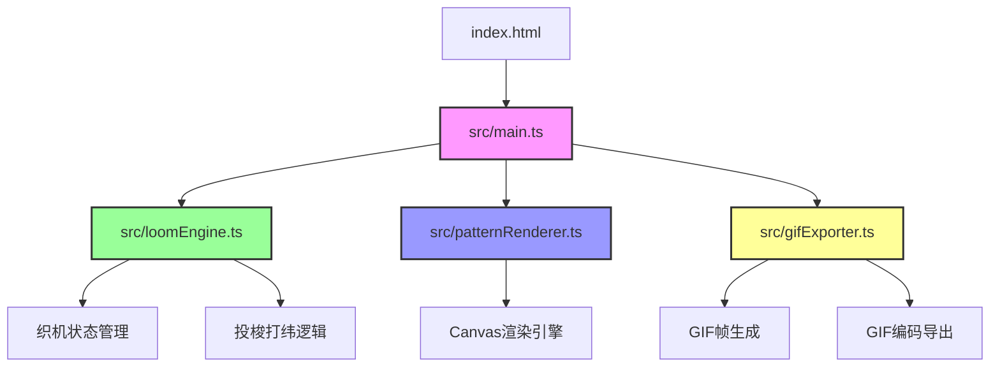

## 1. 架构设计



**文件调用关系与数据流向：**
1. `index.html` → 加载 `src/main.ts`，提供DOM容器
2. `src/main.ts` → 应用入口，协调各模块
   - 启动时创建 `LoomEngine` 实例
   - 监听用户事件（综框点击、颜色选择、滚轮缩放等）
   - 调用 `LoomEngine.doPick()` 获取织口行数据
   - 调用 `PatternRenderer.render()` 更新Canvas
   - 调用 `GifExporter.export()` 导出动画
3. `src/loomEngine.ts` → 织机核心逻辑
   - 管理经线数组、纬线序列、综框状态
   - 提供 `doPick()` 和 `undoLastPick()` 方法
   - 返回织口行数据给 `main.ts`
4. `src/patternRenderer.ts` → Canvas渲染
   - 接收织口行数组，绘制交织点
   - 处理缩放、平移交互
5. `src/gifExporter.ts` → GIF导出（新增模块）
   - 记录每一步操作历史
   - 逐帧生成并编码为GIF文件

## 2. 技术描述

- **前端框架**：无额外UI框架，使用原生JavaScript + TypeScript
- **构建工具**：Vite 5.x
- **开发语言**：TypeScript 5.x（严格模式）
- **Canvas API**：原生HTML5 Canvas 2D API
- **GIF编码**：内置轻量级GIF编码器（无外部依赖）

**核心依赖：**
```json
{
  "devDependencies": {
    "typescript": "^5.3.0",
    "vite": "^5.0.0"
  }
}
```

## 3. 项目结构

```
auto208/
├── index.html                    # 入口HTML
├── package.json                  # 项目配置
├── vite.config.js                # Vite配置
├── tsconfig.json                 # TypeScript配置
└── src/
    ├── main.ts                   # 应用入口（事件绑定、渲染循环）
    ├── loomEngine.ts             # 织机核心逻辑（状态管理、投梭打纬）
    ├── patternRenderer.ts        # Canvas渲染（绘制、缩放、平移）
    ├── gifExporter.ts            # GIF动画导出（新增）
    └── types.ts                  # 类型定义（新增）
```

## 4. 数据模型

### 4.1 类型定义

```typescript
// src/types.ts
export interface WarpThread {
  id: number;
  color: string;      // 经线颜色
  position: number;   // 经线位置索引 0-47
  isUp: boolean;      // 是否提起（由综框控制）
  harnessId: number;  // 所属综框ID 0-7
}

export interface WeftPick {
  id: number;
  color: string;      // 纬线颜色
  direction: 'left' | 'right';  // 投梭方向
  interlacements: Interlacement[];  // 交织点数组
}

export interface Interlacement {
  warpIndex: number;  // 经线索引
  isWarpFaced: boolean;  // 是否经浮点
  color: string;      // 显示颜色
}

export interface HarnessState {
  id: number;         // 综框ID 0-7
  isUp: boolean;      // 提(true)或沉(false)
  warpIndices: number[];  // 控制的经线索引
}

export interface LoomState {
  warps: WarpThread[];  // 48根经线
  harnesses: HarnessState[];  // 8根综框
  weftPicks: WeftPick[];  // 已完成的纬线序列
  currentWeftColor: string;  // 当前选中纬线颜色
  pickDirection: 'left' | 'right';  // 下次投梭方向
  history: HistoryEntry[];  // 操作历史（用于撤销）
}

export interface HistoryEntry {
  harnessChanges: { id: number; wasUp: boolean }[];
  weftPick: WeftPick;
}

export interface RenderConfig {
  scale: number;      // 缩放比例 0.5-2
  offsetX: number;    // X轴偏移
  offsetY: number;    // Y轴偏移
  cellWidth: number;  // 交织点宽度
  cellHeight: number; // 交织点高度
}
```

## 5. 核心算法

### 5.1 综框控制算法
- 48根经线按2上2下交替排列，分配给8个综框
- 每个综框控制6根经线（48/8=6）
- 综框ID = 经线索引 % 8
- 点击综框控制杆时，翻转该综框控制的所有经线的isUp状态

### 5.2 交织点判定算法
- 经浮点（warp-faced）：经线提起(isUp=true)，显示经线色+纬线色叠加
- 纬浮点（weft-faced）：经线下沉(isUp=false)，仅显示纬线色
- 颜色叠加：使用Canvas `globalCompositeOperation = 'multiply'` 实现混色

### 5.3 撤销机制
- 维护history数组，最多保存30条记录
- 每条记录包含：综框状态变化、对应的纬线行数据
- undo时：恢复综框状态、移除最后一行纬线、更新渲染

### 5.4 GIF导出算法
- 遍历history数组，从初始状态开始逐帧重建
- 每帧调用renderer渲染当前状态到offscreen canvas
- 使用LZW压缩算法编码为GIF格式
- 限制最大200帧，单帧生成时间<500ms

## 6. 性能优化

### 6.1 渲染优化
- 仅重绘新增行，不重复绘制已有行（使用双缓冲Canvas）
- 超过600行时，早期行使用半透明渲染（opacity: 0.3）
- 缩放时使用CSS transform过渡，避免频繁Canvas重绘

### 6.2 内存管理
- 历史记录限制30条
- GIF导出时逐帧处理，避免一次性加载所有帧
- Offscreen canvas及时释放

### 6.3 响应式设计
- 使用CSS媒体查询检测屏幕宽度
- <768px时切换布局并放大控件1.2倍
- 触摸事件与鼠标事件统一处理
