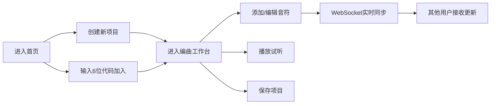

## 1. 产品概述

在线音乐协作编曲平台，支持多用户通过浏览器实时协作编辑音乐轨道，提供基于 Web Audio API 的音频合成引擎，类似简易版 Soundtrap。

- 核心价值：让音乐创作者能够在浏览器中实时协作编曲，无需安装任何软件
- 目标用户：音乐爱好者、学生、小型音乐创作团队
- 市场定位：轻量级、易上手的在线音乐协作工具

## 2. 核心功能

### 2.1 用户角色
| 角色 | 加入方式 | 核心权限 |
|------|----------|----------|
| 协作用户 | 通过6位项目代码加入 | 编辑音符、调整音轨、实时同步 |

### 2.2 功能模块
1. **项目管理**：创建新项目、通过6位代码加入项目
2. **时间线编辑器**：音符块的添加、删除、移动、批量选择
3. **音频合成引擎**：钢琴、吉他、贝斯三种音色，C3-C5 音域
4. **音轨控制**：音量调节、声像调节、静音/独奏
5. **播放控制**：播放/暂停、BPM 调节（60-180）
6. **实时协作**：WebSocket 实时同步、用户光标显示
7. **用户列表**：在线用户头像展示

### 2.3 页面详情
| 页面名称 | 模块名称 | 功能描述 |
|----------|----------|----------|
| 首页/项目入口 | 项目创建/加入 | 创建新项目、输入6位代码加入 |
| 编曲工作台 | 音轨列表 | 音轨名称、音量滑块、静音/独奏按钮 |
| 编曲工作台 | 时间线编辑器 | 网格背景、音符块渲染、拖拽选择、播放指示器 |
| 编曲工作台 | 顶部控制栏 | 播放/暂停、BPM 调节、保存按钮 |
| 编曲工作台 | 用户列表 | 在线用户头像展示 |

## 3. 核心流程

用户进入首页 → 创建新项目（自动生成6位代码）或输入代码加入 → 进入编曲工作台 → 添加/编辑音符 → 实时同步给其他用户 → 播放试听 → 保存项目

## 4. 用户界面设计

### 4.1 设计风格
- 主色：#e94560（玫红）
- 辅色：#0f3460（深蓝）
- 背景：#1a1a2e（深紫蓝）
- 高亮色：#ffd700（金色）
- 播放指示器：#ff4444（红色）
- 整体风格：深色主题，科技感，专业音乐工作站风格
- 过渡动画：0.2s ease-in-out 平滑过渡
- 音符块入场：从透明渐变为不透明

### 4.2 页面设计概述
| 页面名称 | 模块名称 | UI 元素 |
|----------|----------|---------|
| 编曲工作台 | 音轨列表（左） | 音轨名称、音量滑块、静音按钮、独奏按钮、深色卡片 |
| 编曲工作台 | 时间线（中） | 网格背景（十六分音符网格）、音符块矩形、播放竖线、横向滚动 |
| 编曲工作台 | 顶部控制栏 | 播放/暂停按钮、BPM 数字输入框、保存按钮 |
| 编曲工作台 | 用户列表（右） | 用户头像圆形排列、在线状态 |

### 4.3 响应式
- 桌面端优先，适配 1366px 以上屏幕
- 不做响应式适配，固定布局
- 时间线区域支持横向滚动

### 4.4 交互细节
- 鼠标拖拽选择多个音符块，选中状态金色高亮
- 点击音符块立即播放对应音高
- 播放时红色竖线匀速移动
- 所有交互有 0.2s 平滑过渡动画
- 新加入的音符块淡入效果
