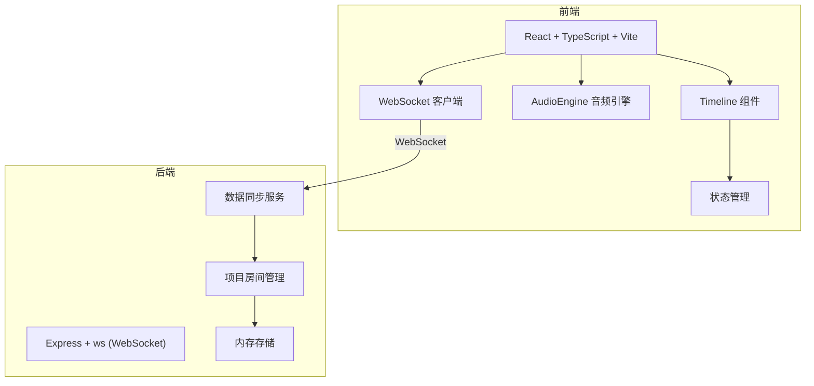

## 1. 架构设计



## 2. 技术描述

- 前端：React@18 + TypeScript + Vite
- 后端：Node.js + Express@4 + ws (WebSocket 库)
- 音频：Web Audio API
- 状态管理：React useState/useReducer
- 项目存储：内存存储（刷新后丢失）
- 唯一标识：uuid

## 3. 文件结构

```
/
├── package.json
├── index.html
├── vite.config.js
├── tsconfig.json
├── src/
│   ├── App.tsx              # React 根组件，路由 + WebSocket 管理
│   └── components/
│       ├── Timeline.tsx     # 时间线编辑器组件
│       └── AudioEngine.ts   # 音频合成引擎模块
└── server/
    └── server.ts            # Express + WebSocket 服务器
```

## 4. 数据模型

### 4.1 音符 (Note)
```typescript
interface Note {
  id: string;
  trackId: string;
  pitch: number;      // 音高，MIDI 编号 (C3-C5 范围)
  start: number;      // 起始时间，以十六分音符为单位
  duration: number;   // 时值，以十六分音符为单位
}
```

### 4.2 音轨 (Track)
```typescript
interface Track {
  id: string;
  name: string;
  instrument: 'piano' | 'guitar' | 'bass';
  volume: number;     // 0-1
  pan: number;        // -1 到 1
  muted: boolean;
  solo: boolean;
}
```

### 4.3 项目 (Project)
```typescript
interface Project {
  id: string;         // 6位代码
  name: string;
  bpm: number;        // 60-180
  tracks: Track[];
  notes: Note[];
  users: User[];
}
```

### 4.4 用户 (User)
```typescript
interface User {
  id: string;
  name: string;
  color: string;
  cursorPosition?: { trackId: string; time: number };
}
```

## 5. WebSocket 消息协议

| 消息类型 | 方向 | 说明 |
|----------|------|------|
| JOIN_PROJECT | 客户端→服务端 | 加入项目 |
| PROJECT_STATE | 服务端→客户端 | 项目完整状态 |
| NOTE_ADDED | 双向 | 添加音符 |
| NOTE_UPDATED | 双向 | 更新音符 |
| NOTE_DELETED | 双向 | 删除音符 |
| TRACK_UPDATED | 双向 | 更新音轨 |
| CURSOR_MOVED | 双向 | 光标移动 |
| USER_JOINED | 服务端→客户端 | 用户加入 |
| USER_LEFT | 服务端→客户端 | 用户离开 |

## 6. API 定义

### 6.1 创建项目
- POST `/api/projects`
- 响应：`{ projectId: string }`

### 6.2 获取项目
- GET `/api/projects/:id`
- 响应：`Project`

### 6.3 保存项目
- PUT `/api/projects/:id`
- 请求体：`Project`
- 响应：`{ success: boolean }`

## 7. 性能要求

- 播放时音频无爆音或断续
- FPS 稳定在 60
- 时间线滚动流畅无卡顿
- WebSocket 同步延迟不超过 200ms
