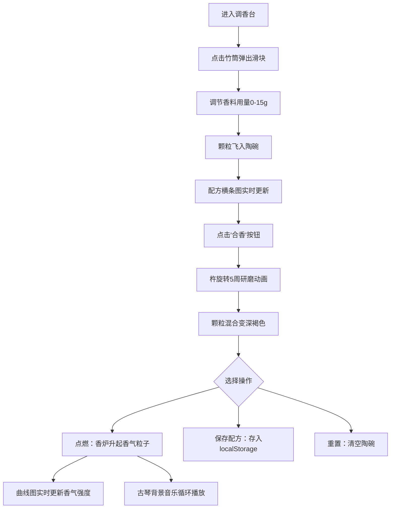

## 1. 产品概述

古代制香师调香模拟器是一款在浏览器中运行的交互式Web应用，让用户以古代香料师的身份体验调配合香、点燃熏香、观察香气扩散的完整过程。
- 目标用户：对中国传统香文化感兴趣的爱好者、教育场景学习者、休闲游戏玩家
- 产品价值：通过沉浸式视觉与交互体验传播传统香文化，提供放松、疗愈的感官体验

## 2. 核心功能

### 2.1 功能模块

1. **调香台主界面**：香料架、竹筒选料、滑块定量、陶碗盛料、横条图配方显示
2. **合香流程**：旋转杵研磨动画、颗粒混合变色、完成后操作面板
3. **点燃熏香**：青铜香炉、彩色香气粒子系统、随机气流影响、实时曲线图
4. **配方管理**：本地存储配方、命名规则、评分星级、加载/删除/清空功能
5. **音频反馈**：颗粒沙沙声、古琴背景音乐循环

### 2.2 页面详情

| 页面名称 | 模块名称 | 功能描述 |
|---------|---------|----------|
| 调香台主页 | 香料架区 | 左侧280px宽老榆木色香料架，6个半透明竹筒显示香料颜色 |
| 调香台主页 | 竹筒滑块 | 点击竹筒弹出0-15克滑块（步长0.5克），滑块色与香料一致 |
| 调香台主页 | 调香区 | 中央青铜香炉，陶碗接料，颗粒飞行动画，碗侧横条图配方 |
| 调香台主页 | 合香按钮 | 120x40px青铜色按钮，悬停变深上移，触发杵旋转研磨动画 |
| 调香台主页 | 操作面板 | 合香完成后弹出：点燃、保存配方、重置三个选项 |
| 调香台主页 | 粒子系统 | 点燃后香炉升彩色粒子，2-6px直径，0.9初始透明度渐降至0.2消失 |
| 调香台主页 | 曲线图 | 顶部半透明60秒香气强度曲线，金色线条+渐变填充 |
| 调香台主页 | 配方列表 | 香料架下方竖排显示本地存储配方，首两味命名+评分+总质量 |

## 3. 核心流程

用户打开页面 → 点击竹筒选择香料 → 调节滑块设定用量 → 颗粒飞入陶碗叠加 → 点击"合香"按钮 → 杵旋转研磨动画 → 完成后三选项：

## 4. 用户界面设计

### 4.1 设计风格

- **主色调**：老榆木色#5C4033为底，背景渐变#2B1B0E到#1A0F08，营造古朴雅致氛围
- **辅助色**：青铜色#B87333/#8B4513、竹筒色#D2B48C、陶碗色#8B7355、金色#FFD700
- **香料色**：檀香#C19A6B、龙脑#F0E68C、沉香#4A3728、乳香#F5DEB3、藿香#8B5A2B、甘松#6B8E23
- **按钮风格**：圆角6px青铜色，悬停变深#8B4513并上移2px，0.2s过渡动画
- **字体**：思源宋体（Noto Serif SC），Google Fonts引入
- **布局**：左侧固定香料架+右侧自适应调香区，Canvas全屏绘制

### 4.2 页面设计概览

| 模块 | UI元素 | 样式描述 |
|-----|--------|---------|
| 香料架 | 竹筒容器 | 280px宽（小屏220px），#5C4033底，竹筒#D2B48C半透明，圆角8px |
| 竹筒 | 香料颗粒 | 竹筒内填充对应香料色圆点点缀 |
| 滑块 | 用量调节 | 0-15克范围，步长0.5g，滑块轨道+填充色对应香料色 |
| 陶碗 | 盛料容器 | 直径60px，碗沿高8px，#8B7355色，颗粒层高度=克数×3px |
| 横条图 | 配方比例 | 8px高横条，每种香料按占比分配宽度，标注克数 |
| 香炉 | 熏香容器 | 顶部直径100px，渐变#B87333到#8B4513，0.5px暗纹 |
| 合香杵 | 研磨工具 | 20度倾斜，银色#C0C0C0，5周旋转周期0.8s |
| 粒子 | 香气粒子 | 2-6px随机直径，按配方比例混色，透明度0.9→0.2衰减 |
| 曲线图 | 强度图表 | 60秒x轴/100%y轴，#FFD700线宽2px，下方渐变填充 |

### 4.3 响应式适配

- 桌面优先设计，支持1920×1080和1440×900两种主流分辨率
- 香料架宽度：大屏280px → 小屏220px，内容等比例缩放
- Canvas基于容器尺寸自适应绘制，保持元素比例
- 竹筒、香炉、陶碗等图形元素按画布比例缩放
- 触摸设备支持点击操作，不依赖悬停状态

### 4.4 动效与性能

- 所有交互过渡动画0.1-0.2秒（opacity/transform属性）
- 颗粒飞入陶碗：抛物线运动+轻微沙沙声（频率随数量递增）
- 香气粒子：requestAnimationFrame驱动，总数上限200，稳定55FPS+
- 水平气流：每3秒随机切换风向，风速0-2px/帧
- 粒子边界碰撞反弹系数0.5
