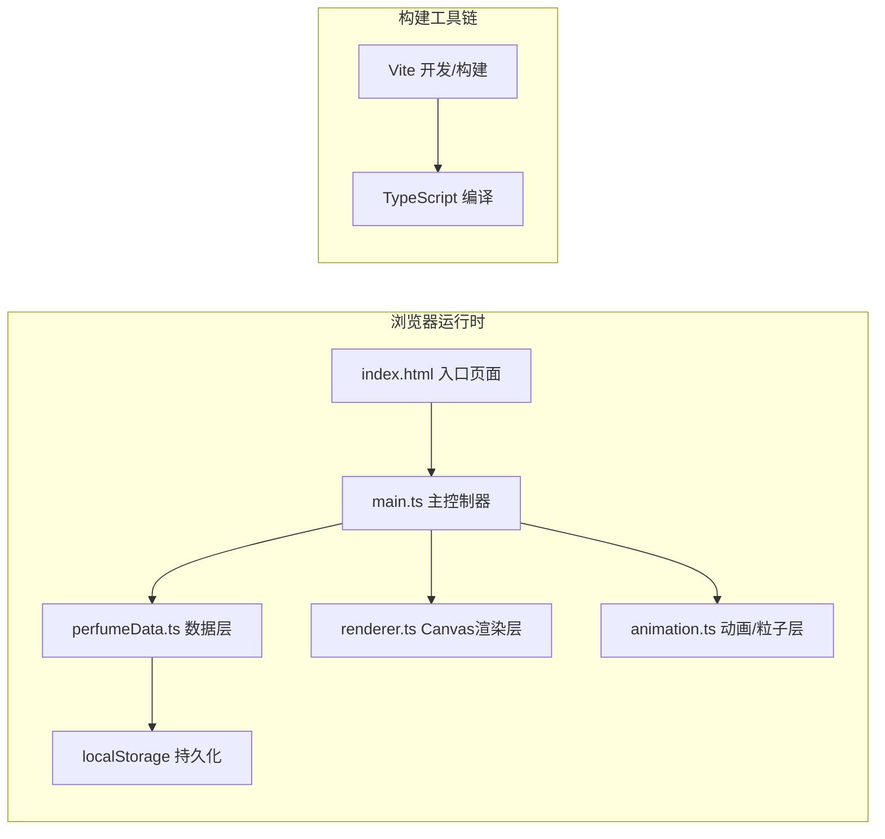

## 1. 架构设计



## 2. 技术描述

- **前端框架**：无框架，纯原生TypeScript + Canvas 2D API
- **构建工具**：Vite 5.x，配置端口3000
- **语言版本**：TypeScript 5.x，target ES2020，strict严格模式
- **状态管理**：main.ts内集中管理应用状态（useState模式）
- **UI组件**：Canvas原生绘制，不引入任何第三方UI库
- **字体资源**：Google Fonts CDN引入Noto Serif SC（思源宋体）
- **音频处理**：Web Audio API合成沙沙声与古琴单音循环

## 3. 目录结构

```
auto211/
├── index.html              # 入口HTML，引入字体与Canvas容器
├── package.json            # typescript + vite 依赖与脚本
├── vite.config.js          # Vite配置（端口3000，入口index.html）
├── tsconfig.json           # TS配置（ES2020，strict，bundler）
└── src/
    ├── main.ts             # 入口：初始化/事件/主循环
    ├── perfumeData.ts      # 香料接口/预设数据/配方管理(localStorage)
    ├── renderer.ts         # Canvas绘制：调香台/竹筒/香炉/粒子/曲线
    └── animation.ts        # 粒子系统：生成/更新/气流/边界反弹
```

## 4. 核心数据模型

### 4.1 类型定义（perfumeData.ts）

```typescript
interface Perfume {
  id: string;
  name: string;           // 中文名称：檀香/龙脑等
  color: string;          // 颗粒颜色HEX
  volatilizeRate: number; // 挥发速率(0-1)
  particleColor: string;  // 香气粒子颜色
}

interface FormulaItem {
  perfumeId: string;
  grams: number;          // 0-15，步长0.5
}

interface SavedFormula {
  id: string;
  name: string;           // 首两味命名，如"檀龙散"
  items: FormulaItem[];
  totalGrams: number;
  score: number;          // 1-5 星评分
  timestamp: number;
}
```

### 4.2 配方管理类 FormulaManager

- `loadAll(): SavedFormula[]` 从localStorage读取
- `save(formula: SavedFormula): void` 写入，最多20条，超出移除最早
- `delete(id: string): void` 删除单条
- `clearAll(): void` 清空全部
- `generateName(items: FormulaItem[]): string` 首两味香料首字+"散/香/露"
- `calculateScore(items: FormulaItem[]): number` 基于配方多样性、总量计算1-5星

## 5. 渲染层设计（renderer.ts）

### 5.1 Renderer 类职责

- 构造函数接收 CanvasRenderingContext2D 和尺寸
- `resize(w, h)` 响应式适配，维护scaleRatio
- `setState(state)` 每帧注入当前应用状态
- `draw()` 按z-index顺序分层绘制：

```
第1层：背景渐变(#2B1B0E → #1A0F08) + 老榆木调香台底色
第2层：左侧香料架(#5C4033) + 6个竹筒容器(#D2B48C半透明)
第3层：竹筒内香料颗粒点缀 + 激活滑块
第4层：陶碗(#8B7355) + 颗粒堆积层 + 配方横条图
第5层：合香按钮 + 杵旋转动画
第6层：青铜香炉(#B87333→#8B4513渐变 + 0.5px暗纹)
第7层：粒子系统（200上限，混合配方颜色）
第8层：香气强度曲线图（半透明覆盖层）
第9层：操作面板（点燃/保存/重置）+ 配方列表
```

### 5.2 坐标映射

- 香料架宽度：`shelfW = canvasWidth < 1600 ? 220 : 280`
- 缩放系数：`scale = shelfW / 280`，竹筒/香炉/陶碗尺寸按scale缩放
- 调香区中心X：`shelfW + (canvasW - shelfW) / 2`

## 6. 动画层设计（animation.ts）

### 6.1 ParticleSystem 类

```typescript
interface Particle {
  x: number; y: number;
  vx: number; vy: number;
  radius: number;        // 2-6px
  color: string;
  alpha: number;         // 0.9 → 0.2 衰减
  decayRate: number;     // 基于各香料挥发速率加权
}

class ParticleSystem {
  maxParticles = 200
  windDirection = 1      // ±1，每3秒切换
  windSpeed = 0          // 0-2 px/帧
  emitRate = 3           // 每帧发射数

  update(): void {
    // 应用重力、风力、边界反弹(0.5系数)、透明度衰减
    // 移除alpha<0.2的粒子
  }
  addParticle(x, y, formulaBlendColor, weightedDecay): void
  updateWind(): void     // 每3秒随机切换
}
```

### 6.2 其它动画

- **颗粒飞行**：从竹筒口到陶碗，贝塞尔曲线+0.4s，按比例生成8px圆点
- **沙沙声**：AudioBufferSourceNode播放白噪声滤波片段，频率随颗粒数线性升高
- **杵旋转**：`rotation += (2π * 5) / (0.8s / frameInterval)`，持续0.8s共5周
- **古琴循环**：OscillatorNode正弦波+指数衰减包络模拟拨弦，约10秒loop，低音量

## 7. 主流程控制（main.ts）

### 7.1 状态机

```typescript
type AppState =
  | 'idle'       // 选料阶段
  | 'mixing'     // 合香研磨动画(5s)
  | 'ready'      // 三选项面板
  | 'burning'    // 点燃熏香中
```

### 7.2 事件处理

- Canvas click → 命中检测：竹筒/滑块/按钮/配方列表项
- Canvas mousemove → 滑块拖动 + hover状态
- window resize → Renderer.resize()
- rAF主循环：`update() → Renderer.draw()`

### 7.3 香气强度计算（每秒采样入曲线数据）

```
intensity(t) = Σ(grams[i] * volatilizeRate[i]) * e^(-t/τ) * sin_noise(t)
其中τ ≈ 30秒，sin_noise叠加±5%波动模拟自然气息
```

## 8. 性能保障策略

1. 粒子总数硬上限200，超出时淘汰最老粒子
2. 每帧仅重绘粒子覆盖区域（dirty rect可选优化）
3. 使用ImageData或离屏canvas预渲染静态元素（香炉、陶碗）
4. requestAnimationFrame，避免setTimeout/setInterval
5. 音频节点复用，避免重复创建
