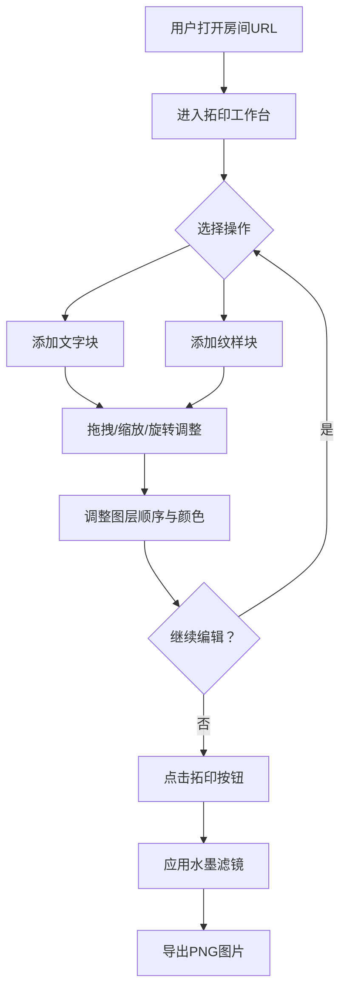

## 1. 产品概述

古风拓印排版设计Web应用——一个基于Canvas与WebSocket的多人协作创作工具，让参与者在虚拟拓印石上实时放置和调整文字与纹样，模拟古代拓印效果，最终生成水墨风格底稿图片。

- 面向古风文化工坊的参与者和设计师，解决缺乏直观实时拓印设计工具的问题
- 提供沉浸式古风创作体验，支持多人协作，降低古风排版创作门槛

## 2. 核心功能

### 2.1 用户角色

| 角色 | 进入方式 | 核心权限 |
|------|---------|---------|
| 协作者 | 打开房间URL即可加入 | 添加/移动/缩放/旋转/删除/改色/改透明度排版元素 |
| 观察者（可选） | 同上 | 仅查看，不操作 |

### 2.2 功能模块

1. **拓印工作台页面**：画布区（主区域）+ 工具面板（右侧），涵盖所有核心创作与协作功能

### 2.3 页面详情

| 页面名称 | 模块名称 | 功能描述 |
|---------|---------|---------|
| 拓印工作台 | 画布区域 | 800x600px宣纸黄底色画布，随机纤维纹理噪点，支持元素拖拽/缩放/旋转，拖拽时显示网格辅助线 |
| 拓印工作台 | 工具面板-文字 | "添加文字"按钮，弹出字体选择（楷体/隶书/篆书），字号24-96px，输入后文字块出现在画布中央，默认色#2F1B0E |
| 拓印工作台 | 工具面板-纹样 | "添加纹样"按钮，5种预设纹样缩略图（云纹/回纹/龙纹/鹤纹/水波纹），默认赭红#8B3A3A，叠加在文字底部 |
| 拓印工作台 | 图层管理 | 图层列表显示所有元素，支持拖拽调整Z轴顺序，实时同步画布渲染 |
| 拓印工作台 | 在线协作 | 左上角显示在线人头像缩略图和数量，所有操作实时WebSocket同步 |
| 拓印工作台 | 拓印导出 | "拓印"按钮导出1920x1440px透明PNG，自动应用水墨风格滤镜，文件名含时间戳和房间号 |

## 3. 核心流程

用户打开房间URL → 进入拓印工作台 → 选择添加文字或纹样 → 在画布上拖拽/缩放/旋转调整位置 → 多人实时协作编辑 → 调整图层顺序和颜色 → 点击"拓印"按钮导出水墨风格图片

多人协作同步流程：

## 4. 界面设计

### 4.1 设计风格

- 主背景：茶色径向渐变 #C4A882 → #B8956A
- 画布底色：宣纸黄 #F5E6CA，表面随机纤维纹理噪点
- 画布与面板分隔：细金线 #DAA520（1px，微光效果）
- 工具面板背景：半透明檀木色 #7B5B3A，圆角8px
- 按钮样式：圆角6px、边框#8B5A2B、背景#5C3A1E、文字#F5E6CA，按下时背景变暗至#4A2E14且内阴影加深
- 字体：楷体几何化风格，使用系统楷体/KaiTi字体族
- 拖拽辅助：半透明网格（间距40px，线色#D2B48C，透明度0.3）
- 添加动画：淡入0.3s，从透明度0到1并向上偏移10px

### 4.2 页面设计概览

| 页面名称 | 模块名称 | UI元素 |
|---------|---------|--------|
| 拓印工作台 | 画布区域 | 宽800px高600px，宣纸黄底色，纤维纹理，拖拽时网格辅助线，左上角在线人数指示 |
| 拓印工作台 | 工具面板 | 宽280px，檀木色半透明背景，包含"添加文字"和"添加纹样"按钮、字体选择器、纹样缩略图、图层列表、色盘、透明度滑块、"拓印"导出按钮 |
| 拓印工作台 | 文字弹窗 | 模态弹窗，字体选择下拉、字号滑块、文本输入框、确认/取消按钮 |
| 拓印工作台 | 纹样选择 | 5个200x200px缩略图排列，点击选中 |
| 拓印工作台 | 在线指示 | 左上角圆形头像（圆角8px，随机底色）+ "N人在线"文字 |

### 4.3 响应式适配

- 桌面优先设计，默认宽1200px布局
- 视口宽度 < 800px 时：工具面板折叠为底部抽屉式（高度120px可展开），画布自动缩放至适应剩余高度
- 触摸优化：支持触摸拖拽、双指缩放

### 4.4 性能要求

- 画布渲染帧率不低于40fps（10个文字块+5个纹样块操作场景）
- WebSocket消息峰值吞吐量不低于50条/秒（5人并发无明显卡顿）
- 协作延迟 < 200ms
