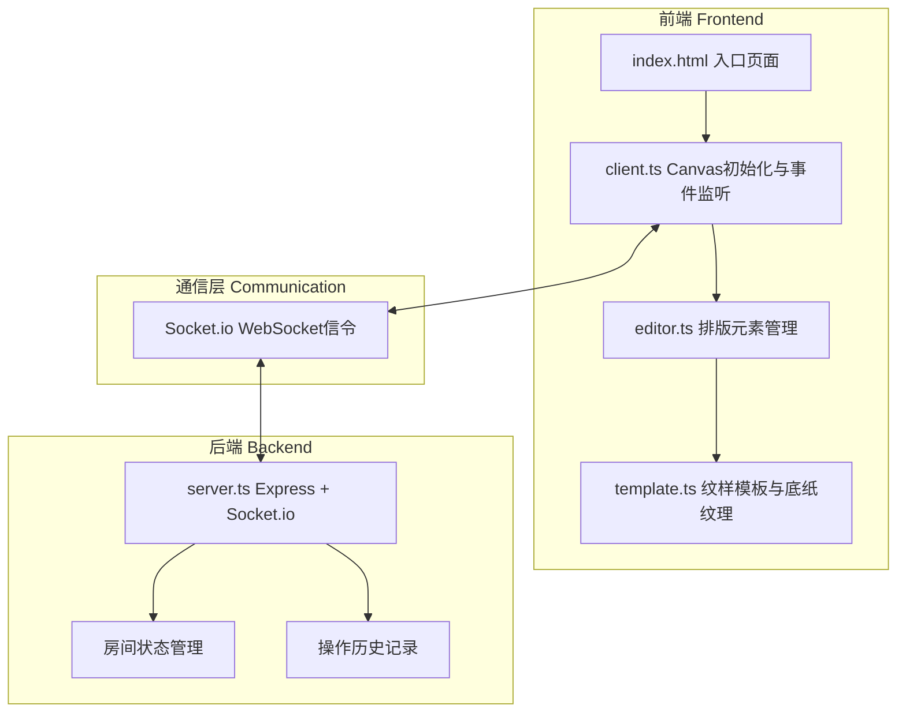
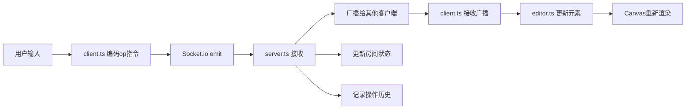
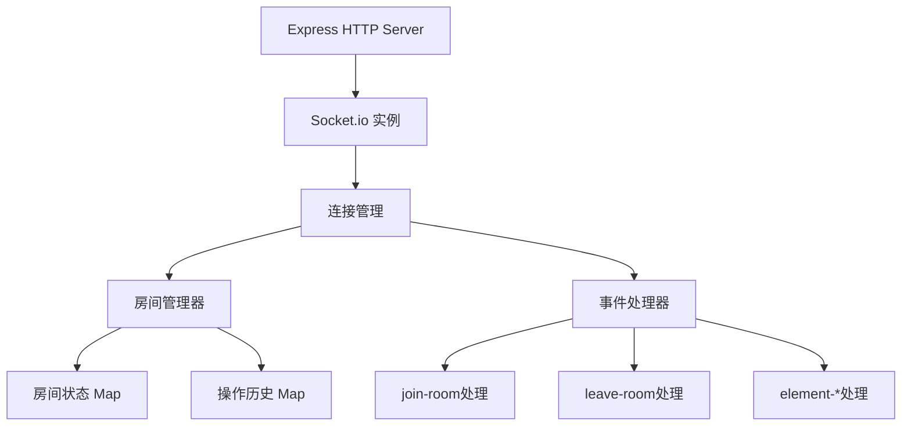
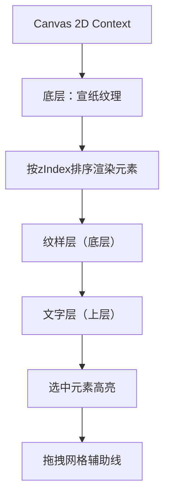

## 1. 架构设计



数据流向：



## 2. 技术说明

- 前端：TypeScript + 原生Canvas API + Socket.io-client + canvas-confetti
- 构建工具：Vite（端口3000）
- 后端：Node.js + Express + Socket.io
- 通信协议：WebSocket（Socket.io封装）
- 无数据库需求（房间状态存于内存）

## 3. 文件结构与职责

| 文件 | 职责 | 调用关系 | 数据流向 |
|------|------|---------|---------|
| package.json | 项目依赖与脚本 | 被npm/vite读取 | - |
| vite.config.js | 构建配置 | 被vite读取 | - |
| tsconfig.json | TypeScript编译配置 | 被tsc/vite读取 | - |
| index.html | 入口页面 | 加载client.ts | 用户交互→client |
| src/server.ts | Express+Socket.io服务器 | 管理房间状态 | 接收客户端op→广播→记录历史 |
| src/client.ts | Canvas初始化、渲染、事件监听 | 调用editor.ts、template.ts | 用户输入→编码op→emit→接收广播→渲染 |
| src/editor.ts | 排版元素CRUD、变换 | 调用template.ts | client调用方法→生成渲染指令→返回client |
| src/template.ts | 预设纹样与底纸纹理 | 被editor.ts调用 | editor请求→返回图案/样式配置 |

## 4. WebSocket协议定义

### 4.1 客户端→服务器事件

| 事件名 | 数据类型 | 说明 |
|--------|---------|------|
| join-room | `{ roomId: string, userName: string }` | 加入房间 |
| leave-room | `{ roomId: string }` | 离开房间 |
| element-add | `ElementOp` | 添加元素 |
| element-move | `ElementOp` | 移动元素 |
| element-scale | `ElementOp` | 缩放元素 |
| element-rotate | `ElementOp` | 旋转元素 |
| element-delete | `ElementOp` | 删除元素 |
| element-color | `ElementOp` | 改变元素颜色 |
| element-opacity | `ElementOp` | 改变元素透明度 |
| element-reorder | `ElementOp` | 调整图层顺序 |

### 4.2 服务器→客户端事件

| 事件名 | 数据类型 | 说明 |
|--------|---------|------|
| room-state | `RoomState` | 房间完整状态（新加入时发送） |
| element-update | `ElementOp` | 元素操作广播 |
| user-joined | `{ userId: string, color: string }` | 用户加入通知 |
| user-left | `{ userId: string }` | 用户离开通知 |
| users-list | `User[]` | 在线用户列表 |

### 4.3 TypeScript类型定义

```typescript
interface ElementOp {
  roomId: string;
  elementId: string;
  type: 'text' | 'pattern';
  action: 'add' | 'move' | 'scale' | 'rotate' | 'delete' | 'color' | 'opacity' | 'reorder';
  data: Record<string, any>;
}

interface TextElement {
  id: string;
  type: 'text';
  text: string;
  font: '楷体' | '隶书' | '篆书';
  fontSize: number;
  x: number;
  y: number;
  color: string;
  opacity: number;
  zIndex: number;
  rotation: number;
  scale: number;
}

interface PatternElement {
  id: string;
  type: 'pattern';
  patternType: '云纹' | '回纹' | '龙纹' | '鹤纹' | '水波纹';
  x: number;
  y: number;
  width: number;
  height: number;
  color: string;
  opacity: number;
  zIndex: number;
  rotation: number;
  scale: number;
}

type DesignElement = TextElement | PatternElement;

interface RoomState {
  roomId: string;
  elements: DesignElement[];
  users: User[];
}

interface User {
  id: string;
  name: string;
  color: string;
}
```

## 5. 服务器架构



## 6. 渲染架构



## 7. 导出流程

1. 创建离屏Canvas（1920x1440px）
2. 按缩放比例（2.4x）重绘所有元素
3. 对每个元素应用水墨风格滤镜：
   - 边缘轻微羽化（shadowBlur）
   - 颜色去饱和度（filter: saturate(0.7)）
   - 轻微抖动（随机偏移1-2px）
4. 背景保留宣纸黄纸色
5. 导出为透明背景PNG
6. 文件名格式：`tuoyin_room{roomId}_{timestamp}.png`
