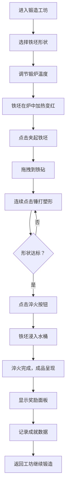

## 1. 产品概述
古代铁匠锻造工艺交互式模拟游戏，用户可在浏览器中体验从加热铁坯、锤打塑形到淬火成型的完整锻造流程，解决传统手工艺教学中无法真实模拟温度变化、锤击形变和成品反馈的问题。

- **核心目标**：提供沉浸式的锻造体验，让用户理解锻打力度、方向与成品形状的关系
- **目标用户**：手工艺爱好者、历史文化学习者、游戏玩家
- **市场价值**：将传统工艺数字化，提供可交互的文化体验和教学工具

## 2. 核心功能

### 2.1 功能模块
1. **锻造工坊主界面**：锻炉加热、铁砧锤打、水桶淬火
2. **左侧工具栏**：温度调节、铁坯形状选择、淬火按钮
3. **右侧信息面板**：铁坯侧视图/俯视图、锻造状态、成品评定
4. **成就系统**：成就记录、解锁展示、奖励面板

### 2.3 页面详情
| 页面名称 | 模块名称 | 功能描述 |
|----------|----------|----------|
| 锻造工坊 | 锻炉加热 | 火焰粒子动画、铁坯温度渐变、从深灰到亮白的颜色映射 |
| 锻造工坊 | 铁砧锤打 | 拖拽铁坯、锤击动画、火花粒子、网格形变算法 |
| 锻造工坊 | 水桶淬火 | 蒸汽粒子、氧化色渐变效果 |
| 左侧工具栏 | 温度控制 | 0-1200度滑块调节、火焰图标滑块头 |
| 左侧工具栏 | 铁坯选择 | 方形/长条形/圆形三种预设形状 |
| 左侧工具栏 | 淬火操作 | 将铁坯浸入水桶、触发淬火效果 |
| 右侧信息面板 | 形状预览 | 150x150px侧视图和俯视图实时显示 |
| 右侧信息面板 | 锻造评定 | 厚度、长宽比、粗糙度检测、成功判定 |
| 右侧信息面板 | 奖励面板 | 仿羊皮纸样式、锻造数据、1-5星评分 |
| 成就面板 | 成就展示 | 滚动列表、圆形图标、最新成就闪耀动画 |

## 3. 核心流程

## 4. 用户界面设计

### 4.1 设计风格
- **主色调**：暖褐色系 #8B4513（主色）、#A0522D（辅色）、#FFD700（强调色）
- **背景色**：深灰色 #2B2B2B，土坯墙 #A0522D，木板地 #8B4513
- **按钮风格**：圆角12px，悬停渐变 #8B4513 → #A0522D，点击内凹阴影
- **字体**：衬线字体（标题）+ 系统字体（正文）
- **布局风格**：左侧工具栏220px、中央画布1000x700px、右侧信息面板260px
- **装饰元素**：工具剪影、仿羊皮纸纹理、金色印章、皮革纹理

### 4.2 页面设计概述
| 页面名称 | 模块名称 | UI元素 |
|----------|----------|--------|
| 锻造工坊 | 锻炉区域 | 圆柱形炉体 #4A2C2A-#6B3A2B 渐变、椭圆炉口、火焰粒子 #FF4500-#FFD700 |
| 锻造工坊 | 铁砧区域 | 梯形黑色金属 #333333-#4A4A4A、锤击痕迹纹理 |
| 锻造工坊 | 水桶区域 | 木质桶 #A0522D、水面波纹 #4A90D9 半透明 |
| 左侧工具栏 | 温度滑块 | 轨道渐变 #2B2B2B-#FFD700、火焰icon滑块头 |
| 左侧工具栏 | 铁坯选择器 | 60x60px半透明图标 #2B2B2B、选中时外发光 #FFD700 8px |
| 右侧信息面板 | 形状预览 | 150x150px双窗口、侧视图显示厚度、俯视图显示长宽 |
| 右侧信息面板 | 奖励面板 | 仿羊皮纸 #F5DEB3、边框 #8B4513、圆角16px、金色印章 #FFD700 |
| 成就面板 | 成就列表 | 半透明黑底 #1A1A1A alpha 0.7、40x40px圆形金色图标、闪耀粒子动画 |

### 4.3 响应式
- **桌面端（≥1200px）**：画布100%尺寸，三栏布局
- **平板（768px-1200px）**：画布缩放到80%，UI元素等比缩小
- **移动端（<768px）**：画布缩放到60%，优化触控区域

### 4.4 动画效果
- **火焰粒子**：正弦波摇曳，幅度5px，频率0.5Hz，每秒生成20个
- **锤击火花**：抛物线轨迹，初速度30px/s，重力0.3px/s²，15个burst
- **蒸汽粒子**：白色半透明，直径6-12px，升腾高度150px，每秒10个
- **铁坯形变**：线性插值平滑过渡0.15秒
- **成就闪耀**：5颗星星从中心向外飞散，持续0.5秒
- **高光闪烁**：成品剑身反射光线动画
