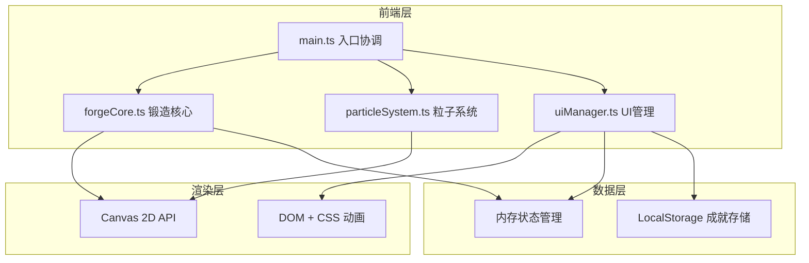

## 1. 架构设计



## 2. 技术描述
- **前端**：TypeScript + Vite + 原生 Canvas 2D API
- **构建工具**：Vite 5.x，端口3000，开启HMR
- **状态管理**：ForgeControl 类内部状态 + 观察者模式通知 UI
- **渲染引擎**：HTML5 Canvas 2D 用于游戏画面，DOM/CSS 用于UI面板
- **数据存储**：LocalStorage 存储成就记录
- **无后端**：纯前端应用，所有逻辑在客户端执行

## 3. 模块职责

### 3.1 forgeCore.ts - 锻造核心
```typescript
export interface IronBillet {
  id: string;
  shape: 'square' | 'rectangle' | 'circle';
  temperature: number;
  vertices: Point[];
  thickness: number;
  width: number;
  height: number;
  roughness: number;
  hammerCount: number;
  heavyHammerStreak: number;
  isQuenched: boolean;
  position: Point;
  isDragging: boolean;
}

export interface Point {
  x: number;
  y: number;
}

export class ForgeControl {
  constructor(canvas: HTMLCanvasElement);
  setTemperature(temp: number): void;
  selectBilletShape(shape: string): void;
  startHeating(): void;
  stopHeating(): void;
  pickUpBillet(position: Point): boolean;
  moveBillet(position: Point): void;
  placeOnAnvil(position: Point): boolean;
  hammer(position: Point, timeSinceLastHammer: number): void;
  quench(): void;
  checkForgingComplete(): boolean;
  getBilletState(): IronBillet;
  getSideViewData(): number[];
  getTopViewData(): number[];
  calculateStarRating(): number;
  getForgingStats(): { time: number; hammerCount: number; rating: number };
  subscribe(callback: (event: string, data: any) => void): void;
}
```

### 3.2 particleSystem.ts - 粒子系统
```typescript
export interface ParticleConfig {
  type: 'flame' | 'spark' | 'steam' | 'star';
  position: Point;
  velocity?: Point;
  color?: string;
  lifeTime?: number;
  size?: number;
  count?: number;
}

export class ParticleEmitter {
  constructor(canvas: HTMLCanvasElement);
  emit(config: ParticleConfig): void;
  update(deltaTime: number): void;
  render(ctx: CanvasRenderingContext2D): void;
  clear(): void;
  getParticleCount(): number;
}
```

### 3.3 uiManager.ts - UI管理
```typescript
export enum UIEvent {
  TEMPERATURE_CHANGED = 'temperature_changed',
  BILLET_SELECTED = 'billet_selected',
  QUENCH_CLICKED = 'quench_clicked',
  ACHIEVEMENT_CLICKED = 'achievement_clicked',
}

export interface Achievement {
  id: string;
  name: string;
  description: string;
  icon: string;
  unlockedAt: number;
  isNew: boolean;
}

export class UIManager {
  constructor(forgeControl: ForgeControl);
  init(): void;
  bindEvents(): void;
  updateSideView(data: number[]): void;
  updateTopView(data: number[]): void;
  showRewardPanel(stats: any): void;
  hideRewardPanel(): void;
  unlockAchievement(achievement: Achievement): void;
  updateAchievementsList(achievements: Achievement[]): void;
  showAchievementDetail(achievement: Achievement): void;
  emit(event: UIEvent, data: any): void;
  subscribe(event: UIEvent, callback: (data: any) => void): void;
}
```

### 3.4 main.ts - 入口协调
```typescript
import { ForgeControl } from './forgeCore';
import { ParticleEmitter } from './particleSystem';
import { UIManager } from './uiManager';

class ForgeGame {
  private canvas: HTMLCanvasElement;
  private ctx: CanvasRenderingContext2D;
  private forgeControl: ForgeControl;
  private particleEmitter: ParticleEmitter;
  private uiManager: UIManager;
  private animationFrameId: number;
  private lastTime: number;
  
  constructor();
  init(): void;
  resizeCanvas(): void;
  gameLoop(currentTime: number): void;
  renderBackground(): void;
  renderForge(): void;
  renderAnvil(): void;
  renderWaterBucket(): void;
  renderBillet(): void;
  renderHammerAnimation(): void;
  handleInput(): void;
  destroy(): void;
}
```

## 4. 文件结构
```
.
├── package.json
├── index.html
├── vite.config.js
├── tsconfig.json
└── src/
    ├── main.ts          # 游戏主循环、场景渲染、输入处理
    ├── forgeCore.ts     # 锻造逻辑、铁坯状态、形变算法
    ├── particleSystem.ts # 粒子系统、对象池
    └── uiManager.ts     # UI面板、事件绑定、成就系统
```

## 5. 性能优化

### 5.1 粒子系统优化
- **对象池模式**：预分配粒子对象，避免频繁GC
- **数量限制**：火焰粒子≤50，火花粒子≤200
- **批量渲染**：同类型粒子一次性绘制

### 5.2 铁坯形变优化
- **网格限制**：顶点数≤64
- **计算优化**：形变计算≤3ms/帧，使用线性插值
- **脏标记**：仅在形变时重新计算网格

### 5.3 渲染优化
- **分层渲染**：背景静态层缓存为离屏Canvas
- **requestAnimationFrame**：60fps 稳定帧率
- **响应式缩放**：使用CSS transform 而非Canvas重绘

## 6. 数据模型

### 6.1 成就数据模型
```typescript
interface AchievementRecord {
  id: string;
  unlocked: boolean;
  unlockedAt?: number;
  progress?: number;
}

interface ForgingRecord {
  id: string;
  completedAt: number;
  duration: number;
  hammerCount: number;
  rating: number;
  shape: string;
}
```

### 6.2 本地存储
- Key: `forge_achievements` - 成就解锁状态
- Key: `forge_records` - 锻造历史记录
