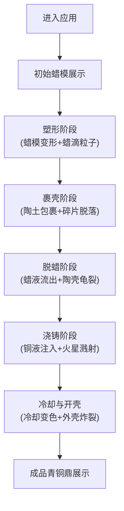

## 1. 产品概述

基于Three.js的交互式3D古代失蜡法青铜铸造过程模拟Web应用，为考古学家和博物馆教育工作者提供沉浸式的古代铸造工艺学习工具。通过六个连续铸造步骤的可视化模拟，让学习者直观理解失蜡法的物理变化过程。

- **目标用户**：考古学家、博物馆教育工作者、历史文化学习者
- **核心价值**：将抽象的古代铸造工艺转化为可交互、可观察的3D可视化体验
- **应用场景**：博物馆教育、考古教学、文化传播

## 2. 核心功能

### 2.1 功能模块

1. **3D场景渲染**：基于Three.js的青铜鼎铸造过程实时渲染
2. **铸造步骤控制**：六个阶段的步骤切换与状态管理
3. **粒子特效系统**：蜡滴、陶土碎片、铜液飞溅、冷却火花四类粒子效果
4. **交互控制面板**：步骤按钮、参数滑块、视角控制
5. **响应式布局**：适配桌面端与移动端

### 2.2 页面详情

| 页面名称 | 模块名称 | 功能描述 |
|-----------|-------------|---------------------|
| 主页面 | 3D场景区域 | 居中展示青铜铸造3D模型，支持旋转观察 |
| 主页面 | 左侧控制面板 | 6个步骤按钮、2个参数滑块、1个角度滑块 |
| 主页面 | 右上角状态显示 | 当前铸造阶段名称 |
| 主页面 | 部件标签提示 | 鼠标悬停显示鼎部件名称 |

## 3. 核心流程

用户进入应用后，从初始蜡模状态开始，依次点击六个步骤按钮，逐步观察失蜡法铸造青铜鼎的全过程：

1. 初始状态：展示灰白色蜡质鼎雏形
2. 塑形：调节蜡软硬度，蜡模表面变形，蜡滴粒子效果
3. 裹壳：陶土外壳从下至上包裹，裂纹碎片脱落
4. 脱蜡：加热熔蜡，蜡液从底部渗出，陶壳变色龟裂
5. 浇铸：铜液从顶部注入，填充空腔，火星溅射
6. 冷却与开壳：冷却变色，敲碎外壳，露出青铜鼎

## 4. 用户界面设计

### 4.1 设计风格

- **主色调**：炭黑色 #1A1A1A 至 深铜色 #3D2B1F 渐变背景
- **辅助色**：古铜色 #8B5A2B、陶土棕 #8B4513、铜金色 #CD853F
- **文字色**：米黄色 #D2B48C
- **字体**：篆体风格标题字体，古朴典雅
- **按钮风格**：圆角矩形，铜色边框，半透明深色底色
- **整体美学**：战国青铜器风格，深铜绿点缀，仿古火痕纹理，柔和边缘过渡

### 4.2 页面设计概述

| 页面名称 | 模块名称 | UI元素 |
|-----------|-------------|-------------|
| 主页面 | 3D场景区 | 居中3D渲染画布，渐变背景，柔和光照 |
| 主页面 | 左侧控制面板 | 280px宽，深灰半透明背景，竖排6个80x40px按钮，铜色边框 |
| 主页面 | 滑块控件 | 蜡软硬度滑块、铜液温度滑块、角度滑块，铜色圆形滑块按钮 |
| 主页面 | 状态标题 | 右上角古风字体阶段名称，带阴影效果 |
| 主页面 | 部件标签 | 鼠标悬停时显示，黑底白字半透明，圆角4px |

### 4.3 响应式设计

- **桌面端（1024px以上）**：左侧竖排控制面板，3D场景居中
- **平板端（768px-1024px）**：左侧面板宽度自适应，保持竖排布局
- **移动端（768px以下）**：控制面板折叠为底部横条（高80px），按钮平铺排列

### 4.4 3D场景设计

- **环境**：深色渐变背景，柔和环境光+方向光组合
- **光照**：主方向光模拟火光效果，环境光提供基础照明
- **相机**：透视相机，支持轨道控制旋转观察
- **材质**：
  - 蜡模：灰白色半透明材质，带划痕纹理
  - 陶壳：棕色粗糙材质，带裂纹纹理
  - 铜液：亮橙色发光材质，渐变颜色
  - 青铜鼎：金属质感材质，带兽面纹和铭文浮雕
- **粒子系统**：四类粒子发射器，对象池管理，生命周期回收
- **后处理**：轻微泛光效果增强真实感
