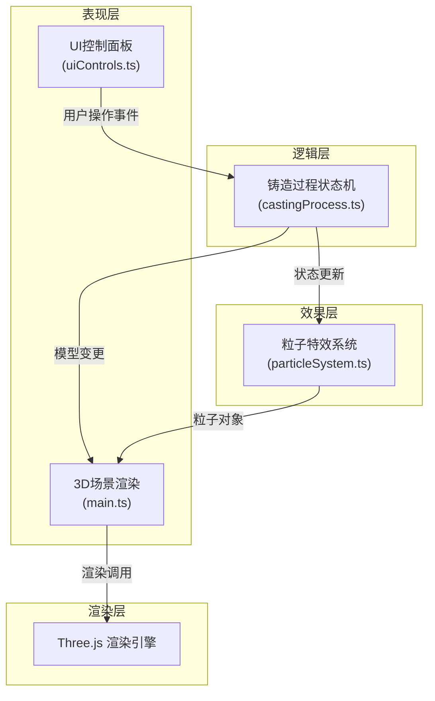

## 1. 架构设计

本项目为纯前端3D可视化应用，采用模块化架构设计，各模块职责清晰，数据流向明确。



## 2. 技术描述

- **前端框架**：原生 TypeScript + Three.js
- **构建工具**：Vite 5.x
- **类型系统**：TypeScript 5.x（严格模式，target ES2020）
- **3D引擎**：Three.js r160+
- **UI实现**：原生CSS + HTML，响应式布局
- **性能优化**：对象池管理粒子、requestAnimationFrame渲染循环、按需更新

## 3. 文件结构

```
auto225/
├── index.html              # 入口HTML页面
├── package.json            # 项目依赖与脚本
├── vite.config.js          # Vite构建配置
├── tsconfig.json           # TypeScript配置
└── src/
    ├── main.ts             # 应用入口，场景初始化与主循环
    ├── castingProcess.ts   # 核心铸造逻辑模块，状态机管理
    ├── particleSystem.ts   # 粒子特效模块，四类粒子系统
    └── uiControls.ts       # UI交互控制模块，控制面板
```

### 模块调用关系

| 模块 | 职责 | 输入 | 输出 |
|------|------|------|------|
| main.ts | 应用入口，场景管理，渲染循环 | 无 | Three.js场景、相机、渲染器 |
| castingProcess.ts | 铸造过程状态机，模型变形管理 | UI步骤切换事件、参数值 | 各阶段3D对象、状态变更 |
| particleSystem.ts | 粒子特效生成与管理 | 铸造阶段、粒子发射参数 | 粒子对象组 |
| uiControls.ts | 用户界面交互控制 | 无 | 用户操作状态（步骤、滑块值） |

### 数据流向

```
用户交互 → uiControls.ts → castingProcess.ts → 场景更新与粒子系统 → 渲染循环
```

## 4. 核心数据模型

### 4.1 铸造阶段枚举

```typescript
enum CastingStage {
  INITIAL = 'initial',      // 初始蜡模
  SHAPING = 'shaping',      // 塑形
  SHELLING = 'shelling',    // 裹壳
  DEWAXING = 'dewaxing',    // 脱蜡
  POURING = 'pouring',      // 浇铸
  COOLING = 'cooling',      // 冷却与开壳
  FINISHED = 'finished'     // 完成
}
```

### 4.2 粒子类型

```typescript
enum ParticleType {
  WAX_DROP = 'waxDrop',           // 蜡滴
  CLAY_FRAGMENT = 'clayFragment', // 陶土碎片
  COPPER_SPARK = 'copperSpark',   // 铜液火星
  COOLING_SPARK = 'coolingSpark'  // 冷却火花
}
```

### 4.3 控制参数

```typescript
interface ControlParams {
  currentStage: CastingStage;
  waxSoftness: number;      // 0-100 蜡软硬度
  copperTemp: number;       // 0-100 铜液温度
  viewAngle: number;        // 0-360 观察角度
}
```

## 5. 性能优化策略

### 5.1 粒子系统优化

- 对象池模式：粒子生命周期结束后回收复用，避免频繁创建销毁
- 最大粒子数限制：峰值不超过3000个
- 批量更新：每帧统一更新所有粒子状态，减少计算开销
- 视锥剔除：不可见粒子跳过渲染

### 5.2 渲染优化

- 单渲染循环：每帧只更新一次场景
- 材质复用：同类对象共享材质实例
- 几何体合并：静态几何体尽量合并减少draw call
- 按需更新：仅在状态变化时更新模型几何体

### 5.3 动画优化

- requestAnimationFrame 驱动
- 时间差计算动画进度，保证速度一致
- 关键帧插值，减少计算量

## 6. 响应式布局策略

- 桌面端（≥1024px）：左侧固定280px控制面板，主场景占满剩余空间
- 平板端（768px-1024px）：面板宽度弹性调整，保持竖排布局
- 移动端（<768px）：面板转为底部横条，高度80px，按钮横向排列

## 7. 开发与构建

- **开发命令**：npm run dev（端口3000）
- **构建命令**：npm run build
- **代码规范**：TypeScript严格模式，ES2020语法
