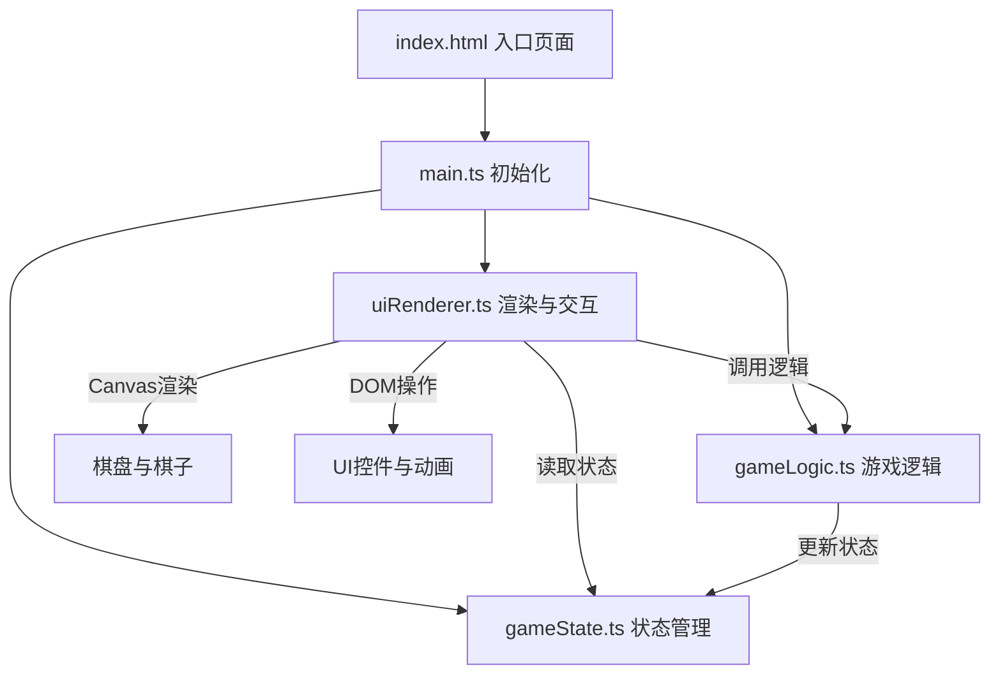

## 1. 架构设计

## 2. 技术说明
- 前端：TypeScript + 原生JavaScript（无框架）
- 构建工具：Vite
- 渲染：Canvas 2D API 绘制棋盘与棋子
- 音频：Web Audio API 生成交互音效
- 动画：requestAnimationFrame + CSS Animation
- 初始化工具：手动创建项目结构（用户指定文件结构）

## 3. 文件结构

| 文件 | 用途 |
|------|------|
| package.json | 项目依赖（typescript, vite）与启动脚本 |
| vite.config.js | Vite构建配置，入口index.html，端口3000 |
| tsconfig.json | TypeScript严格模式，target ES2020 |
| index.html | 入口页面，古风样式，全屏居中布局 |
| src/main.ts | 入口脚本，初始化游戏 |
| src/gameState.ts | 游戏状态管理：玩家、回合、棋子位置、投琼历史 |
| src/gameLogic.ts | 核心逻辑：琼的投掷、走棋规则、逼走判定、成枭胜负 |
| src/uiRenderer.ts | Canvas渲染、用户交互、动画、音效 |

## 4. 核心数据结构

### 4.1 棋盘
- 16x16交叉点网格（0-15索引）
- 中央河区域：交叉点(7,7)(7,8)(8,7)(8,8)
- 四角方形区域：3x3交叉点
  - 左上(0-2,0-2)、右上(13-15,0-2)
  - 左下(0-2,13-15)、右下(13-15,13-15)

### 4.2 棋子
- 每方6枚，初始位于对角方形区域内
- 属性：id、player(red/blue)、position、startPosition、isXiao

### 4.3 琼（骰子）
- 六面：1面"枭" + 5面数字1-5
- 随机生成：1/6概率枭，5/6概率数字

### 4.4 走棋规则
- 沿8个方向（横/竖/斜）直线移动，步数=琼点数
- 路径不可穿越其他棋子
- 目标位有对方棋子且不在起始位时"逼"回起始位
- 己方棋子不可重叠

### 4.5 成枭判定
- 己方3枚棋子在横/竖/斜线上连续排列
- 其中至少1枚为"枭"标记棋子

## 5. 性能策略
- Canvas仅在状态变更时重绘，动画使用requestAnimationFrame
- 投琼动画总时长<2秒
- 棋盘渲染保持60fps
- 移动端<768px时缩放至70%
