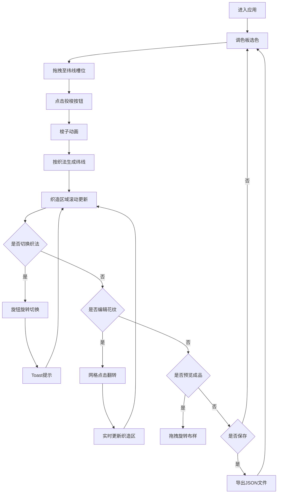

## 1. 产品概述

古代织机模拟器是一款交互式Web应用，用于传统织锦工艺教学。通过在浏览器中模拟经线与纬线在不同织法下的交错过程，直观展示复杂几何纹样的形成原理，解决传统教学中无法动态演示丝线交织、张力变化和图案生成的痛点。

- **核心价值**：为纺织专业学生和传统工艺爱好者提供沉浸式学习体验，让抽象的织法原理可视化、可交互、可编辑
- **目标用户**：纺织院校师生、传统织锦工艺传承人、工艺美术爱好者

---

## 2. 核心功能

### 2.1 用户角色
| 角色 | 注册方式 | 核心权限 |
|------|----------|----------|
| 普通用户 | 无需注册 | 完整使用所有织造、编辑、预览、保存功能 |

### 2.2 功能模块
1. **织机操作间**：古风场景渲染，包含木制织机模型、经线阵列、彩色丝线悬挂
2. **织造区域**：Canvas画布实时渲染编织过程，支持三种织法动态生成纬线
3. **调色板系统**：6色渐变调色板，支持拖拽选色、纬线槽位放置
4. **织法切换**：平纹/斜纹/缎纹三种模式循环切换，旋钮动画+音效
5. **花纹编辑器**：8x8网格手动修改交织点，实时预览图案变化
6. **成品预览**：布样卷轴展示，支持拖拽旋转多角度观察
7. **数据导出**：完整织造过程JSON格式保存，包含所有行数据和织法信息

### 2.3 页面详情
| 页面名称 | 模块名称 | 功能描述 |
|----------|----------|----------|
| 主页面 | 织机操作间 | 土坯色墙面、青砖地面、木制织机模型渲染，40根经线排列 |
| 主页面 | 织造区域 | 400x300px Canvas画布，米白背景带毛边效果，实时显示织法名称和纬线颜色 |
| 主页面 | 调色板 | 160px宽竖屏布局，6种传统色彩渐变排列，40x40px圆角色块 |
| 主页面 | 投梭按钮 | 木纹色按钮，点击触发梭子动画并生成新纬线行 |
| 主页面 | 织法旋钮 | 黄铜色圆形旋钮，点击旋转切换织法，带Web Audio音效 |
| 主页面 | 花纹编辑器 | 8x8网格显示单元花纹，点击翻转交织点状态 |
| 主页面 | 成品预览 | 卷轴边框布样展示，拖拽旋转360度观察 |
| 主页面 | 保存印章 | 朱红古风印章样式，点击导出JSON数据文件 |

---

## 3. 核心流程

### 主要操作流程
用户进入应用 → 调色板选择颜色 → 拖拽到纬线槽位 → 点击投梭按钮 → 梭子动画穿过 → 新纬线按当前织法生成 → 织造区域滚动更新 → 切换织法观察不同纹理 → 花纹编辑器手动调整 → 成品预览旋转观察 → 保存织样数据。

---

## 4. 用户界面设计

### 4.1 设计风格
- **主色调**：土黄#D2B48C、深棕#5C4033、朱红#DC143C、米白#F5F0E1
- **配色方案**：深红#8B0000、天蓝#4682B4、翠绿#228B22、明黄#FFD700、紫色#8B008B、粉红#FF69B4
- **按钮样式**：圆角木纹按钮，悬停亮度提升130%+上下浮动动画，点击缩放至0.95倍
- **字体**：汉字使用"Noto Serif SC"、"华文楷体"，英文数字使用"Georgia"
- **布局风格**：三栏flex布局，左25%织机调色板、中50%织造区、右25%编辑预览，凹槽分隔线#8B7355
- **动画风格**：缓动曲线ease-in-out，过渡时长0.15-0.5s，旋钮旋转45度、投梭0.5s、滚动0.2s

### 4.2 页面设计概述
| 页面名称 | 模块名称 | UI元素 |
|----------|----------|--------|
| 主页面 | 背景 | 复古宣纸纹理，linear-gradient+radial-gradient叠加SVG噪点滤镜 |
| 主页面 | 织机模型 | 300x200px木制机身，#8B5E3C到#A0522D渐变+水平木纹线条 |
| 主页面 | 经线阵列 | 40根2px宽丝线，间距4px，颜色可自定义 |
| 主页面 | 织造画布 | 400x300px，#F5E6CC背景，5px高毛边锯齿效果 |
| 主页面 | 织法显示 | 楷体18px#4A2C2A，淡金色#DAA520发光阴影 |
| 主页面 | 纬线槽位 | 50x20px#D2B48C凹槽，拖入时#FFE4B5高亮闪烁两次 |
| 主页面 | 投梭按钮 | 80x35px#8B5E3C圆角10px，按下凹陷效果 |
| 主页面 | 织法旋钮 | 30px直径#DAA520黄铜色，径向渐变模拟滚花 |
| 主页面 | Toast提示 | 半透明#1A1A1ACC背景，顶部滑入下滑出，2s持续 |
| 主页面 | 花纹网格 | 8x8#D3D3D3背景，亮色#FF4500/暗色#2F4F4F交织点 |
| 主页面 | 预览卷轴 | 240x240px，左右木轴#5C4033，#FFF8DC背景 |
| 主页面 | 保存印章 | 方形#DC143C边框，白底篆书"存"字，点击闪烁加深 |

### 4.3 响应式
- Desktop-first设计，支持1920x1080和1366x768分辨率
- 使用flex-wrap布局，最小宽度1200px
- 所有尺寸使用CSS变量定义，便于整体调整

### 4.4 性能要求
- Canvas刷新率≥55fps，使用requestAnimationFrame循环
- 单帧计算时间≤16ms
- 花纹编辑后更新延迟≤200ms
- 预览旋转帧率≥50fps
