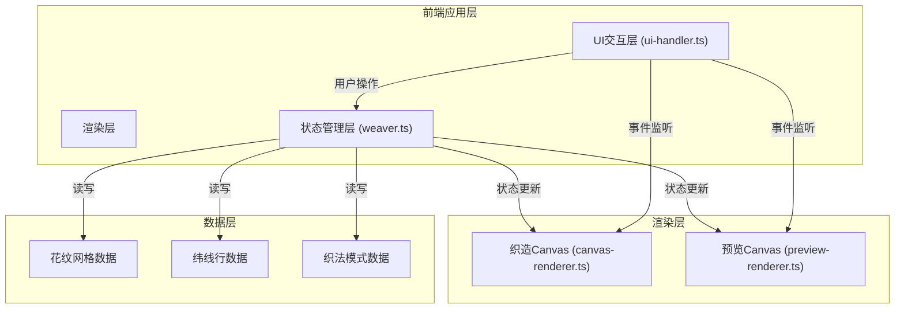

## 1. 架构设计



---

## 2. 技术描述

- **前端技术栈**：TypeScript + 原生JavaScript（无框架）+ Vite
- **构建工具**：Vite 5.x，端口3000，启用HMR
- **渲染技术**：HTML5 Canvas 2D API + requestAnimationFrame
- **音频技术**：Web Audio API（旋钮音效）
- **样式方案**：原生CSS + CSS变量 + SVG滤镜
- **数据序列化**：JSON格式导出

---

## 3. 核心文件结构

| 文件路径 | 职责描述 |
|----------|----------|
| [package.json](file:///c:/Users/Administrator/Desktop/VersionFast/VersionFast/tasks/auto227/package.json) | 项目依赖配置：typescript, vite；脚本：npm run dev |
| [index.html](file:///c:/Users/Administrator/Desktop/VersionFast/VersionFast/tasks/auto227/index.html) | 入口页面：完整DOM结构、CSS变量定义、外部字体引入 |
| [vite.config.js](file:///c:/Users/Administrator/Desktop/VersionFast/VersionFast/tasks/auto227/vite.config.js) | Vite构建配置：入口index.html，端口3000，HMR启用 |
| [tsconfig.json](file:///c:/Users/Administrator/Desktop/VersionFast/VersionFast/tasks/auto227/tsconfig.json) | TypeScript配置：严格模式，target ES2020，include src/**/*.ts |
| [src/weaver.ts](file:///c:/Users/Administrator/Desktop/VersionFast/VersionFast/tasks/auto227/src/weaver.ts) | 织机状态管理类：经线数、行数、织法模式、纬线颜色、花纹网格 |
| [src/ui-handler.ts](file:///c:/Users/Administrator/Desktop/VersionFast/VersionFast/tasks/auto227/src/ui-handler.ts) | UI交互事件绑定：拖拽、点击、旋转、导出等用户操作处理 |
| [src/canvas-renderer.ts](file:///c:/Users/Administrator/Desktop/VersionFast/VersionFast/tasks/auto227/src/canvas-renderer.ts) | 织造区域Canvas绘制：经纬交织、滚动动画、投梭动画 |
| [src/preview-renderer.ts](file:///c:/Users/Administrator/Desktop/VersionFast/VersionFast/tasks/auto227/src/preview-renderer.ts) | 成品预览Canvas绘制：40行x40列布样、拖拽旋转、矩阵变换 |

---

## 4. 核心数据模型

### 4.1 数据类型定义

```typescript
// 织法类型
type WeaveType = 1 | 2 | 3; // 1=平纹, 2=斜纹, 3=缎纹

// 交织状态：true=纬线在经线上方, false=纬线在经线下方
type InterlaceState = boolean;

// 花纹网格：8x8单元
type PatternGrid = InterlaceState[][];

// 纬线行数据
interface WeaveRow {
    rowIndex: number;
    weaveType: WeaveType;
    weftColor: string;
    patternGrid: PatternGrid;
}

// 完整织样数据
interface WeaveData {
    width: number;      // 经线数（40）
    height: number;     // 总行数
    weaves: WeaveRow[]; // 所有行数据
}

// 织机状态
interface WeaverState {
    wrapCount: number;          // 经线数量，固定40
    rowCount: number;           // 当前总行数
    currentWeaveType: WeaveType; // 当前织法
    currentWeftColor: string;   // 当前纬线颜色
    patternGrid: PatternGrid;   // 当前花纹单元网格
    rows: WeaveRow[];           // 已织行数据
    wrapColors: string[];       // 每根经线的颜色
}
```

### 4.2 织法算法

**平纹（WeaveType 1）**：
- 公式：`interlace[row][col] = (row + col) % 2 === 0`
- 描述：奇数经线在上、偶数经线在下，循环交替

**斜纹（WeaveType 2）**：
- 公式：`interlace[row][col] = (col - row) % 4 === 0 || (col - row) % 4 === 1`
- 描述：每根纬线从第1根经线下穿，第2、3根经线上方，第4根经线下，每次偏移1根形成45度斜纹

**缎纹（WeaveType 3）**：
- 公式：`interlace[row][col] = (col * 2 + row) % 7 < 5`
- 描述：5上2下，长浮长效果，交织点间距均匀

---

## 5. 核心类与方法

### 5.1 Weaver 类 (src/weaver.ts)

| 方法 | 签名 | 功能描述 |
|------|------|----------|
| constructor | `()` | 初始化状态：40经线、8x8网格、默认平纹 |
| addRow | `(color: string): void` | 按当前织法和花纹网格生成新行，追加到rows数组 |
| getPattern | `(row: number, col: number): boolean` | 返回指定行列的交织状态 |
| setPattern | `(gridRow: number, gridCol: number, value: boolean): void` | 设置花纹网格单元值 |
| togglePattern | `(gridRow: number, gridCol: number): void` | 翻转花纹网格单元值 |
| setWeaveType | `(type: WeaveType): void` | 设置当前织法，重新生成patternGrid |
| setWeftColor | `(color: string): void` | 设置当前纬线颜色 |
| setWrapColor | `(index: number, color: string): void` | 设置指定经线颜色 |
| exportJSON | `(): WeaveData` | 导出完整织样数据 |
| getRecentRows | `(count: number): WeaveRow[]` | 获取最近N行数据用于预览 |

### 5.2 UIHandler 类 (src/ui-handler.ts)

| 方法 | 功能描述 |
|------|----------|
| bindPaletteDrag | 绑定调色板色块拖拽事件，支持HTML5 Drag & Drop API |
| bindWeftSlotDrop | 绑定纬线槽放置事件，处理颜色放置和高亮闪烁 |
| bindThrowShuttle | 绑定投梭按钮点击事件，触发动画和addRow |
| bindWeaveKnob | 绑定织法旋钮点击事件，处理旋转动画、音效和织法切换 |
| bindPatternGrid | 绑定花纹编辑器网格点击事件，处理翻转和回弹动画 |
| bindSaveButton | 绑定保存印章点击事件，处理闪烁和JSON导出下载 |
| showToast | 显示织法切换Toast提示 |
| playClickSound | 使用Web Audio API播放旋钮点击音效 |

### 5.3 CanvasRenderer 类 (src/canvas-renderer.ts)

| 方法 | 功能描述 |
|------|----------|
| constructor | 初始化Canvas上下文，设置尺寸400x300 |
| start | 启动requestAnimationFrame渲染循环 |
| stop | 停止渲染循环 |
| render | 主渲染方法，每帧调用 |
| drawBackground | 绘制米白背景和毛边锯齿效果 |
| drawWrapThreads | 绘制40根经线 |
| drawWeftRows | 绘制已织纬线行，处理滚动偏移 |
| drawShuttleAnimation | 绘制投梭动画（横向扁椭圆运动） |
| drawWeaveInfo | 绘制织法名称和当前纬线颜色文字 |
| updateScrollOffset | 更新滚动动画偏移量 |

### 5.4 PreviewRenderer 类 (src/preview-renderer.ts)

| 方法 | 功能描述 |
|------|----------|
| constructor | 初始化预览Canvas，绑定鼠标拖拽事件 |
| start | 启动渲染循环 |
| stop | 停止渲染循环 |
| render | 主渲染方法，应用旋转矩阵变换 |
| drawScrollFrame | 绘制卷轴边框（左右木轴） |
| drawFabric | 绘制40x40布样，缩放至面板尺寸 |
| handleDrag | 处理鼠标拖拽更新旋转角度 |

---

## 6. 性能优化策略

### 6.1 Canvas渲染优化
- **离屏Canvas**：花纹图案预渲染到离屏Canvas，避免每帧重复计算
- **脏矩形渲染**：仅重绘变化区域，而非全画布重绘
- **对象池**：复用Path2D对象，避免频繁GC
- **批量绘制**：相同颜色线段合并绘制，减少state切换

### 6.2 计算优化
- **缓存计算结果**：织法patternGrid计算后缓存，切换织法时才重新计算
- **位运算**：交织状态判断使用位运算替代模运算
- **TypedArray**：使用Uint8Array存储网格数据，减少内存占用

### 6.3 动画优化
- **RAF同步**：所有动画统一使用requestAnimationFrame调度
- **CSS变量**：动画参数使用CSS变量，GPU加速
- **will-change**：关键动画元素设置will-change属性
