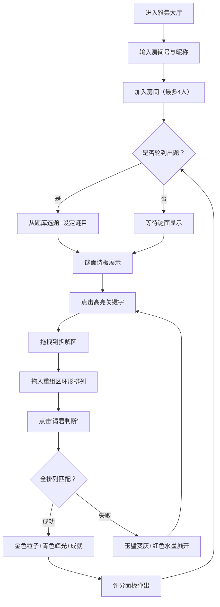

## 1. 产品概述

诗谜雅集——基于Canvas与WebSocket的多人协作古代诗谜拆解与生成Web应用，让多位玩家在浏览器中沉浸式体验古人以诗词意象为谜面、通过层层拆解与组合来猜谜的雅趣过程。

- 目标用户：古风文学爱好者与教育者
- 核心价值：将传统诗谜文化数字化，通过实时多人协作、沉浸式古风视觉体验，让玩家在"曲水流觞"式的雅集氛围中猜谜、拆字、重组，感受诗词与谜语的深层关联

## 2. 核心功能

### 2.1 用户角色

| 角色 | 进入方式 | 核心权限 |
|------|----------|----------|
| 出题者 | 创建/加入房间后轮转 | 从题库选题、设定谜目 |
| 解谜者 | 输入房间号加入 | 拆解关键字、重组谜底、判断提交 |

### 2.2 功能模块

1. **雅集大厅**：房间创建/加入界面，输入房间号，古风宣纸背景
2. **诗谜游戏主界面**：谜面诗板、拆解区、重组区、倒计时、聊天栏、评分面板

### 2.3 页面详情

| 页面名称 | 模块名称 | 功能描述 |
|----------|----------|----------|
| 雅集大厅 | 房间输入 | 输入房间号加入，最多4人同房间 |
| 雅集大厅 | 昵称设置 | 设置玩家昵称，古风称谓风格 |
| 游戏主界面 | 谜面诗板 | 中央竹简样诗板显示五言诗句，关键字高亮边框#5C3A21，其余字#A08060 |
| 游戏主界面 | 出题操作 | 出题者从20首古诗库随机选题，选择谜目（花名/药名/器物名/地名） |
| 游戏主界面 | 拆解区 | 左侧竹简竖排版，拖入关键字固定为竹简块80×40px，拖回取消 |
| 游戏主界面 | 重组区 | 右侧玉璧圆形（直径200px），竹简块按圆周均分环形排列，中央判断按钮 |
| 游戏主界面 | 倒计时 | 右上角龟甲裂纹圆环（外径120px/内径90px），60秒倒计时 |
| 游戏主界面 | 聊天栏 | 底部木框镶边，草书字体#F0E68C，广播游戏事件与玩家消息 |
| 游戏主界面 | 评分面板 | 时间归零弹出，宣纸质感#F5E6C8，圆角展开动画0.6s，满分100分 |
| 游戏主界面 | 成就系统 | 重组成功解锁"诗仙初现"等金色篆书印章，浮现后淡出 |

## 3. 核心流程

1. 玩家进入雅集大厅，输入房间号和昵称加入房间
2. 出题者从预设20首古诗库随机选一首，设定谜目
3. 谜面显示在中央诗板上，关键字以深褐色高亮边框标记
4. 解谜者点击高亮关键字（橙色脉冲光晕0.4s），拖拽到左侧拆解区
5. 拆解后的关键字变为竹简块，可拖入右侧玉璧重组区
6. 重组区按拖入顺序环形排列，顺序错误红色颤抖0.3s
7. 点击"请君判断"按钮，系统全排列匹配谜底
8. 成功：金色粒子飘散2s + 青色辉光 + 成就印章；失败：玉璧变灰 + 红色水墨溅开0.5s
9. 倒计时归零自动揭示谜底，弹出评分面板

## 4. 用户界面设计

### 4.1 设计风格

- 主色调：宣纸米黄#F5E6C8（背景）、深木色#5C3A21（框架）、金色#D4A017（标题）
- 辅助色：竹简#D4B896、玉璧青白渐变#9ACD32→#F0FFF0、浅褐#A08060
- 字体：匾额标题用隶书，诗板正文用楷体#3A2E1E，聊天栏用草书#F0E68C
- 布局：宽屏三列横向（诗板居中、拆解区左下、重组区右下），窄屏竖向堆叠
- 风格：古风水墨，手工撕边效果，卷轴轴头#8B4513

### 4.2 页面设计概览

| 页面名称 | 模块名称 | UI元素 |
|----------|----------|--------|
| 雅集大厅 | 房间输入区 | 宣纸背景#F5E6C8，居中输入框，木框镶边#5C3A21，隶书标题 |
| 游戏主界面 | 匾额标题栏 | 宽1000px高80px，深木色#5C3A21底，金色#D4A017隶书"诗谜雅集" |
| 游戏主界面 | 谜面诗板 | 长条竹简样式，卷轴轴头#8B4513，楷体#3A2E1E，关键字高亮边框#5C3A21 |
| 游戏主界面 | 竹简拆解区 | 竖排版高400px宽160px，竹片纹理#D4B896间隔2px，竹简块80×40px |
| 游戏主界面 | 玉璧重组区 | 圆形直径200px，青白渐变，中央判断按钮，环形排列 |
| 游戏主界面 | 倒计时 | 右上角龟甲裂纹圆环，外径120px内径90px，裂纹#3E2723 |
| 游戏主界面 | 聊天栏 | 底部高120px，木框#5C3A21，半透明灰#2F2F2F，草书#F0E68C |
| 游戏主界面 | 评分面板 | 宣纸质感#F5E6C8圆角，展开动画0.6s |
| 游戏主界面 | 成就印章 | 金色篆书"诗仙初现"，屏幕中央浮现淡出 |

### 4.3 响应式设计

- 宽屏（>1200px）：横向三列布局——左侧拆解区、中央诗板、右侧重组区
- 窄屏（<768px）：竖向堆叠——诗板居上，拆解区在中，重组区在下
- 拖拽和点击反馈均有0.2s缓动过渡
- 所有Canvas元素按比例缩放

### 4.4 动画与交互

- 关键字点击：橙色脉冲光晕0.4s
- 拖拽跟随：半透明阴影块80×20px，不透明度0.5
- 拖拽轨迹：波纹涟漪粒子2px持续0.3s
- 竹简块弹跳：弹出5px落回
- 重组顺序错误：红色颤抖0.3s
- 重组成功：青色辉光 + 金色粒子向上飘散2s
- 重组失败：红色水墨溅开0.5s
- 成就解锁：金色篆书印章浮现淡出
- 评分面板：宣纸展开0.6s
- 倒计时：龟甲裂纹顺时针减少
