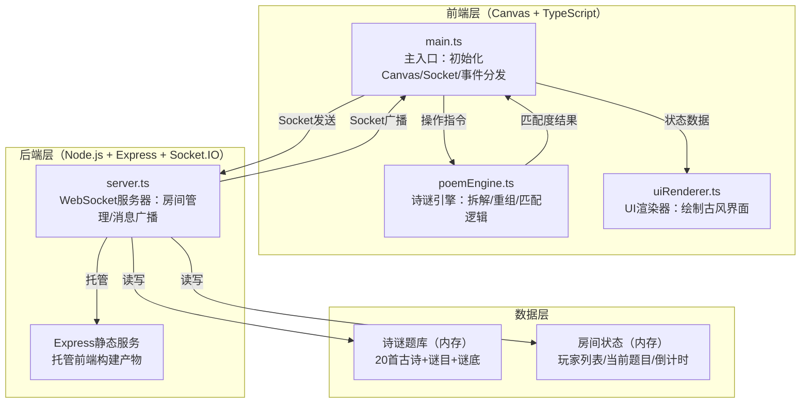
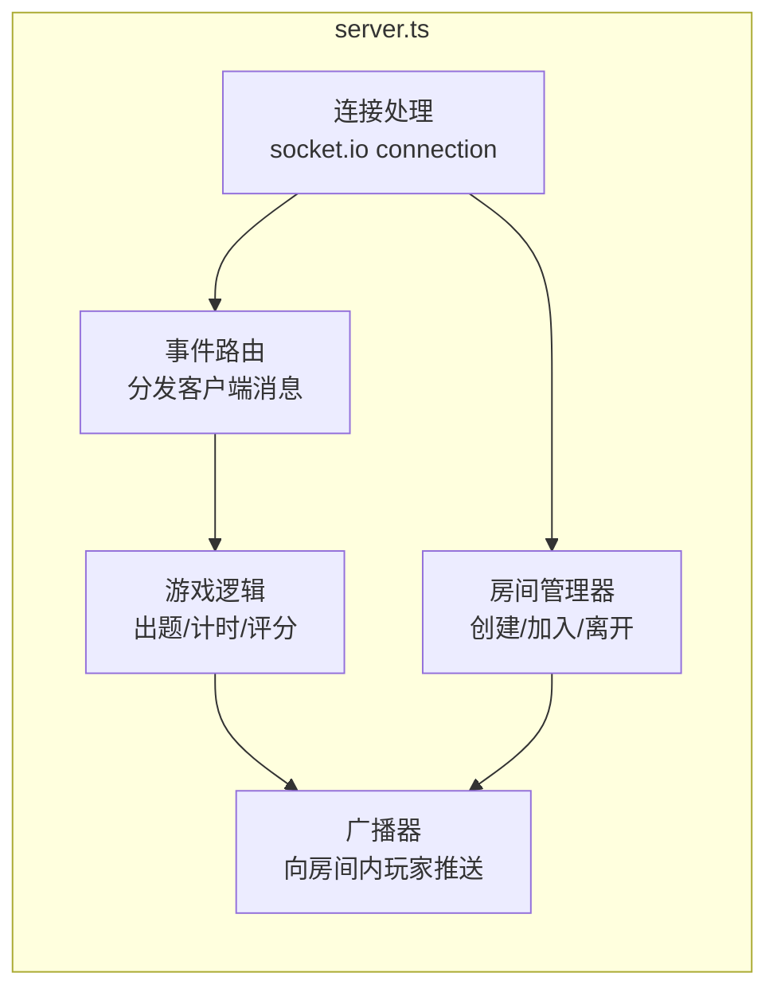
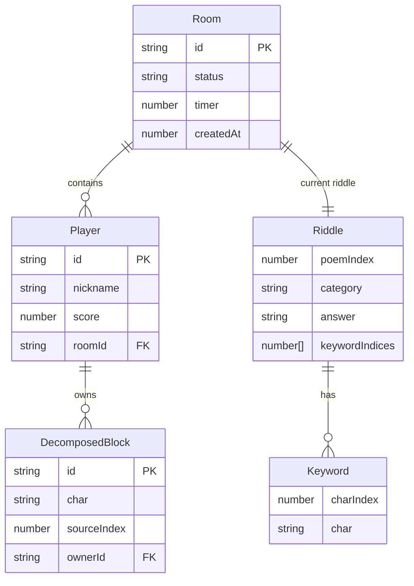

## 1. 架构设计



## 2. 技术说明

- **前端**：TypeScript + Canvas 2D API + Socket.IO Client，Vite构建
- **构建工具**：Vite，入口index.html，端口3000
- **后端**：Node.js + Express + Socket.IO，TypeScript编写
- **数据库**：无外部数据库，诗谜题库与房间状态均存放于内存
- **通信**：WebSocket（Socket.IO），消息延迟≤200ms
- **渲染**：Canvas 2D，requestAnimationFrame驱动，拖拽响应≤50ms，帧率≥40fps

## 3. 文件结构与职责

```
项目根目录/
├── package.json              # 依赖与启动脚本
├── vite.config.js            # Vite构建配置
├── tsconfig.json             # TypeScript严格模式配置
├── index.html                # 入口页面
├── server/
│   └── server.ts             # WebSocket服务器
├── src/
│   ├── main.ts               # 主入口
│   ├── poemEngine.ts         # 诗谜引擎
│   └── uiRenderer.ts         # UI渲染器
└── dist/                     # 构建输出
```

**文件间调用关系与数据流向：**

| 调用方 | 被调用方 | 数据流向 |
|--------|----------|----------|
| main.ts | uiRenderer.ts | 传递游戏状态→更新画布元素 |
| main.ts | poemEngine.ts | 传递操作指令→返回匹配度结果 |
| main.ts | server.ts（via Socket） | 发送用户操作→接收广播事件 |
| server.ts | 所有客户端（via Socket） | 接收消息→处理→广播给房间玩家 |
| poemEngine.ts | 内部 | 拆解/重组/全排列匹配算法 |

## 4. API定义（WebSocket事件）

### 4.1 客户端 → 服务器事件

```typescript
interface JoinRoomPayload {
  roomId: string;
  nickname: string;
}

interface SetRiddlePayload {
  roomId: string;
  poemIndex: number;
  category: 'flower' | 'medicine' | 'utensil' | 'place';
}

interface DecomposePayload {
  roomId: string;
  charIndex: number;
}

interface RecomposePayload {
  roomId: string;
  blockId: string;
  targetAngle: number;
}

interface JudgePayload {
  roomId: string;
}

interface ChatPayload {
  roomId: string;
  message: string;
}
```

### 4.2 服务器 → 客户端事件

```typescript
interface RoomJoinedPayload {
  roomId: string;
  players: Player[];
  yourId: string;
}

interface RiddleSetPayload {
  poem: string[];
  keywords: number[];
  category: string;
  timer: number;
}

interface PlayerDecomposedPayload {
  playerId: string;
  charIndex: number;
  blocks: DecomposedBlock[];
}

interface PlayerRecomposedPayload {
  playerId: string;
  blockId: string;
  ringOrder: string[];
}

interface JudgeResultPayload {
  success: boolean;
  answer: string;
  scores: Record<string, number>;
}

interface TimerTickPayload {
  remaining: number;
}

interface ChatMessagePayload {
  playerId: string;
  nickname: string;
  message: string;
}

interface AchievementPayload {
  playerId: string;
  achievement: string;
}

interface DecomposedBlock {
  id: string;
  char: string;
  sourceIndex: number;
  owner: string;
}

interface Player {
  id: string;
  nickname: string;
  score: number;
}
```

## 5. 服务器架构



## 6. 数据模型

### 6.1 数据模型定义



### 6.2 诗谜题库数据结构

```typescript
interface PoemRiddle {
  lines: string[];
  keywords: number[];
  answer: string;
  category: 'flower' | 'medicine' | 'utensil' | 'place';
  hint: string;
}

const POEM_DATABASE: PoemRiddle[] = [
  {
    lines: ['红豆生南国', '春来发几枝', '愿君多采撷', '此物最相思'],
    keywords: [0, 1],
    answer: '红豆',
    category: 'medicine',
    hint: '此物既可入药，亦表相思'
  },
];
```
